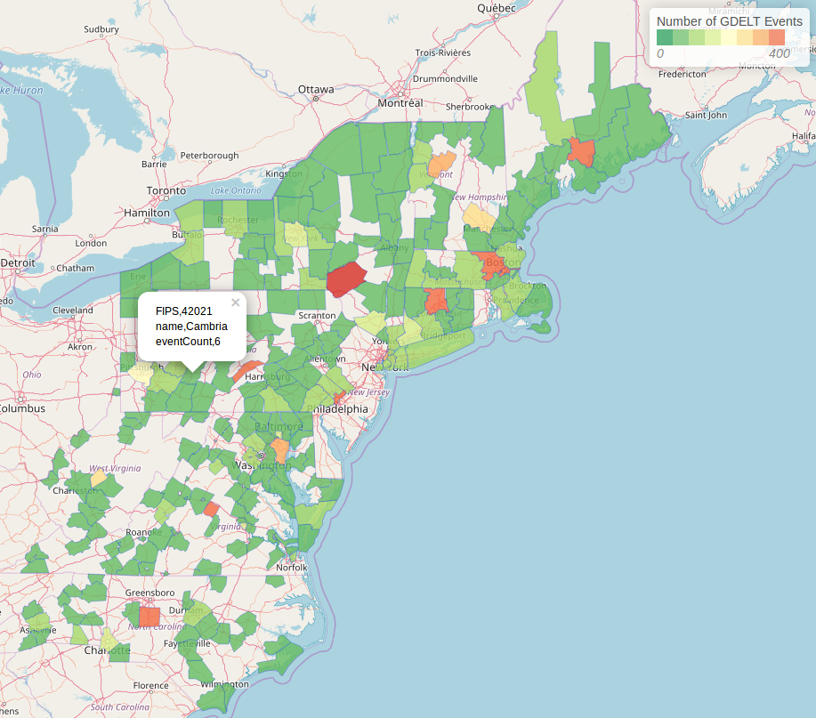

GeoMesa Spark: Broadcast Join and Aggregation
=============================================

This tutorial will show you how to:

1. Use GeoMesa with `Apache Spark <https://spark.apache.org/>`__ in Scala.
2. Create and use DataFrames with our geospatial User Defined Functions.
3. Calculate aggregate statistics using a covering set of polygons.
4. Create a new simple feature type to represent this aggregation.
5. Visualize the result as a choropleth map.

Background
----------

`GDELT <https://gdeltproject.org/>`__ provides a comprehensive time- and location-indexed archive of events reported
in broadcast, print, and web news media worldwide from 1979 to today.

`FIPS Codes <https://www.census.gov/geo/maps-data/data/cbf/cbf_counties.html>`__ are
Federal Information Processing Standard Publication codes that uniquely identify counties in the United States.

If we make the assumption that a county with more GDELT events is somehow more politically relevant, we may be interested
in seeing which counties are more dense with GDELT events.

Since GDELT is a data set with point geometries, we do not immediately know which county it belongs to. To resolve this,
we will use a second data set, a FIPS Codes shapefile that denotes the boundary and FIPS code of a county, and join GDELT
points with the county that contains them.

In this case, the number of counties is particularly small, approximately 3000 records, we can make our query much
more efficient by "broadcasting" the counties. "Broadcast" here meaning a
`Spark Broadcast <https://spark.apache.org/docs/2.2.0/api/java/org/apache/spark/sql/functions.html#broadcast-org.apache.spark.sql.Dataset->`__.
In a traditional Spark SQL join, data will be shuffled around the executors based on the partitioners of the RDDs,
and since in our case the join key is a geometric field, there is no built-in Spark partitioner that can map data effectively.
The resulting movement of data across nodes is expensive, so we can attain a performance boost by sending (broadcasting)
our entire small data set to each of the nodes once. This ensures that the executors have all the data needed to compute
the join, and no additional shuffling is needed.

Spark provides a means of executing this "broadcast join", though it should only be used when the data being broadcast
is small enough to fit in the memory of the executors.

Prerequisites
-------------

For this tutorial, we will assume that your have already ingested the two data sets into the data store of your choosing.
Following this tutorial without having created the necessary tables will lead to errors.

The converter for the GDELT data set, :doc:`/user/convert/premade/gdelt`, is provided with GeoMesa, and the FIPS data can
be ingested without a converter as a shapefile. For further guidance, you can follow one of the ingest tutorials
:doc:`/tutorials/geomesa-examples-gdelt`.
Once you have the data ingested in GeoMesa, you may proceed with the rest of the tutorial.

Initializing Spark
------------------

To start working with Spark, we will need a Spark Session initialized, and to apply GeoMesa's geospatial User Defined
Types (UDTs) and User Defined Functions (UDFs) to our data in Spark, we will need to initialize our SparkSQL extensions.
This functionality requires having the appropriate GeoMesa Spark runtime jar on the classpath when running your Spark job.
GeoMesa provides Spark runtime jars for Accumulo, HBase, and FileSystem data stores. For example, the following would start an
interactive Spark REPL with all dependencies needed for running Spark with GeoMesa on an Accumulo data store. Replace
``${VERSION}`` with the appropriate Scala plus GeoMesa versions (e.g. |scala_release_version|):

.. code-block:: bash

    $ bin/spark-shell --jars geomesa-accumulo-spark-runtime-accumulo2_${VERSION}.jar

.. note::

  See :ref:`spatial_rdd_providers` for details on choosing the correct GeoMesa Spark runtime JAR.

To configure the Spark Session such that we can serialize Simple Features and work with geometric UDTs and UDFs, we must
alter the Spark Session as follows.

.. code-block:: scala

    import org.apache.spark.sql.SparkSession
    import org.locationtech.geomesa.spark.GeoMesaSparkKryoRegistrator
    import org.locationtech.geomesa.spark.jts._

    val spark: SparkSession = SparkSession.builder()
        .appName("testSpark")
        .config("spark.serializer", "org.apache.spark.serializer.KryoSerializer")
        .config("spark.kryo.registrator", classOf[GeoMesaSparkKryoRegistrator].getName)
        .master("local[*]")
        .getOrCreate()
        .withJTS

Note the ``withJTS``, which registers GeoMesa's UDTs and UDFs, and the two ``config`` options which tell Spark to
use GeoMesa's custom Kryo serializer and registrator to handle serialization of Simple Features. These configuration options can
also be set in the ``conf/spark-defaults.conf`` configuration file.

Creating DataFrames
-------------------

With our Spark Session created and configured, we can move on to loading our data from the data store into a Spark DataFrame.

First we'll set up the parameters for connecting to the data store. For example, if our data is in two Accumulo
catalogs, we would set up the following parameter maps:

.. code-block:: scala

  val fipsParams = Map(
    "accumulo.instance.name" -> "instance",
    "accumulo.zookeepers"    -> "zoo1:2181,zoo2:2181,zoo3:2181",
    "accumulo.user"          -> "user",
    "accumulo.password"      -> "password",
    "accumulo.catalog"       -> "fips")

  val gdeltParams = Map(
    "accumulo.instance.name" -> "instance",
    "accumulo.zookeepers"    -> "zoo1:2181,zoo2:2181,zoo3:2181",
    "accumulo.user"          -> "user",
    "accumulo.password"      -> "password",
    "accumulo.catalog"       -> "gdelt")

.. note::

    The above parameters assume Accumulo as the backing data store, but the rest of the tutorial is independent of which
    data store is used. Other supported data stores may be used by simply adapting the above parameters appropriately.

Then we make use of Spark's ``DataFrameReader`` and our ``SpatialRDDProvider`` to create a ``DataFrame`` with geospatial
types.

.. code-block:: scala

    val fipsDF = spark.read.format("geomesa")
      .options(fipsParams)
      .option("geomesa.feature", "fips")
      .load()

    val gdeltDF = spark.read.format("geomesa")
      .options(gdeltParams)
      .option("geomesa.feature", "gdelt")
      .load()

Filtering DataFrames (Optional)
-------------------------------

Depending on the scale of the data in our data store, and how specific our questions are, we may want to narrow the result
before joining. For example, if we only wanted GDELT events within a one-week span, we could filter the DataFrame as
follows:

.. code-block:: scala

    import spark.implicits._
    val filteredGdelt = gdeltDF.where("dtg between '2018-01-01 12:00:00' and '2018-01-08 12:00:00'")

Broadcast Join
--------------

Now we're ready to join the two data sets. This is where we will make use of our geospatial UDFs. ``st_contains`` takes
two geometries as input, and it outputs whether the second geometry lies within the first one. For more documentation
and a full list of the UDFs provided by GeoMesa see :doc:`/user/spark/sparksql_functions`.

Using these two UDFs, we can build the following join query.

.. code-block:: scala

    import org.apache.spark.sql.functions.broadcast
    val joinedDF = gdeltDF.join(broadcast(fipsDF), st_contains($"the_geom", $"geom"))

The above query executes the broadcast as described previously, sending the FIPS data to each of the executors, then
joining the two data sets based on whether the GDELT event occurred in the county.

Aggregating
-----------

Now we have a DataFrame where each GDELT event is paired with the US county where it occurred.
To turn this into meaningful statistics about the distribution of GDELT events in the US, we
can do a ``GROUP BY`` operation and use some of SparkSQL's aggregate functions.

.. code-block:: scala

    import org.apache.spark.sql.functions.concat
    import org.apache.spark.sql.functions.count
    import org.apache.spark.sql.functions.first
    val aggregateDF = joinedDF.groupBy(concat($"STATEFP", $"COUNTYFP"))
      .agg(first("NAME").as("name"),
           count($"globalEventId").as("eventCount"),
           first("the_geom").as("geom"))

The above query groups the data based on FIPS code, (which is split into a state and county code),
and counts the number of distinct GDELT events in each one. The result can be used to generate a visualization
of the event density in each county, which we will see in the next section.

Visualization
-------------

To visualize this result, we first need to map our data into the `GeoJSON <https://geojson.org/>`__ format. To do this,
we make use of GeoMesa's DataFrame to GeoJSON converter.

.. code-block:: scala

    import org.locationtech.geomesa.spark.sql.GeoJSONExtensions._
    val geojsonDF = aggregateDF.toGeoJSON

If the result can fit in memory, it can then be collected on the driver and written to a file. If not, each executor can
write to a distributed file system like HDFS.

.. code:: scala

    val geoJsonString = geojsonDF.collect.mkString("[",",","]")

Once we have our data exported as GeoJSON, we can create a `Leaflet <https://leafletjs.com/>`__ map, which is an interactive
map in JavaScript that can be embedded into a web page.

Loading and parsing the JSON is simple. In this case we are wrapping the file load in an ``XMLHttpRequest`` callback function
for compatibility with a notebook like Jupyter or Zeppelin. If the GeoJSON was exported to a file named ``aggregate.geojson``,
then the following JavaScript will load that a file into a Leaflet map.

.. code-block:: javascript

    $(document).ready(function() {
        var map = L.map('map').setView([35.4746,-44.7022],3);
        L.tileLayer("https://{s}.tile.osm.org/{z}/{x}/{y}.png").addTo(map);

        var aggFeature = "eventCount";
        var colors = ["#1a9850", "#66bd63", "#a6d96a", "#d9ef8b", "#ffffbf", "#fee08b", "#fdae61", "#f46d43", "#d73027"]
        var numBins = 8;
        var bins = [];

        // Load the GeoJSON
        var rawFile = new XMLHttpRequest();
        rawFile.onreadystatechange = function () {
            if(rawFile.readyState === 4) {
                if(rawFile.status === 200 || rawFile.status == 0) {
                    var allText = rawFile.response;
                    var aggJson = JSON.parse(allText)
                    L.geoJson(aggJson, {
                        style: function(feature) { return {
                            fillColor: getColor(feature.properties[aggFeature]),
                            weight: 0.5
                        }},
                        onEachFeature: decorate
                    }).addTo(map);
                    // Css override
                    $('svg').css("max-width","none")
                }
            }
        }
        rawFile.open("GET", "aggregate.geojson", false);
        rawFile.send()
    });

This does make use of a few helper functions for setting the color and popup content of each item on the map:

.. code-block:: javascript

    // Create the bins of the histogram, allows for coloring features by value
    function createBins(json) {
        var min = Number.MAX_SAFE_INTEGER;
        var max = 0;
        json.forEach(function(feature) {
            let aggValue = Number(feature.properties[aggFeature])
            if (aggValue < min)
                min = aggValue
            if (aggValue > max)
                max = aggValue
        });
        var interval = (max-min) / numBins;
        for (var i = 0; i < numBins; i++) {
            bins.push(i*interval);
        }
    }

    // Get the fill color based on which bin a value is in
    function getColor(value) {
        var fillColor = colorRange[numBins];
        for (var x = 0; x < numBins; x++) {
           if (Number(value)< bins[x]) {
               fillColor = colorRange[x];
               break;
           }
        }
        return fillColor;
    }

    // Decorate a feature with a popup of its properties
    function decorate(feature, layer) {
       feature.properties.popupContent = Object.entries(feature.properties).join(" ").toString();
       layer.bindPopup(feature.properties.popupContent);
    }

Afterwards, this simple HTML will load a Leaflet map with the data.

.. code-block:: html

    <html>
      <meta charset="utf-8"/>
<<<<<<< HEAD
      <link rel="stylesheet" href="https://cdn.leafletjs.com/leaflet/v0.7.7/leaflet.css" />
      
=======
      <link rel="stylesheet" href="http://cdn.leafletjs.com/leaflet/v0.7.7/leaflet.css" />
      
<<<<<<< HEAD
<<<<<<< HEAD
<<<<<<< HEAD
<<<<<<< HEAD
<<<<<<< HEAD
<<<<<<< HEAD
=======
>>>>>>> e007dde981 (GEOMESA-3176 Docs - fix download links in install instructions)
=======
>>>>>>> 80c85285b7 (GEOMESA-3176 Docs - fix download links in install instructions)
=======
>>>>>>> 4fd46f4f99 (GEOMESA-3176 Docs - fix download links in install instructions)
>>>>>>> 16b2e83f22 (GEOMESA-3176 Docs - fix download links in install instructions)
=======
>>>>>>> 16b2e83f2 (GEOMESA-3176 Docs - fix download links in install instructions)
>>>>>>> 71c56e6b77 (GEOMESA-3176 Docs - fix download links in install instructions)
<<<<<<< HEAD
<<<<<<< HEAD
<<<<<<< HEAD
=======
>>>>>>> 16b2e83f22 (GEOMESA-3176 Docs - fix download links in install instructions)
>>>>>>> 983d0b0983 (GEOMESA-3176 Docs - fix download links in install instructions)
=======
>>>>>>> e007dde981 (GEOMESA-3176 Docs - fix download links in install instructions)
=======
>>>>>>> 16b2e83f22 (GEOMESA-3176 Docs - fix download links in install instructions)
>>>>>>> d13d2eab26 (GEOMESA-3176 Docs - fix download links in install instructions)
=======
>>>>>>> 80c85285b7 (GEOMESA-3176 Docs - fix download links in install instructions)
=======
=======
>>>>>>> 16b2e83f22 (GEOMESA-3176 Docs - fix download links in install instructions)
>>>>>>> 983d0b0983 (GEOMESA-3176 Docs - fix download links in install instructions)
>>>>>>> 4fd46f4f99 (GEOMESA-3176 Docs - fix download links in install instructions)
      
      
      <body>
        

      </body>
    </html>

The end result will look something like this:

