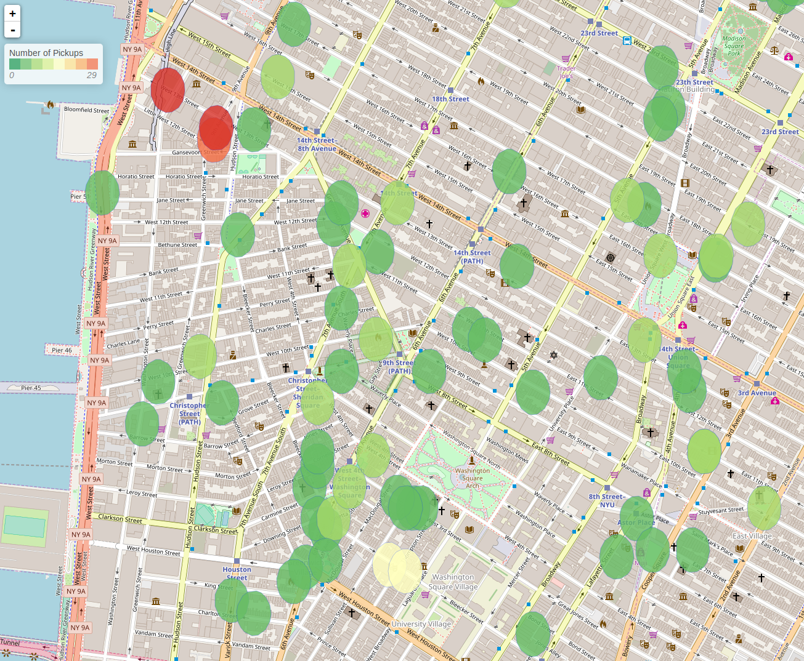

GeoMesa Spark: Spatial Join and Aggregation
===========================================

This tutorial will show you how to:

1. Use GeoMesa with `Apache Spark <https://spark.apache.org/>`__ in Scala.
2. Create and use DataFrames with our geospatial User Defined Functions.
3. Calculate aggregate statistics based on a threshold distance.
4. Create a new simple feature type to represent this aggregation.
5. Write the result back to a data store.

Background
----------

`NYCTaxi <https://databank.illinois.edu/datasets/IDB-9610843>`__ is  taxi activity data
published by the University of Illinois from Freedom of Information Law requests to NYC Taxi and Limo Commission.

`GeoNames <https://www.geonames.org>`__ is a geographical database containing over
10 million geographical names and over 9 million unique features.

Suppose we wanted to answer the questions: "Do taxi pickups centralize near certain points of interest?",
"Are people more likely to request a pickup or be dropped off at points of interest?". To find out, we would need to
combine these two data sets and aggregate statistics over the result.

Since GeoNames is a data set of points, and NYCTaxi provides only the pickup and drop-off points of a trip, it is highly
unlikely that the trip would start or end exactly on the labeled point of interest. So we can't naively join
the data sets based on where the points are equal. Instead, we will need to join where the points are within some tolerable
distance of each other. This is henceforth referred to as a D-within join.

Prerequisites
-------------

For this tutorial, we will assume that your have already ingested the two data sets into the data store of your choosing.
Following this tutorial without having created the necessary tables will lead to errors.

The converters for the GeoNames data set, :doc:`/user/convert/premade/geonames`, and the NYCTaxi data set,
:doc:`/user/convert/premade/nyctaxi`, are provided with GeoMesa. For further guidance, you can follow one of the ingest
tutorials :doc:`/tutorials/geomesa-examples-gdelt`.
Once you have the data ingested in GeoMesa, you may proceed with the rest of the tutorial.

Initializing Spark
------------------

To start working with Spark, we will need a Spark Session initialized, and to apply GeoMesa's geospatial User Defined
Types (UDTs) and User Defined Functions (UDFs) to our data in Spark, we will need to initialize our SparkSQL extensions.
This functionality requires having the appropriate GeoMesa Spark runtime jar on the classpath when running your Spark job.
GeoMesa provides spark runtime jars for Accumulo, HBase, and FileSystem data stores. For example, the following would start an
interactive Spark REPL with all dependencies needed for running Spark with GeoMesa on an Accumulo data store. Replace
``${VERSION}`` with the appropriate Scala plus GeoMesa versions (e.g. |scala_release_version|):

.. code-block:: bash

    $ bin/spark-shell --jars geomesa-accumulo-spark-runtime-accumulo2_${VERSION}.jar

.. note::

  See :ref:`spatial_rdd_providers` for details on choosing the correct GeoMesa Spark runtime JAR.

To configure the Spark Session such that we can serialize Simple Features and work with geometric UDTs and UDFs, we must
alter the Spark Session as follows.

.. code-block:: scala

    import org.apache.spark.sql.SparkSession
    import org.locationtech.geomesa.spark.GeoMesaSparkKryoRegistrator
    import org.locationtech.geomesa.spark.jts._

    val spark: SparkSession = SparkSession.builder()
        .appName("testSpark")
        .config("spark.serializer", "org.apache.spark.serializer.KryoSerializer")
        .config("spark.kryo.registrator", classOf[GeoMesaSparkKryoRegistrator].getName)
        .master("local[*]")
        .getOrCreate()
        .withJTS

Note the ``withJTS``, which registers GeoMesa's UDTs and UDFs, and the two ``config`` options which tell Spark to
use GeoMesa's custom Kryo serializer and registrator to handle serialization of Simple Features. These configuration options can
also be set in the ``conf/spark-defaults.conf`` configuration file.

Creating DataFrames
-------------------

With our Spark Session created and configured, we can move on to loading our data from the data store into a Spark DataFrame.

First we'll set up the parameters for connecting to the data store. For example, if our data is in two Accumulo
catalogs, we would set up the following parameter maps:

.. code-block:: scala

  val taxiParams = Map(
    "accumulo.instance.name" -> "instance",
    "accumulo.zookeepers"    -> "zoo1:2181,zoo2:2181,zoo3:2181",
    "accumulo.user"          -> "user",
    "accumulo.password"      -> "password",
    "accumulo.catalog"       -> "nyctaxi")

  val geonamesParams = Map(
    "accumulo.instance.name" -> "instance",
    "accumulo.zookeepers"    -> "zoo1:2181,zoo2:2181,zoo3:2181",
    "accumulo.user"          -> "user",
    "accumulo.password"      -> "password",
    "accumulo.catalog"       -> "geonames")

.. note::

    The above parameters assume Accumulo as the backing data store, but the rest of the tutorial is independent of which
    data store is used. Other supported data stores may be used by simply adapting the above parameters appropriately.

Then we can make use of Spark's ``DataFrameReader`` and our ``SpatialRDDProvider`` to create a ``DataFrame``

.. code-block:: scala

    val taxiDF = spark.read.format("geomesa")
      .options(taxiParams)
      .option("geomesa.feature", "nyctaxi-single")
      .load()

    val geonamesDF = spark.read.format("geomesa")
      .options(geonamesParams)
      .option("geomesa.feature", "geonames")
      .load()

Since we know our taxi data is limited to the state of New York, we can filter our geonames data.

.. code-block:: scala

    import spark.implicits._
    import org.apache.spark.sql.functions._

    val geonamesNY = geonamesDF.where($"admin1Code" === lit("NY"))

D-within Join
-------------

Now we're ready to join the two data sets. This is where we will make use of two of our geospatial UDFs.
``st_contains`` takes two geometries as input, and it outputs whether the second geometry lies within the first one.
``st_bufferPoint`` takes a point and a distance in meters as input, and it outputs a circle around the point with radius
equal to the provided distance.
For more documentation and a full list of the UDFs provided by GeoMesa see :doc:`/user/spark/sparksql_functions`.

Using these two UDFs, we can build the following join query.

.. code-block:: scala

    val joinedDF = geonamesNY
      .select(st_bufferPoint($"geom", lit(50)).as("buffer"), $"name", $"geonameId")
      .join(taxiDF, st_contains($"buffer", $"pickup_point"))

The above query transforms the geometry of each GeoName point into a circle with a radius of 50 meters, and joins the result
with the taxi records that had pickups anywhere in that circle.

Aggregating
-----------

Now we have a DataFrame where each point of interest in New York is combined with a taxi record where a pickup
was issued from approximately that location. To turn this into meaningful statistics about taxi habits in the region, we
can do a ``GROUP BY`` operation and use some of SparkSQL's aggregate functions.

.. code-block:: scala

    val aggregateDF = joinedDF.groupBy($"geonameId")
      .agg(first("name").as("name"),
           countDistinct($"trip_id")).as(s"numPickups"),
           first("buffer").as("buffer"))

The above query groups the data based on point of interest, and counts the number of distinct pickups. The result can be
used to generate a heatmap of points of interest based on density of pickups, but to quickly see which points of interest
are most departed from via taxi, we can sort the results and look at the top ten.

.. code-block:: scala

    val top10 = aggregateDF.orderBy($"numPickups".desc).take(10)
    top10.foreach { row => println(row.getAs[String]("name") + row.getAs[Int]("numPickups")) }

This tells us that Hotel Gansevoort has the most taxi pickups.

Write-back
----------

If we would like to persist this aggregated result beyond the spark session, we will need to write it back to the
underlying data store. This is done is two steps.

First we create a SimpleFeatureType that is aligned with the aggregated result:

.. code-block:: scala

    import org.locationtech.geomesa.utils.geotools.SchemaBuilder

    val aggregateSft = SchemaBuilder.builder()
        .addString("name")
        .addInt("numPickups")
        .addPolygon("buffer")
        .build("aggregate")

Following this, we can create the schema in the data store, then safely write the data.

.. code-block:: scala

    import org.geotools.api.data.DataStoreFinder
    DataStoreFinder.getDataStore(taxiParams).createSchema(aggregateSft)
    aggregateDF.write.format("geomesa").options(taxiParams).option("geomesa.feature", "aggregate").save()

If you followed all of the above steps, the end result is a data set with the density of taxi pickups at all
the points of interest in New York, optionally written back to the data store. If one was further interested in
comparing this result against the distribution of taxi drop-offs, the above code could easily be adapted to use
the drop-off points instead.

Further steps to visualize this result can be taken by following the example in  :doc:`/tutorials/broadcast-join`.
This will lead to something like the following:

