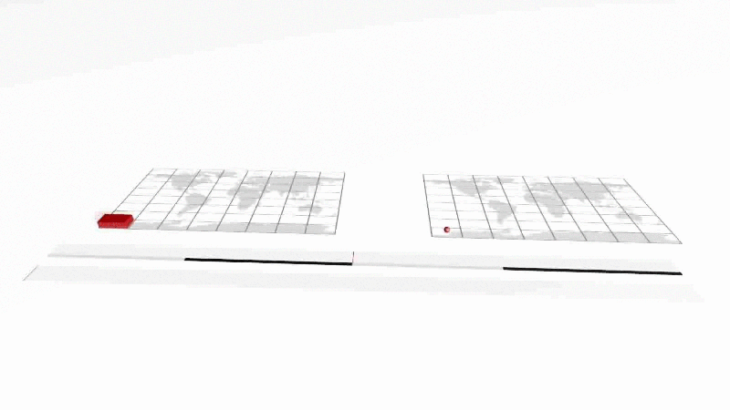
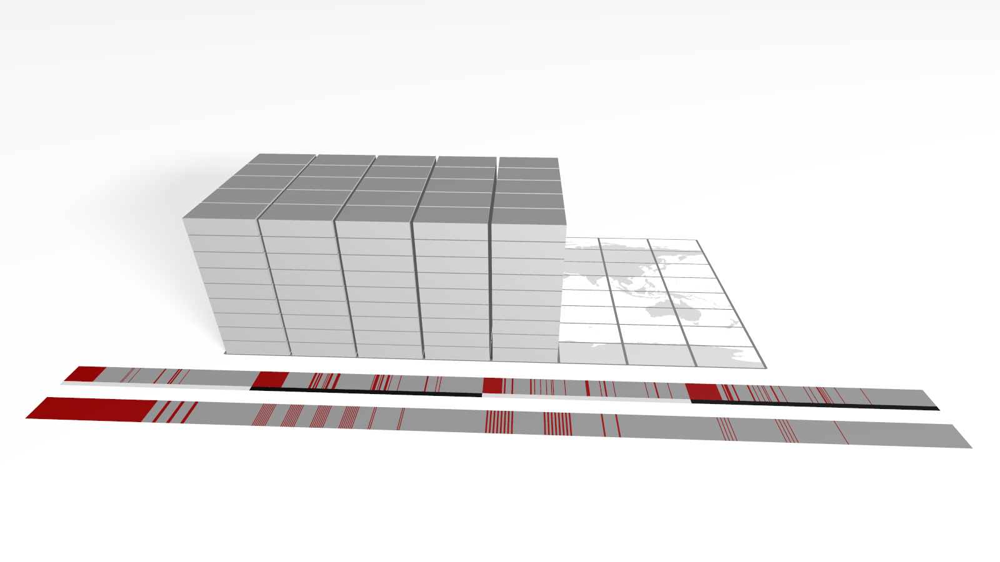

Geohash Ranges
==============

Encoding a (geometry, date-time) pair is only useful when those encoded
entries can be found quickly. That is the job of the query planner. In
this post, we present one challenge the query planner in GeoMesa has to
overcome: How to identify the Geohash prefixes that cover a query
polygon.

Indexing Geo-Time Data
~~~~~~~~~~~~~~~~~~~~~~

`Accumulo <http://accumulo.apache.org>`__ -- GeoMesa's primary backing
data store -- is a distributed, sorted key-value store in which the only
system-level index is the lexicographical ordering of the keys.  
Indexing geo-time data is a matter of finding a sensible way to flatten
three dimensions of data -- longitude, latitude, and time -- into a
single dimension: the list of Accumulo keys. The specific flattening
is described by an index-schema format, a customizable `space-filling
curve <http://en.wikipedia.org/wiki/Space-filling_curve>`__ that
interleaves portions of the location's `Geohash <http://geohash.org>`__
with portions of the date-time string.  

The following animation depicts a simple space-filling curve in which
the index-schema format is 10 bits that follow the pattern "YXTTYXTTYX",
with the time dimension represented on the Z-axis. This encoding is a
simplified version of what GeoMesa uses as the default index-schema
format.

The two ribbons in front of the space-time cube represent the single,
logical list of cell identifiers (in the foreground); and the same list
in which each cell has been randomly assigned to one of four partitions
(in the background, with each partition identified by a gray or black
stripe next to the ribbon).

Planning a Query
~~~~~~~~~~~~~~~~

If you keep the image of the preceding space-time cube in mind, then you
might intuit that a query plan is really a list of contiguous cell
ranges that fall inside the desired geographic area and time interval.
As an example, assume we had this query:

 * -180 ≤ longitude < 45
 * -90 ≤ latitude < 22.5
 * 0 < time < 9 (on an arbitrary scale of 0 to 16 for this illustration)

This corresponds to just over half of the lowest values in each of the
three dimensions. The visual selection of cells and their locations in
both the global list of keys as well as the sharded lists of keys are
depicted in this image:

This example uses a 10-bit encoding, so there are only 1024 cells in the
cube. The default GeoMesa index-schema format uses more than 55 bits in
the encoding, resulting in more than 36 quadrillion possible cells, so
an exhaustive search would take far too long to be practical.
Fortunately, both the Geohash used to encode locations and the strings
used to encode date-times are hierarchical: The Geohash whose encoding
begins with "0100" contains Geohash "01000", "01001", "010001011" and
every other Geohash whose encoding starts with those four digits. Dates
work similarly, because 2014 includes all twelve months as well as all
365 days. To simplify the discussion, we will omit the date portion, and
focus on how the query planner identifies the ranges of contiguous
Geohash values.

The Algorithm
~~~~~~~~~~~~~

In Scala-esque pseudo code, the algorithm is:

.. code-block:: scala

    // assume that any Geohash that makes it into this function
    // is already known to intersect the query polygon
    def getGeohashPrefixes(gh: Geohash): Set = {
      // if this Geohash is at the maximum precision,
      // simply return it
      if (gh.precision >= precision) gh
      else {
        // if the Geohash is wholly contained in the target
        // polygon, we need look no further:  all of its
        // children will also be wholly contained, because
        // they nest
        if (polygon.contains(gh)) gh
        else {
          // recurse into all children that intersect the
          // query polygon, but start with the child whose
          // centroid is closer to that of the target
          val leftChild = GeoHash(gh.binaryString + "0")
          val rightChild = GeoHash(gh.binaryString + "1")
          if (distance(polygon, leftChild) <= distance(polygon, rightChild) {
            // the left child is closer, so start there
            (if (polygon.intersects(leftChild) getGeohashPrefixes(leftChild) else Nil) +
            (if (polygon.intersects(rightChild) getGeohashPrefixes(rightChild) else Nil)
          } else {
            // right right child is closer, so start there
            (if (polygon.intersects(rightChild) getGeohashPrefixes(rightChild) else Nil) +
            (if (polygon.intersects(leftChild) getGeohashPrefixes(leftChild) else Nil)
          }
        }
      }
    }

    // fetch all prefixes that intersect the target polygon,
    // starting with the 0-bit Geohash, the entire world
    getGeoHashPrefixes(GeoHash())

Here is an animated GIF that shows how, given a query polygon that
roughly approximates the continental USA, this algorithm steps through
identifying Geohash prefixes whose precision is less than or equal to 10
bits:

.. image:: _static/geohash-substrings/usa.gif

The query polygon is colored yellow. Each of the non-terminal Geohashes
that intersects the query polygon is shaded white with a red square
indicating which of its two children will be the first candidate
considered. The Geohashes that are uncolored are ones that have not yet
been explicitly visited; those that are shaded red are Geohashes that
constitute prefixes that remain in the final result set; Geohashes that
are shaded dark gray are those that have been rejected, because they do
not intersect the target polygon at all.

This discussion of the algorithm is coarse, in part because its role in
the overall query process has been simplified to streamline the
explanation in this short note. The full version as used within the
query planner can be found nested inside the
`getUniqueGeohashSubstringsInPolygon`_
method, where it enables GeoMesa to enumerate the unique substrings of
larger Geohashes quickly and efficiently, expediting the entire
query-planning process.

.. _getUniqueGeohashSubstringsInPolygon: https://github.com/locationtech/geomesa/blob/geomesa_2.11-1.3.0-m0/geomesa-utils/src/main/scala/org/locationtech/geomesa/utils/geohash/GeohashUtils.scala#L937

Addendum
--------

If you remain interested, you might make a good contributor to GeoMesa.
Please do! In the interim, here are some topics that provide additional
background:

-  `Z-order curves <http://en.wikipedia.org/wiki/Z-order_curve>`__
-  `Hilbert curves <http://en.wikipedia.org/wiki/Hilbert_curve>`__
-  The `SFCurve <https://github.com/locationtech/sfcurve>`__ project

