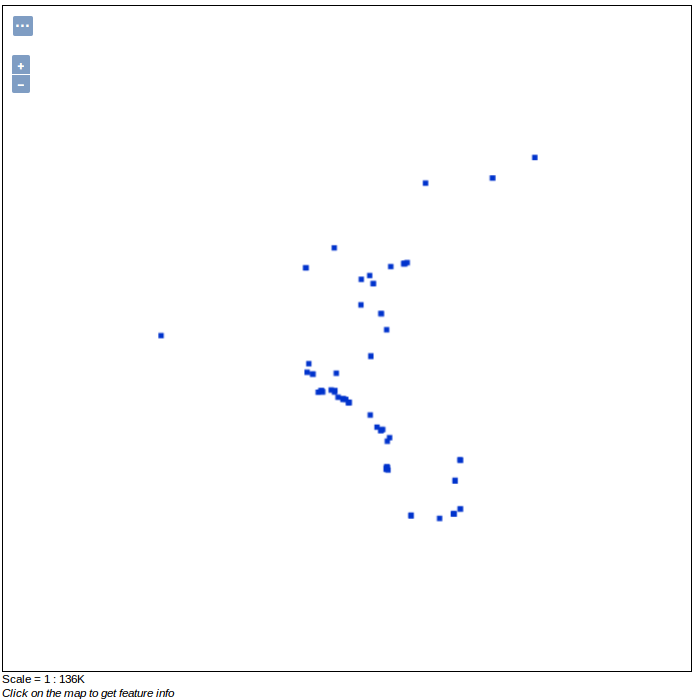
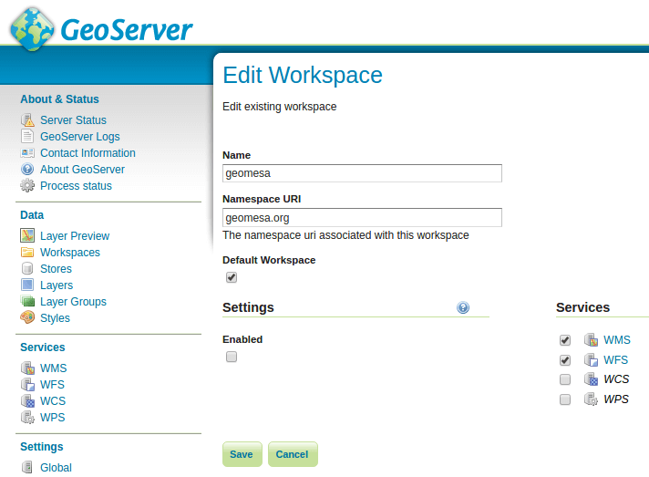

GeoMesa BlobStore EXIF
======================

This tutorial will show you:

1. How to deploy the EXIF handler to ingest geotagged images
2. How to view the spatial index of the BlobStore in geoserver
3. How to query the index for individual blobs
4. How to download blobs from the BlobStore

Prerequisites
-------------

.. warning::

    For Accumulo deployment, you will need access to an Accumulo |accumulo_version| instance.

Before you begin, you should have these:

-  basic knowledge of `GeoTools <http://www.geotools.org>`__ and
   `GeoServer <http://geoserver.org>`__
-  access to a `GeoServer <http://geoserver.org/>`__ 2.8.x installation
-  an Accumulo user that has both create-table and write permissions

Before you begin, you should have followed the instructions for setting up the blobstore in :doc:`/user/blobstore`.

Introduction
------------

The GeoMesa BlobStore is able to handle a variety of file types by using a pluggable interface for FileHandlers.
This allows support for new file formats to be quickly integrated. GeoMesa comes with a handler for EXIF headers,
which are included in a variety of image formats from digital cameras that will be demonstrated by this tutorial.
Also demonstrated in this tutorial is querying the BlobStore's DataStore index for Blobs and demonstrating the two
step query - fetch workflow users use to interact with the BlobStore.

GeoMesa BlobStore EXIF Handler Installation Instructions
--------------------------------------------------------

As the FileHandlers use the Java Service Registry, they can be loaded at runtime by simply placing the jar
for the handler into the existing classpath. For this tutorial, we assume the user is deploying
the EXIF FileHandler to an existing GeoServer with the BlobStore web servlet. See instructions above for
setting up the BlobStore in the prerequisites.

To deploy the EXIF FileHandler if you are using Tomcat run:

.. code-block:: bash

    $ tar -xzvf \
      geomesa-$VERSION/geomesa-blobstore/geomesa-blobstore-handler/geomesa-blobstore-exif-handler/target/geomesa-blobstore-exif-handler_2.11-$VERSION.jar \
      -C /path/to/tomcat/webapps/geoserver/WEB-INF/lib/

To deploy the EXIF FileHandler if you are using GeoServer's built in Jetty web server:

.. code-block:: bash

    $ tar -xzvf \
      geomesa-$VERSION/geomesa-blobstore/geomesa-blobstore-handler/geomesa-blobstore-exif-handler/target/geomesa-blobstore-exif-handler_2.11-$VERSION.jar \
      -C /path/to/geoserver/webapps/geoserver/WEB-INF/lib/

Now the BlobStore is able to read image files with EXIF metadata headers.

Using the EXIF Handler
----------------------
In order to use our new handler, we will need to get some geotagged images.
Below is a partial Python script that uses the Flickr API to grab some geotagged images taken around Monument Valley.
Using the Flickr API is beyond the scope of this tutorial; however the Python code snippet is provided for those
interested in obtaining a test data set. The below script will download 100 images to the user's home directory.

.. code-block:: python

    import flickrapi
    import requests
    import itertools
    api_key = u'Some API Key'
    secret  = u'some secret'

    flickr = flickrapi.FlickrAPI(api_key, secret)
    flickr.authenticate_console(perms='read')
    photos = flickr.photos_search(lat='37.0000', lon='-110.1700', radius='10', safe_search='1', extras='url_o')

    urls = itertools.islice((p.attrib['url_o'] for p in photos[0] if 'url_o' in p.keys()), 100)

    for i, url in enumerate(urls):
        with open('~/flickr{0:03d}.jpg'.format(i), 'wb') as fd:
            r = requests.get(url)
            for chunk in r.iter_content(1024):
                fd.write(chunk)

First we need to register a BlobStore using the following command. Note that the parameters for user/password/zookeepers/instanceId need to be modified to suite your environment:

.. code-block:: bash

    $ curl -d 'instanceId=myCloud' -d 'zookeepers=zoo1,zoo2,zoo3' -d 'tableName=myblobstore' -d 'user=user' -d 'password=password' http://localhost:8080/geoserver/geomesa/blobstore/ds/myblobstore

To ingest the files, we can write a simple bash loop to use cURL on each file to ingest to the BlobStore.

.. code-block:: bash

    $ for f in *.jpg; do curl -X POST -F file=@$f http://localhost:8080/geoserver/geomesa/blobstore/blob/myblobstore ; done

The files have now been ingested.

Register Index table in GeoServer
---------------------------------

The BlobStore index DataStore is an ordinary GeoTools DataStore, so the registration in GeoServer is no different than for other DataStores.
For an example of registering a DataStore in GeoServer please follow these :doc:`/user/geoserver`.

Once the layer is registered we can view the layer in the GeoServer layer previewer.

Querying the Index for Blobs
----------------------------

To Query for blobs in the spatio-temporal index we will need to enable WFS queries for the layer in GeoServer.
Ensure the Workspace in which the BlobStore index DataStore was registered has the WFS service enabled.
This can be verified by clicking through to Workspaces -> (your workspace) -> Checkbox next to WFS -> Save, in the GeoServer UI.

This can also be achieved through the `GeoServer REST API <http://docs.geoserver.org/stable/en/user/rest/index.html>`__
which is beyond the scope of this tutorial.

Explaining WFS requests are beyond the scope of this tutorial, however listed below are some links to relevant documentation.
A detailed description of WFS can be found here `GeoServer WFS reference <http://docs.geoserver.org/stable/en/user/services/wfs/reference.html>`__ .
Further details on ECQL predicates are listed here: `GeoServer ECQL reference <http://docs.geoserver.org/stable/en/user/filter/ecql_reference.html#filter-ecql-reference>`__ .

Request for all features of provided type:

.. code-block:: bash

    $ curl -X GET 'http://localhost:8080/geoserver/wfs?service=wfs&version=2.0.0&request=GetFeature&typeNames=<workspace>:blob'

Request for all filenames contained in index:

.. code-block:: bash

    $ curl -X GET 'http://localhost:8080/geoserver/wfs?service=wfs&version=2.0.0&request=GetFeature&typeNames=<workspace>:blob&propertyName=filename'

Request for all features within a BBOX via ECQL:

.. code-block:: bash

    $ curl -X GET 'http://localhost:8080/geoserver/wfs?service=wfs&version=2.0.0&request=GetFeature&typeNames=<workspace>:blob&cql_filter=BBOX(geom,0,0,90,-180)'

Downloading Blobs
-----------------

After performing a WFS query for relevant blob ids, you can use the BlobStore RESTful api to download a given blob by
the blob id and alias for the BlobStore.

.. code-block:: bash

    $ curl -JO http://localhost:8080/geoserver/geomesa/blobstore/blob/:alias/some-id

You can also use the GZip support to minimize network utilization by running

.. code-block:: bash

    $ curl --compressed -JO http://localhost:8080/geoserver/geomesa/blobstore/blob/:alias/some-id

