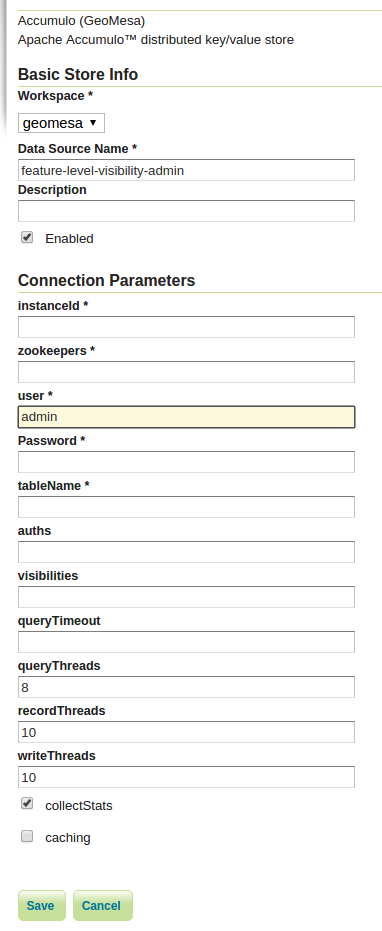

Feature Level Visibility and Security
=====================================

GeoMesa supports security on a per-feature level, which allows data to be
filtered on a granular level for different users. It is a more advanced tutorial;
you should already be familiar with the basics of GeoMesa and GeoServer. This tutorial
targets Accumulo - GeoMesa also supports HBase visibilities through the same mechanisms,
but the HBase configuration required is not covered here. See :ref:`hbase_visibilities`
for more information on HBase.

In this tutorial, you will learn how to:

1. Set visibilities on your features during ingestion into GeoMesa
2. Apply authorizations to your queries through GeoMesa

For information how to configure a secure environment that can leverage feature visibilities,
see :doc:`./geomesa-examples-authorizations`.

Prerequisites
-------------

Before you begin, you must have the following:

-  `Java <http://java.oracle.com/>`__ JDK 1.8
-  Apache `Maven <http://maven.apache.org/>`__ |maven_version|
-  a GitHub client
-  an Accumulo |accumulo_version| instance
-  an Accumulo user that has both create-table and write permissions
-  the GeoMesa distributed runtime installed for your instance

If you are not familiar with Accumulo authorizations, you should review
the relevant Accumulo
`documentation <http://accumulo.apache.org/1.7/accumulo_user_manual.html#_security>`__,
with more examples
`here <http://accumulo.apache.org/1.7/examples/visibility.html>`__.

About this Tutorial
-------------------

This tutorial operates by inserting and then querying several thousand features.
The features are inserted with visibility labels, and then queried with two different users
to show how authorizations work.

Download and Build the Tutorial
-------------------------------

Pick a reasonable directory on your machine, and run:

.. code-block:: bash

    $ git clone https://github.com/geomesa/geomesa-tutorials.git
    $ cd geomesa-tutorials

.. warning::

    Make sure that you download or checkout the version of the tutorials project that corresponds to
    your GeoMesa version. See :ref:`tutorial_versions` for more details.

To ensure that the quick start works with your environment, modify the ``pom.xml``
to set the appropriate versions for Accumulo, Hadoop, etc.

For ease of use, the project builds a bundled artifact that contains all the required
dependencies in a single JAR. To build, run:

.. code-block:: bash

    $ mvn clean install -pl geomesa-tutorials-accumulo/geomesa-tutorials-accumulo-feature-level-vis -am

Run the Tutorial
----------------

On the command line, run:

.. code-block:: bash

    $ java -cp geomesa-tutorials-accumulo/geomesa-tutorials-accumulo-feature-level-vis/target/geomesa-tutorials-accumulo-feature-level-vis-${geomesa.version}.jar \
        org.geomesa.example.accumulo.vis.FeatureLevelVisibilityTutorial \
        --accumulo.instance.id <instance>                                  \
        --accumulo.zookeepers <zookeepers>                                 \
        --accumulo.user <user>                                             \
        --accumulo.password <password>                                     \
        --accumulo.catalog <table>

where you provide the following arguments:

-  ``<instance>`` the name of your Accumulo instance
-  ``<zookeepers>`` your Zookeeper nodes, separated by commas
-  ``<user>`` the name of an Accumulo user that has permissions to
   create, read and write tables
-  ``<password>`` the password for the previously-mentioned Accumulo
   user
-  ``<table>`` the name of the destination table that will accept these
   test records. This table should either not exist or should be empty

.. warning::

    If you have set up the GeoMesa Accumulo distributed
    runtime to be isolated within a namespace (see
    :ref:`install_accumulo_runtime_namespace`) the value of ``<table>``
    should include the namespace (e.g. ``myNamespace.geomesa``).

Optionally, you can also specify that the tutorial should delete its data upon completion. Use the
``--cleanup`` flag when you run to enable this behavior.

Once run, you should see the following output:

.. code-block:: none

    Loading datastore

    Creating schema: GLOBALEVENTID:String,Actor1Name:String,Actor1CountryCode:String,Actor2Name:String,Actor2CountryCode:String,EventCode:String,NumMentions:Integer,NumSources:Integer,NumArticles:Integer,ActionGeo_Type:Integer,ActionGeo_FullName:String,ActionGeo_CountryCode:String,dtg:Date,geom:Point,visibility:String

    Generating test data

    Writing test data
    Wrote 2356 features

    Done

Looking at the Code
-------------------

The source code is meant to be accessible for this tutorial. The main logic is contained in
``org.geomesa.example.accumulo.vis.FeatureLevelVisibilityTutoriall`` in the
``geomesa-tutorials-accumulo/geomesa-tutorials-accumulo-feature-level-vis`` module. Some relevant methods are:

-  ``getSimpleFeatureType`` add an extra attribute to the base GDELT feature type
-  ``getTestFeatures`` set visibilities on each feature

.. code-block:: java

    SimpleFeature feature = features.get(i);
    String visibilities;
    if (i % 2 == 0) {
        visibilities = "admin";
    } else {
        visibilities = "user|admin";
    }
    // set the visibility as user data in the feature
    SecurityUtils.setFeatureVisibility(feature, visibilities);
    // also set as an attribute for visualization
    feature.setAttribute("visibility", visibilities);

This code snippet shows how you can specify the visibilities for each feature.
``SecurityUtils.setFeatureVisibility`` sets the visibilities string as user data in the feature.
When writing to Accumulo, GeoMesa will use that user data to apply the appropriate Accumulo visibility
string to the record.

Half the data is marked as ``admin``, which means only a user with that authorization can view it. The
other half is marked as ``user|admin``, which means that both admin authorizations and user authorizations are
sufficient to view the data. Unless users are explicitly granted permissions to read features with that level of
authorization, we cannot visualize the data in a meaningful way. Next we will add new Accumulo users to do just
that.

Adding New Accumulo Users
-------------------------

In this part of the tutorial, we'll use the Accumulo shell to add users. First, login to Accumulo with:

.. code-block:: bash

    $ accumulo shell -u <username> -p <password>

You should then see something similar to this:

.. code-block:: bash

    Shell - Apache Accumulo Interactive Shell
    -
    - version: 1.8.1
    - instance name: xxxxx
    - instance id: xxxxxxxx-xxxx-xxxx-xxxx-xxxxxxxxxxxx
    -
    - type 'help' for a list of available commands
    -
    myUser@accumulo>

Now, we're ready to add new users to Accumulo with the Accumulo shell
``createuser`` command. At the prompt, run:

.. code-block:: bash

    > createuser user
    Enter new password for 'user': ***********
    Please confirm new password for 'user': ***********
    > createuser admin
    Enter new password for 'admin': ***********
    Please confirm new password for 'admin': ***********

With these new users added, we're going to give them the proper
authorizations with the ``setauths`` command:

.. code-block:: bash

    > setauths -s admin,user -u admin
    > setauths -s user -u user

This will grant authorizations ``admin,user`` to ``admin``, meaning as
the user ``admin``, one will be able to read both features written with
the visibility ``user`` and features written with the visibility
``admin``. Additionally, the user ``user`` will be granted ``user``
authorizations, meaning they can only view features of visibility
``user``. They will never see features written with the visibility
``admin``.

Next we'll grant permissions to the read the appropriate tables to
``user`` and ``admin``. Replace ``<table>`` in the following command with
the table you specified when running the tutorial code.

.. code-block:: bash

    > grant -u user -p <table>.* Table.READ
    > grant -u admin -p <table>.* Table.READ

To verify user permissions you can switch users in the accumulo console
by using:

.. code-block:: bash

    > user admin
    Enter password for user admin: ******

We can now move to the table we'd like to verify. Here we use
``<table>_z2_v2`` but any valid table will work.

.. code-block:: bash

    > table <table>_z2_v2
    > scan
    \x01\x00\x0C0\xB0Pf\x0A&\x19Observation.99 F: [user|admin]    \x02\x00\x00\x00CAddam\xF3\x01\x00\x00\x00\x00\x00\x00\x00c\x01\x00\x00\x01H\xAC\xB4;\xB0\x01\x08\x03\xC0Sz\x1Ff\x15}H\xC0C(\xC5jq\x08\x8F\x7F\xF8\x00\x00\x00\x00\x00\x00\x80user|admi\xEE\x05\x0B\x14\x1D89
    \x01\x00\x0C0\xB22\xB7-\xA4;Observation.585 F: [user|admin]    \x02\x00\x00\x00CAddam\xF3\x01\x00\x00\x00\x00\x00\x00\x02I\x01\x00\x00\x01DUby\xE8\x01\x08\x03\xC0S\x7F\xDF\x0Aw\xD9\x14\xC0C\x19\xA4\xFC{\xE7\xA6\x7F\xF8\x00\x00\x00\x00\x00\x00\x80user|admi\xEE\x05\x0B\x14\x1D89
    ---------------hit any key to continue or 'q' to quit ------------------

``scan`` should return a sample of the data if everything is configured
correctly.

Next we'll use GeoServer to visualize feature level visibility.

GeoServer Visualization
-----------------------

Assuming you have already set up GeoServer as described in the GeoMesa
User Manual, we're going to add a new ``DataStore`` to GeoServer. First,
login to GeoServer, and then click "Add stores" from the homepage.

Next, click the link to add a new "Accumulo (GeoMesa)" store and name it
``feature-level-visibility-admin``. Fill in the correct connection
parameters to make contact with GeoMesa/Accumulo, but be sure to use
``admin`` for the "user" parameter.

   GeoMesa DataStore configuration with "admin" user

Then, publish your layer when prompted by GeoServer. Remember to click
the "Compute from data" and "Compute from native bounds" links on the
"Add Layer" page, and click "Save".

Repeat the above steps one more time to add an additional ``DataStore``
with the same parameters, but this time, name it
``feature-level-visibility-user`` and use ``user`` for the "user"
parameter.

With your layers added in GeoServer, we're nearly ready to visualize the
data. One final step is adding our custom SLD that will style your
features to make visualizations of the data even easier to understand.

Download :download:`feature-level-vis.sld <_static/geomesa-examples-featurelevelvis/feature-level-vis.sld>`,
or copy the contents, and add it as a Style in GeoServer. It will style the points on
a map based on the visibility attribute present.

Lastly, click on "Layer Preview" in the left hand sidebar and find your
two newly added layers. If everything went correctly, you should see
fewer results returning in the ``user`` layer than in the ``admin``
layer, and this is expected behavior. Because ``user`` has only been
granted permission to view features with the ``user`` visibility, only
that half of the records are returned. However, the ``admin`` user is granted
permission to see both ``admin`` and ``user`` visibilities.

Expanding The Concept
---------------------

In this very simple example, you wrote features of two different
visibilities, added two new users to Accumulo, and granted them separate
authorization levels to be able to view portions of the data. This
tutorial has real-world use cases in security and data integrity. For
example, when storing sensitive data and having users of varying
authorization and security levels querying that data, visibility labels
ensure that sensitive data is not leaked to a user of a lower level of
security.

The concept of feature level visibility can be extended and modified to
have many more, or only a few, visibility levels. And with GeoServer
being flexible and extensible, writing a module to consider feature
level security in GeoServer is relatively painless.

GeoMesa also provides a mechanism to have authorizations applied on a
per-user level, instead of a per-datastore level. More information,
including integration with PKI and LDAP, can be found in the Authorizations
tutorial under :ref:`authorizations-gs-pki-ldap`.
