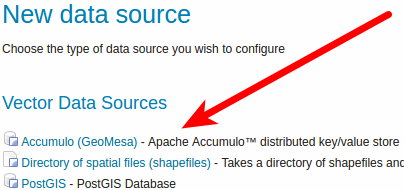
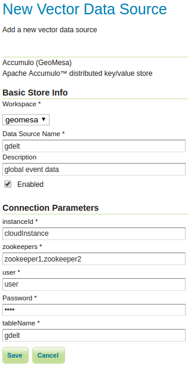
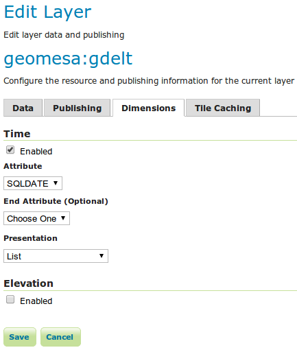
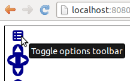
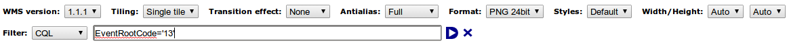
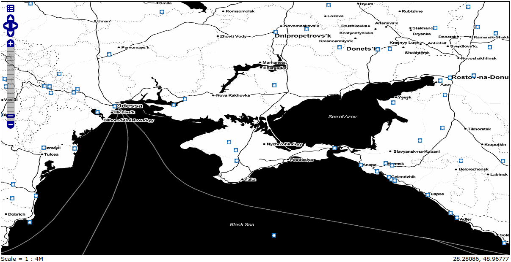
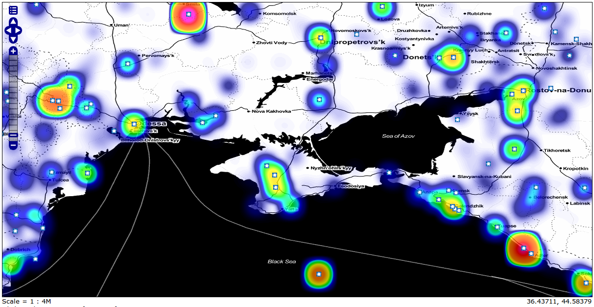

Map-Reduce Ingest of GDELT
==========================

This tutorial shows how to:

1. Ingest big `GDELT <http://www.gdeltproject.org>`__ data files into a
   GeoMesa Accumulo table via a Hadoop Map/Reduce job.
2. Leverage GeoServer to query and visualize the data.

Prerequisites
-------------

.. warning::

    You will need access to a Hadoop 2.2.2 or better
    installation as well as an Accumulo |accumulo_version| database.

You will also need:

-  access to an Accumulo user that has both create-table and write
   permissions
-  an instance of GeoServer |geoserver_version| with the GeoMesa plugin installed,
-  `Java JDK 8 <http://www.oracle.com/technetwork/java/javase/downloads/index.html>`__,
-  `Apache Maven <http://maven.apache.org>`__ |maven_version|
-  a `git <http://git-scm.com>`__ client

Obtaining GDELT data
--------------------

The `GDELT Event database <http://www.gdeltproject.org>`__ provides a
comprehensive time- and location-indexed archive of events reported in
broadcast, print, and web news media worldwide from 1979 to today. You
can download raw GDELT data files at
http://data.gdeltproject.org/events/index.html. For example, the
following Bash commands use ``wget`` to download all event files for
2013 and 2014 (5 GB compressed, 30 GB uncompressed) and ``md5sum`` to
verify each by their MD5 hash:

.. code-block:: bash

    $ mkdir gdelt && cd gdelt
    $ wget http://data.gdeltproject.org/events/md5sums
    $ for file in `cat md5sums | cut -d' ' -f3 | grep '^201[34]'` ; do wget http://data.gdeltproject.org/events/$file ; done
    $ md5sum -c md5sums 2>&1 | grep '^201[34]'

Note: the whole GDELT data set is very large, over 100 GB compressed and
over 1 TB uncompressed. We download all data for 2013-2014 as we look at
events in the Ukraine in this time period in the **ANALYZE** section
below. However, you may load a smaller dataset for demonstration
purposes; data for a typical month is about ~2 GB uncompressed, but you
will see fewer data in the analysis below. In any case, omit the
aggregated, reduced GDELT data in
``GDELT.MASTERREDUCEDV2.1979-2013.zip``, which has fewer columns than
the fully-described event data in the other files, and is not supported
by the ingest code described below.

In the directory with the ``*.zip`` data files, use the following
command to unpack and aggregate them into a file called ``gdelt.tsv`` on
the Hadoop file system:

.. code-block:: bash

    $ (ls -1 *.zip | xargs -n 1 zcat) | hadoop fs -put - /gdelt/uncompressed/gdelt.tsv

Note: the individual files, when uncompressed, have ``*.csv``
extensions, but the data contained within them are tab-separated values,
hence the ``*.tsv`` extension. See the `GDELT raw data file
documentation <http://www.gdeltproject.org/data.html#rawdatafiles>`__
for more information on the format of these files.

Download and Build the Tutorial
-------------------------------

Pick a reasonable directory on your machine, and run:

.. code-block:: bash

    $ git clone git@github.com:geomesa/geomesa-tutorials.git
    $ cd geomesa-tutorials

To build, run

.. code-block:: bash

    $ mvn clean install -pl geomesa-examples-gdelt

.. note::

    Ensure that the version of Accumulo, Hadoop, etc in
    the root ``pom.xml`` match your environment.

.. note::

    Depending on the version, you may also need to build
    GeoMesa locally. Instructions can be found under
    :doc:`/user/installation_and_configuration`.

Running the Ingest
------------------

Use ``hadoop jar`` to launch the Map/Reduce ingest job:

.. code-block:: bash

    $ hadoop jar geomesa-examples-gdelt/target/geomesa-examples-gdelt-<version>.jar \
        com.example.geomesa.gdelt.GDELTIngest            \
        -instanceId <accumulo-instance-id>               \
        -zookeepers <zookeeper-hosts-string>             \
        -user <username> -password <password>            \
        -auths <comma-separated-authorization-string>    \
        -tableName gdelt -featureName event              \
        -ingestFile hdfs:///gdelt/uncompressed/gdelt.tsv

Note that authorizations are optional. Unless you know that your table
already exists with explicit authorizations, or that it will be created
with default authorizations, you probably want to omit this parameter.

DataStore Initialization
~~~~~~~~~~~~~~~~~~~~~~~~

`GeoTools <http://www.geotools.org>`__ uses a ``SimpleFeatureType`` to
represent the schema for individual ``SimpleFeatures`` created from the
GDELT data. We can easily create a schema for the GDELT
``SimpleFeatureType`` using the `GeoTools DataUtilities
class <http://docs.geotools.org/latest/userguide/library/main/feature.html>`__.
The schema string is a comma separated list of attribute descriptors of
the form ":", e.g. "Year:Integer". Some attributes may have a third term
with an appended "hint", e.g. "geom:Point:srid=4236", and the default
geometry attribute is often prepended with an asterisk. For example, a
complete schema string for a ``SimpleFeatureType`` describing a city
with a latitude/longitude point, a name, and a population might be
"\*geom:Point:srid=4326,cityname:String,population:Integer".

This is how ``GDELTIngest.java`` creates the ``SimpleFeatureType`` for
the GDELT event data:

.. code-block:: java

    static List<String> attributes = Lists.newArrayList(
        "GLOBALEVENTID:Integer",
        "SQLDATE:Date",
        "MonthYear:Integer",
        "Year:Integer",
        "FractionDate:Float",
        //...
        "*geom:Point:srid=4326"
    );
    String spec = Joiner.on(",").join(attributes);
    SimpleFeatureType featureType = DataUtilities.createType(name, spec);

After we create the GDELT feature type, we have to tell GeoMesa which
field to use for the date index. We specify this field using the
``SimpleFeatureType``'s user data.

.. code-block:: java

    //This tells GeoMesa to use this Attribute as the Start Time index
    featureType.getUserData().put(Constants.SF_PROPERTY_START_TIME, "SQLDATE");

Finally, we create the new feature type in GeoMesa as follows.

.. code-block:: java

    ds.createSchema(featureType);

Mapper
~~~~~~

In the ``setup`` method of the Mapper class, we create a
``FeatureBuilder`` for the GDELT ``SimpleFeatureType`` we created in the
initialization.

.. code-block:: java

    String featureName = context.getConfiguration().get(GDELTIngest.FEATURE_NAME);
    SimpleFeatureType featureType = GDELTIngest.buildGDELTFeatureType(featureName);
    featureBuilder = new SimpleFeatureBuilder(featureType);

The input to the map method is a single line of the GDELT TSV file. We
split the line on tabs and extract the attributes of the data. We parse
the latitude and longitude field to set the default geometry of our
``SimpleFeature``.

GeoTools provides common conversions for most data types and some date
formats. However, any attribute strings that will not convert
automatically into the specified class need to be explicitly set on the
``SimpleFeature``. See "SQLDATE" below.

.. code-block:: java

    featureBuilder.reset();
    featureBuilder.addAll(attributes);

    Double lat = Double.parseDouble(attributes[LATITUDE_COL_IDX]);
    Double lon = Double.parseDouble(attributes[LONGITUDE_COL_IDX]);
    Geometry geom = geometryFactory.createPoint(new Coordinate(lon, lat));
    SimpleFeature simpleFeature = featureBuilder.buildFeature(attributes[ID_COL_IDX]);
    simpleFeature.setAttribute("SQLDATE", formatter.parse(attributes[DATE_COL_IDX]));
    simpleFeature.setDefaultGeometry(geom);

We leverage the ``GeoMesaOutputFormat`` in order to write
``SimpleFeature``\ s to Accumulo. Once we have created the
``SimpleFeature``, all we have to do is write it to the output context:

.. code-block:: java

    context.write(new Text(), simpleFeature);

Analyze
-------

GeoServer Setup
~~~~~~~~~~~~~~~

First, follow :doc:`/user/installation_and_configuration` to set up the
GeoMesa GeoServer plugin if you haven't done so.

Register the GeoMesa DataStore with GeoServer
~~~~~~~~~~~~~~~~~~~~~~~~~~~~~~~~~~~~~~~~~~~~~

Click "Stores" and "Add new Store". If you do not see the Accumulo
Feature Data Store listed under Vector Data Sources, ensure the plugin
is in the right directory and restart GeoServer.

Register the newly created Accumulo table using the same parameters
specified in the command line above. (If you use a workspace:layer name
other than "geomesa:gdelt", you will need to change the WMS requests
that follow.)

Publish layer
~~~~~~~~~~~~~

After registering the DataStore, click to publish the layer. You will be
taken to the Edit Layer screen. In the Data pane, enter values for the
bounding boxes. For the whole world, use [-180,-90,180,90]. In the
Dimensions pane, enable Time and select the SQLDATE field. You will also
need to specify a presentation for time - use List as a default.

Query
~~~~~

Let's look at events in the Ukraine from 2013 until April 30, 2014. The
red squares are the default styling that GeoServer applies to point
data.

.. code-block:: bash

    http://localhost:8080/geoserver/wms?service=WMS&version=1.1.0&request=GetMap&layers=geomesa:gdelt&styles=&bbox=31.6,44,37.4,47.75&width=1200&height=600&srs=EPSG:4326&format=application/openlayers&TIME=2013-01-01T00:00:00.000Z/2014-04-30T23:00:00.000Z

.. figure:: _static/geomesa-examples-gdelt/Ukraine_Unfiltered.png
   :alt: Showing all GDELT events from Jan 1, 2013 to April 30, 2014

The above map is using the `Stamen
Toner <http://maps.stamen.com/toner>`__ layer as a base layer. For more
information about adding multiple layers into one group see the
`GeoServer
documentation <http://docs.geoserver.org/stable/en/user/webadmin/data/layergroups.html>`__.

Filter
~~~~~~

Let's narrow our results. GDELT labels events with `CAMEO (Conflict and
Mediation Event
Observations) <http://www.gdeltproject.org/data.html#documentation>`__
codes. The CAMEO code for events of type 'THREATEN' starts with '13'. We
can filter down to these events using the drop down in GeoServer's
OpenLayers preview.

Let's use a custom icon to display THREATEN events, by adding an `SLD
style <http://docs.geoserver.org/latest/en/user/styling/index.html>`__
to the layer. Add the SLD file
:download:`threat.sld <_static/geomesa-examples-gdelt/threat.sld>`
to GeoServer (See the GeoServer documentation for `more information
about adding SLD
files <http://docs.geoserver.org/latest/en/user/styling/sld-working.html>`__.
For the ExternalGraphic in the SLD to work, move the image file to the
specified location in your GeoServer installation.

.. code-block:: bash

    http://localhost:8080/geoserver/wms?service=WMS&version=1.1.0&request=GetMap&layers=geomesa:gdelt&CQL_FILTER=EventRootCode=13&styles=threat&bbox=31.6,44,37.4,47.75&width=1200&height=600&srs=EPSG:4326&format=application/openlayers&TIME=2013-01-01T00:00:00.000Z/2014-04-30T23:00:00.000Z

Heatmaps
~~~~~~~~

Use a heatmap to more clearly visualize multiple events in the same
location or high volume of data in general. Add the SLD file
:download:`heatmap.sld <_static/geomesa-examples-gdelt/heatmap.sld>` to
GeoServer.

In the request below, the heatmap is before the points layer so that the
points will be overlaid and not hidden. Notice the
"&env=radiusPixels:30" in the URL; this is SLD variable substitution,
and will replace the default value assigned in the SLD.

.. code-block:: bash

    http://localhost:8080/geoserver/wms?service=WMS&version=1.1.0&request=GetMap&layers=geomesa:gdelt,geomesa:gdelt&CQL_FILTER=include;EventRootCode=13&styles=heatmap,threat&bbox=31.6,44,37.4,47.75&width=1200&height=600&srs=EPSG:4326&format=application/openlayers&TIME=2013-01-01T00:00:00.000Z/2014-04-30T23:00:00.000Z&env=radiusPixels:30

