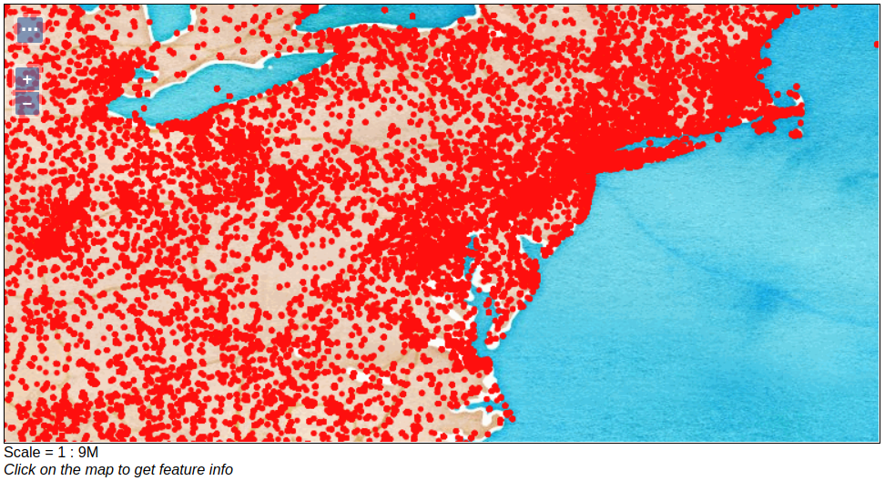
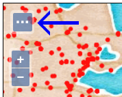
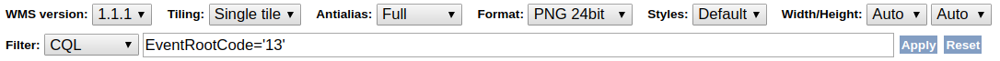
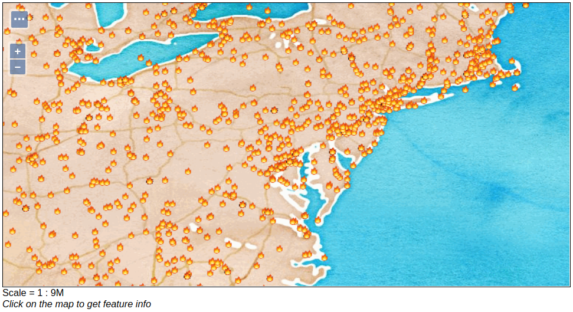
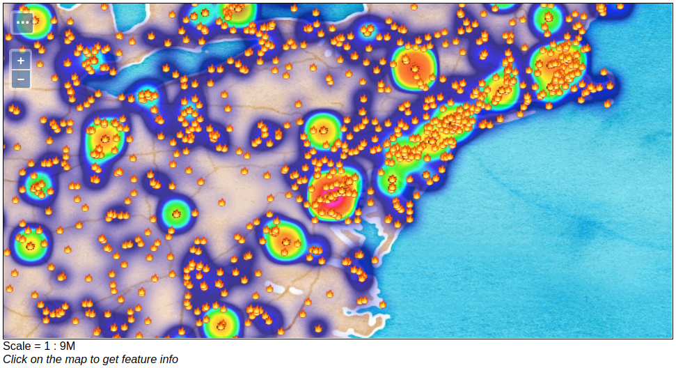

Map-Reduce Ingest of GDELT
==========================

GeoMesa makes it easy to get started with big data. Using the included command-line tools, you can
launch map/reduce jobs to ingest data in a distributed fashion, with minimal configuration. This is a more advanced
tutorial; you should already be familiar with the basics of GeoMesa and GeoServer. If you haven't already,
take a moment to run through one of the quick start tutorials.

This tutorial shows how to:

1. Leverage the GeoMesa command-line tools to ingest big `GDELT <http://www.gdeltproject.org>`__
   data files into GeoMesa via a Hadoop Map/Reduce job
2. Leverage GeoServer to query and visualize the data

Prerequisites
-------------

Before you begin, you must have the following:

-  `Java <http://java.oracle.com/>`__ JDK 1.8
-  Apache `Maven <http://maven.apache.org/>`__ |maven_version|
-  a GitHub client
-  a Hadoop |hadoop_version| cluster

Choice of Backing Storage
-------------------------

This tutorial will work with several different back-ends. For simplicity, the rest of the tutorial will assume
the use of HBase. Alternatively, you may use Accumulo, or (for the simplest use case) the
GeoMesa FileSystem DataStore to ingest directly into HDFS. If not using HBase, the commands in the rest of the
tutorial will vary slightly.

Install the GeoMesa Tools
-------------------------

Follow the instructions under the appropriate back-end to install the command-line tools:

* :ref:`setting_up_hbase_commandline`
* :ref:`setting_up_accumulo_commandline`
* :ref:`setting_up_fsds_commandline`

Obtaining GDELT data
--------------------

The `GDELT Event database <http://www.gdeltproject.org>`__ provides a
comprehensive time- and location-indexed archive of events reported in
broadcast, print, and web news media worldwide from 1979 to today.

GDELT has two different data formats, the original 1.0 and the new 2.0. GeoMesa supports both formats, with the
named simple feature types ``gdelt`` and ``gdelt2``, respectively. This tutorial will use GDELT 2.0.

You can download raw GDELT data files at https://blog.gdeltproject.org/gdelt-2-0-our-global-world-in-realtime/.
Files are written every 15 minutes. For example, the following Bash commands use ``wget`` to download all event
files for January, 2018:

.. code-block:: bash

    $ mkdir gdelt && cd gdelt
    $ for day in {01..31}; do
        do mkdir 201801$day && cd 201801$day;
        for hour in {00..23}; do
          for minute in 00 15 30 45; do
            wget "http://data.gdeltproject.org/gdeltv2/201801${day}${hour}${minute}00.export.CSV.zip"
          done
        done
      done

Next we need to stage the files to HDFS using the ``hadoop`` command. For example,
the following command will extract and concatenate all the files for January, 2018 into HDFS:

.. code-block:: bash

    $ for day in {01..31}; do
        ls 201801$day/*.zip | xargs -n 1 zcat | hadoop fs -put - /gdelt/uncompressed/201801${day}.tsv
      done

Note: the individual files, when uncompressed, have ``*.csv``
extensions, but the data contained within them are tab-separated values,
hence the ``*.tsv`` extension. See the `GDELT raw data file
documentation <http://www.gdeltproject.org/data.html#rawdatafiles>`__
for more information on the format of these files.

Running the Ingest
------------------

Use the command-line tools to launch the ingest. Since the target files are in HDFS, the job will automatically
run as a distributed map/reduce. We use the provided GDELT definitions that ship with GeoMesa by calling them by name.
You can examine the ``SimpleFeatureType`` and converter definitions under ``conf/sfts/gdelt/``.

.. code-block:: bash

    $ bin/geomesa-hbase ingest \
        --catalog <table>      \
        --feature-name gdelt   \
        --converter gdelt2     \
        --spec gdelt2          \
        "hdfs://host:port/gdelt/uncompressed/*"

Replace ``<table>`` with the catalog table you wish to ingest into, and use the correct host and port for your
HDFS instance. Make sure that you quote the HDFS path to prevent shell expansion of the ``*``.

You should see the following output:

.. code-block:: none

    INFO  Creating schema 'gdelt'
    INFO  Running ingestion in distributed mode
    INFO  Submitting job - please wait...
    INFO  Tracking available at http://namenode/proxy/application_xxxxxxx/
    [============================================================] 100% complete xxxxxx ingested 0 failed in 00:00:45
    INFO  Distributed ingestion complete in 00:00:45
    INFO  Ingested xxxxxx features with no failures.

You can verify that the data ingested successfully by querying it with the tools:

.. code-block:: bash

    $ bin/geomesa-hbase export \
        --feature-name gdelt   \
        --catalog <table>      \
        --max-features 10

You should see ten records returned.

Analyze
-------

GeoServer Setup
~~~~~~~~~~~~~~~

Follow the instructions under the appropriate back-end to install the GeoServer plugin:

* :ref:`install_hbase_geoserver`
* :ref:`install_accumulo_geoserver`
* :ref:`install_fsds_geoserver`

Register the GeoMesa DataStore with GeoServer
~~~~~~~~~~~~~~~~~~~~~~~~~~~~~~~~~~~~~~~~~~~~~

Add a new GeoMesa store pointing to the data you ingested, and publish the ``gdelt`` layer. If you're
not familiar with how to register a store and publish a layer, refer to the relevant quick start for
your back end.

Query
~~~~~

Let's look at events in the Eastern United States. The default layer preview will return all the data you ingested.
Since this might take some time, you can restrict the dates coming back using the ``cql_filter`` query parameter.
Depending on the dates of the data you ingested, adjust the time range in the layer preview URL below. The URL
assumes a GeoServer workspace named "geomesa" - adjust the URL if you use something different.

.. code-block:: bash

    http://localhost:8080/geoserver/wms?service=WMS&version=1.1.0&request=GetMap&layers=geomesa:gdelt&styles=&bbox=-85.3,35.4,-68.5,43.7&width=1200&height=600&srs=EPSG:4326&format=application/openlayers&cql_filter=dtg%20DURING%202018-01-01T00:00:00.000Z/2018-01-31T23:59:59.999Z

   Showing all GDELT events for January 2018

The above map is using `Stamen Watercolor <http://maps.stamen.com/watercolor/>`__ as a base layer. For more
information about adding multiple layers into one group see the
`GeoServer documentation <http://docs.geoserver.org/2.9.1/user/data/webadmin/layergroups.html>`__.

Filter
~~~~~~

Let's narrow our results. GDELT labels events with `CAMEO (Conflict and
Mediation Event Observations) <http://www.gdeltproject.org/data.html#documentation>`__
codes. The CAMEO code for events of type 'THREATEN' starts with '13'. We
can filter down to these events using the drop down in GeoServer's OpenLayers preview:

   Open GeoServer Toggle Options Toolbar

   Enter CQL Filter into Toolbar

Let's use a custom icon to display THREATEN events, by adding an `SLD
style <http://docs.geoserver.org/latest/user/styling/index.html>`__ to
the layer. Add the SLD file :download:`threat.sld <_static/geomesa-examples-gdelt/threat.sld>`
to GeoServer by going to "Styles" on the left menu and then "Add new style".
The SLD references an icon from `EmojiOne <https://www.emojione.com/>`__. Download the emojis
and rename ``1f525.png`` to ``fire.png``, then copy the file into your GeoServer servlet so
that it's available at http://localhost:8080/icons/fire.png.

Now we modify the layer preview by adding ``threat`` to the ``styles`` parameter:

.. code-block:: bash

    http://localhost:8080/geoserver/wms?service=WMS&version=1.1.0&request=GetMap&layers=geomesa:gdelt&CQL_FILTER=EventRootCode=13&styles=threat&bbox=-85.3,35.4,-68.5,43.7&width=1200&height=600&srs=EPSG:4326&format=application/openlayers

   Showing GDELT events with CAMEO root code THREATEN

.. _gdelt_heatmaps:

Heatmaps
~~~~~~~~

You can use a heatmap to more clearly visualize multiple events in the same
location, or high volume data in general.

.. note::

    The heatmap style requires that ``geomesa-process-wps`` be installed in your
    GeoServer, as described in :ref:`install_geomesa_process`.

Add the SLD file :download:`heatmap.sld <_static/geomesa-examples-gdelt/heatmap.sld>` to
GeoServer.

In the request below, GDELT layer is referenced twice, once with the heatmap style and once with the threat
style. The heatmap layer is defined before the points layer so that the points will be overlaid and not hidden.
Notice the ``&env=radiusPixels:30`` in the URL; this is SLD variable substitution,
and will replace the default value assigned in the SLD.

.. code-block:: bash

    http://localhost:8080/geoserver/wms?service=WMS&version=1.1.0&request=GetMap&layers=geomesa:gdelt,geomesa:gdelt&CQL_FILTER=EventRootCode=13;EventRootCode=13&styles=heatmap,threat&bbox=-85.3,35.4,-68.5,43.7&width=1200&height=600&srs=EPSG:4326&format=application/openlayers&env=radiusPixels:30

   Showing heatmap with event overlay of GDELT events with CAMEO root code THREATEN
