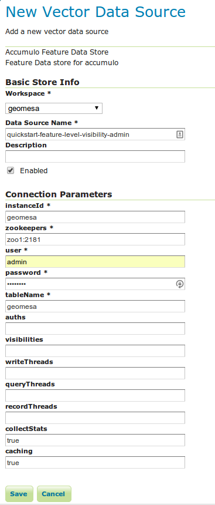
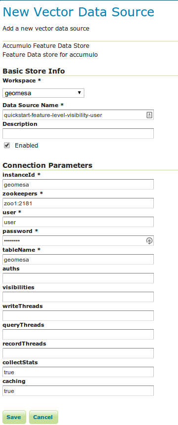

Feature Level Visibility & Security
===================================

Feature visibility is a new and important feature recently supported by
GeoMesa. Accumulo has support for cell-level visibility built-in, and in
recent versions of GeoMesa, support was added to utilize these
visibility markings and enhance data security. From the Accumulo user
guide:

    Accumulo extends the BigTable data model to implement a security
    mechanism known as cell-level security. Every key-value pair has its
    own security label, stored under the column visibility element of
    the key, which is used to determine whether a given user meets the
    security requirements to read the value. This enables data of
    various security levels to be stored within the same row, and users
    of varying degrees of access to query the same table, while
    preserving data confidentiality.

In this tutorial, you'll be guided through ingesting data with varying
levels of visibility and querying that data as different users through
GeoServer.

Prerequisites
-------------

.. warning::    

    You will need access to a Hadoop 2.2 installation as well as an Accumulo |accumulo_version| database.

You will also need:

-  an Accumulo user that has appropriate permissions to query data and
   to create and edit users and user authorizations,
-  Java JDK 7,
-  `Apache Maven <http://maven.apache.org/>`__ 3.2.2 or better, and
-  a `git <http://git-scm.com/>`__ client.

If you haven't already read both the :doc:`../user/installation_and_configuration` section of the GeoMesa User Manual and the  :doc:`geomesa-quickstart-accumulo`, you should do so now, and make sure you have gone through the initial setup of GeoMesa.

Additionally, you should be familiar with `Accumulo's Security Label
Expression
Syntax <https://accumulo.apache.org/1.5/accumulo_user_manual.html#_security_label_expressions>`__,
which we make use of when writing a visibility label to features in
GeoMesa.

Downloading and Building Tutorial Code
--------------------------------------

Clone the **geomesa-quickstart** project:

.. code-block:: bash

    $ git clone http://github.com/geomesa/geomesa-quickstart.git

The feature level visibility tutorial is on the
``feature_level_visibility`` branch, so check it out and build with
Maven:

.. code-block:: bash

    $ cd geomesa-quickstart
    $ git pull origin master
    $ git checkout feature_level_visibility
    $ mvn clean install

Understanding The Code
----------------------

If you inspect the code, you'll notice only a few changes from the
original Quick Start project. The main change is that the
``SimpleFeatureType`` has an additional attribute, "Visibility", added
to it. This attribute will assist later in testing that features were
written with the appropriate Accumulo visibilities.

Additionally, if you look in the ``createNewFeatures`` method, you'll
see:

.. code-block:: java

      if (i % 2 == 0) {
          simpleFeature.setAttribute("Visibility", "admin");
          SecurityUtils.setFeatureVisibility(simpleFeature, "admin");
      } else {
          simpleFeature.setAttribute("Visibility", "user|admin");
          SecurityUtils.setFeatureVisibility(simpleFeature, "user|admin");
      }

This is where visibilities are being set in Accumulo. The line

.. code-block:: java

    simpleFeature.getUserData().put(SecurityUtils.FEATURE_VISIBILITY, "admin")

is adding a key-value pair to the ``SimpleFeature``'s ``userData``,
where the string ``geomesa.feature.visibility`` maps to ``user``. In
GeoMesa, this key-value pair is read out of the ``SimpleFeature``, and
the appropriate Accumulo visibility string is applied to the feature.

This means that the feature ``simpleFeature`` will be written to GeoMesa
with the visibility ``admin``, where only users that have been granted
the authorization level of ``admin`` will be able to view the feature in
GeoMesa.

So, to add visibility to a GeoMesa feature, simply add a line that looks
like this when creating or writing a ``SimpleFeature``:

.. code-block:: java

    simpleFeature.getUserData().put(SecurityUtils.FEATURE_VISIBILITY, "{visibility-string-here}");

Now, when users query GeoMesa, or when data is read out of Accumulo by
GeoServer, only users with the correct level of authorization will be
able to read the feature.

In the Quickstart example, 500 features are written with the visibility
``admin`` and 500 are written with ``user|admin``. However, unless users
are explicitly granted permissions to read these tables and read
features with that level of authorization, we cannot visualize the data
in a meaningful way. Let's add new Accumulo users to do just that.

Adding New Accumulo Users
-------------------------

In this part of the tutorial, we'll get familiar with the Accumulo
shell. First, login to Accumulo with:

.. code-block:: bash

    $ accumulo shell -u <username> -p <password>
    # OR
    $ accumulo shell -u <username>   # Accumulo will prompt for your password if you don't want it to be written in plain text to your shell history

You should see something similar to this:

.. code-block:: bash

    Shell - Apache Accumulo Interactive Shell
    -
    - version: 1.5.0
    - instance name: accumulo
    - instance id: {instance-id}
    -
    - type 'help' for a list of available commands
    -
    {username-here}@accumulo>

Now, we're ready to add new users to Accumulo with the Accumulo shell
``createuser`` command. At the prompt, run:

.. code-block:: bash

    > createuser user
    Enter new password for 'user': ***********
    Please confirm new password for 'user': ***********
    > createuser admin
    Enter new password for 'admin': ***********
    Please confirm new password for 'admin': ***********

With these new users added, we're going to give them the proper
authorizations with the ``setauths`` command:

.. code-block:: bash

    > setauths -s admin,user -u admin
    > setauths -s user -u user

This will grant authorizations ``admin,user`` to ``admin``, meaning as
the user ``admin``, one will be able to read both features written with
the visibility ``user`` and features written with the visibility
``admin``. Additionally, the user ``user`` will be granted ``user``
authorizations, meaning they can only view features of visibility
``user``. They will never see features written with the visibility
``admin``.

Let's move to GeoServer to visualize feature level visibility.

GeoServer Visualization
-----------------------

Assuming you have already set up GeoServer  as described in the :doc:`../user/installation_and_configuration` section of the GeoMesa User Manual, we're going to add a new
``DataStore`` to GeoServer. First, login to GeoServer, and then click
"Add stores" from the homepage.

Next, click the link to add a new "Accumulo Feature Data Store" and name
it ``quickstart-feature-level-visibility-admin``. Fill in the correct
connection parameters to make contact with GeoMesa/Accumulo, but be sure
to use ``admin`` for the "user" parameter.

   "GeoMesa DataStore configuration with "admin" user"

Then, publish your layer when prompted by GeoServer. Remember to click
the "Compute from data" and "Compute from native bounds" links on the
"Add Layer" page, and click "Save".

Repeat the above steps one more time to add an additional ``DataStore``
with the same parameters, but this time, use ``user`` for the "user"
parameter.

   "GeoMesa DataStore configuration with "user" user"

With your layers added in GeoServer, we're nearly ready to visualize the
data. One final step is adding our custom SLD that will style your
features to make visualizations of the data even easier to understand.
`You can find it
here. <https://raw.githubusercontent.com/geomesa/geomesa-quickstart/feature_level_visibility/featureLevelVisibility.xml>`__

Download this XML file, or copy the contents, and add it as a Style in
GeoServer. It will style the points on a map based on the visibility
attribute present.

Lastly, click on "Layer Preview" in the left hand sidebar and find your
two newly added layers. If everything went correctly, you should see
fewer results returning in the ``user`` layer than in the ``admin``
layer, and this is expected behavior. Because ``user`` has only been
granted permission to view features with the ``user`` visibility, only
those 500 records are returned. However, the ``admin`` user is granted
permission to see both ``admin`` and ``user`` visibilities.

Expanding The Concept
---------------------

In this very simple example, you wrote features of two different
visibilities, added two new users to Accumulo, and granted them separate
authorization levels to be able to view portions of the data. This
tutorial has real-world use cases in security and data integrity. For
example, when storing sensitive data and having users of varying
authorization and security levels querying that data, visibility labels
ensure that sensitive data is not leaked to a user of a lower level of
security.

The concept of feature level visibility can be extended and modified to
have many more, or only a few, visibility levels. And with GeoServer
being flexible and extensible, writing a module to consider feature
level security in GeoServer is relatively painless.

At CCRi, we've implemented a very small, example Java class that does a
simple match on the username provided by GeoServer. Our example class
then matches the username to a level of authorization specified in the
class and hands this off to an ``AuthorizationsProvider`` in GeoMesa.
This ``AuthorizationsProvider`` uses the correct level of authorization
when querying Accumulo, no matter the user that is specified in the
GeoServer DataStore. This allows us to have only one layer per
``DataSource``, rather than what is in the example above, that many
users of varying authorizations levels can hit and return only the data
granted to their level of security.

If you're interested in learning more about this, feel free to email
geomesa-users@locationtech.org.

To learn more about PKI or LDAP authorizations, see `the GeoMesa
Authorizations tutorial
here <http://www.geomesa.org/2014/06/04/geomesa-authorizations/#applying-authorizations-and-visibilities-to-geoserver-using-pkis-and-ldap>`__.

Conclusion
----------

In this tutorial, you learned about feature level visibility and
security built into GeoMesa. You ingested a dataset of 1000 features to
your GeoMesa instance -- 500 having the visibility ``admin`` and 500
having the visibility ``user|admin``. You added two new users to
Accumulo and granted them the correct authorization levels to query the
data. Finally, you visualized the data and saw how, despite both
``DataStore`` connecting to the same features in GeoMesa, ``user`` could
only have a subset of those features returned because of the lower
security authorization.

If you found this tutorial helpful, have additional questions, or run
into an error at any step of the way, feel free to `reach out on our
listserv <mailto:geomesa-users@locationtech.org>`__.
