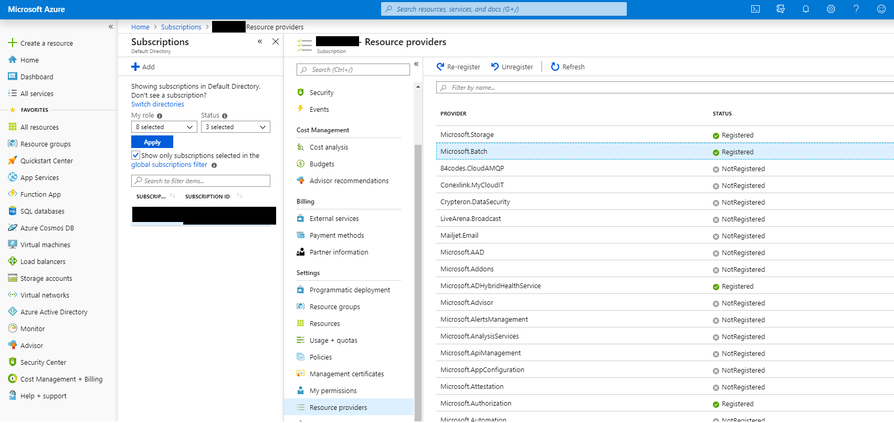
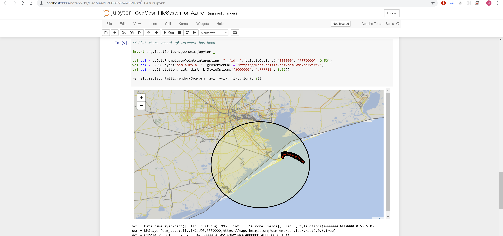
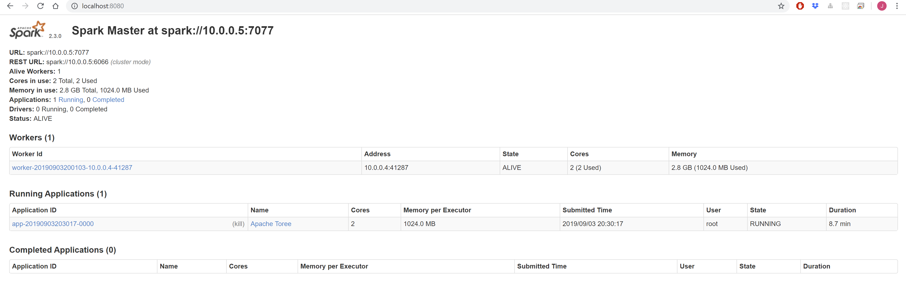
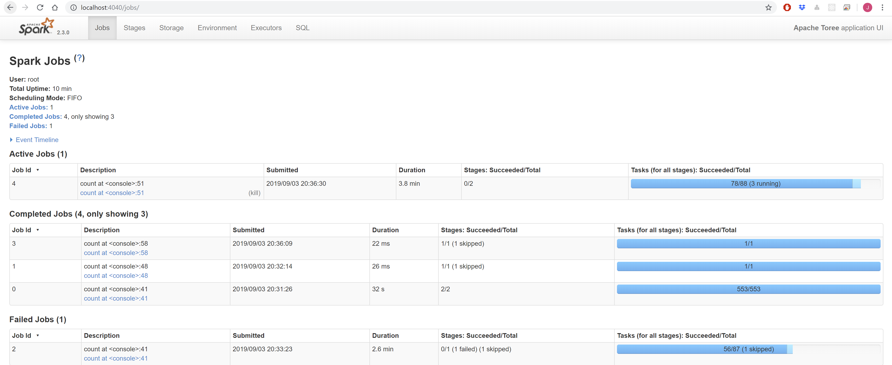

GeoMesa FileSystem on Microsoft Azure
=====================================

GeoMesa FileSystem can be used on top of Azure Blob storage, with Apache Spark analytics running using ephemeral
(temporary) Azure Batch clusters. This mode of running GeoMesa is cost-effective due to the separation of storage
(relatively cheap) and compute (relatively expensive, but only charged when required). The following guide describes
how to set up an Azure Batch cluster, ingest some data, then analyse it using Spark (Scala) in a Jupyter notebook.

Prerequisites
-------------

You will need a Microsoft Azure account with sufficient credit or an appropriate payment method. As a guide, running the
steps in this tutorial should cost no more than $5. If you don't already have an account, you can sign up for a free
trial `here <https://azure.microsoft.com/>`__.

Installing & Configuring Azure Distributed Data Engineering Toolkit
-------------------------------------------------------------------

This guide uses the `Azure Distributed Data Engineering Toolkit (AZTK) <https://github.com/Azure/aztk>`__ in order to set
up an ephemeral cluster. Alternatively, you may wish to deploy a more permanent
`Azure HDInsight <https://azure.microsoft.com/en-gb/services/hdinsight/>`__ cluster. This latter option is not covered here,
but much of the subsequent operations will be common.

Follow the `AZTK instructions <https://github.com/Azure/aztk>`__ to install AZTK.

.. warning::

  Make sure you pick the correct branch of the documentation to match the latest release (not ``main``).

.. note::

  It is recommended to install AZTK in an
  `Anaconda environment <https://docs.conda.io/projects/conda/en/latest/user-guide/tasks/manage-environments.html>`__, or
  a `Python virtual environment <https://docs.python.org/3/tutorial/venv.html>`__.

In summary, to install AZTK:

#. ``pip install aztk``
#. In a directory of your choosing, ``aztk spark init``
#. Use `Azure Cloud Shell <https://shell.azure.com/>`__ and the ``account_setup.sh`` script to generate the contents of
   ``.aztk/secrets.yaml`` for you. Alternatively, you can create the necessary Resource Groups, Batch Accounts, Storage
   Accounts, etc. manually.
#. Optionally, generate a ssh key pair and reference the public key from ``.aztk/secrets.yaml``.

.. note::

  You may need to register the ``Microsoft.Batch`` provider in your Azure account. Check in the
  `Azure Portal <https://portal.azure.com.>`__ under Subscriptions...Subscription Name...Settings...Resource providers.

    Microsoft Azure Resource Providers

.. warning::

    Your ``secrets.yaml`` file now contains sensitive data and should be protected accordingly.

Customise Cluster Default Configuration
---------------------------------------

Edit ``.aztk/cluster.yaml`` as follows:

#. Comment out the ``size:`` line. We will specify the cluster size on the command line and specifying the size here
   will cause issues with mixed normal and low priority nodes unless additional network configuration is performed (beyond
   the scope of this guide, but covered `here <https://github.com/Azure/aztk/blob/master/docs/10-clusters.md#mixed-mode>`__).
#. Set ``environment: anaconda``.
#. Ensure the ``jupyter`` plugin is *not* enabled (we will manually install Jupyter later so we can add Spark Scala
   support).
#. Set ``worker_on_master`` to ``false`` to disable running Apache Spark executors on the master itself.

Customise Hadoop Cluster Configuration
--------------------------------------

Add the following lines to ``.aztk/core-site.xml`` to enable Hadoop access to your Azure Blob Storage account via the
secure (``wasbs``) protocol. Replace ``[storage account name]`` and ``[key]`` with the appropriate values.

.. code-block:: xml

    <property>
        <name>fs.AbstractFileSystem.wasbs.impl</name>
        <value>org.apache.hadoop.fs.azure.Wasbs</value>
    </property>

    <property>
        <name>fs.wasbs.impl</name>
        <value>org.apache.hadoop.fs.azure.NativeAzureFileSystem</value>
    </property>

    <property>
        <name>fs.azure.account.key.[storage account name].blob.core.windows.net</name>
        <value>[key]</value>
    </property>

.. warning::

  Your ``core-site.xml`` file now contains sensitive data and should be protected accordingly.

Create an Azure File Share
---------------------------

Using the `Azure Portal <https://portal.azure.com>`__, create a File Share inside your Storage Account and record the name
and key. This file share will be mounted by your cluster master and used to store persistent files e.g. your Jupyter
notebook.

Create a Apache Spark Cluster for Ingest
----------------------------------------

We will first create a minimal Apache Spark cluster and use the master to download and ingest some data:

.. code-block:: shell

  aztk spark cluster create --id geomesa --vm-size standard_f2 --size-low-priority 2 --docker-run-options="--privileged"

This should start the creation of a cluster using low priority (i.e. cheaper) nodes. The cluster is deployed as a Docker
container on each node; ``--privileged`` is required in order to be able to mount the Azure Files share you have just
created.

If you aren't using ssh keys, you will be prompted to enter a password for the ``spark`` user. You can monitor cluster
creation progress using ``aztk spark cluster list`` & ``aztk spark cluster get --id geomesa``. You can also monitor
cluster creation and status using `Batch Explorer <https://azure.github.io/BatchExplorer/>`__.
The cluster is ready when all nodes are shown in the idle state, which usually takes 5-10 minutes:

.. code-block:: shell

  aztk spark cluster get --id geomesa

  Cluster         geomesa
  ------------------------------------------
  State:          steady
  Node Size:      standard_f2
  Created:        2019-08-30 15:07:36
  Nodes:          2
  | Dedicated:    0
  | Low priority: 2

  |               Nodes                |        State        |        IP:Port       | Dedicated  |  Master  |
  |------------------------------------|---------------------|----------------------|------------|----------|
  |tvmps_b2e6b9f170b73fe9f993d3e0f1cd2a40cd49041b54dfbf9774fbc07b2c883b03_p|        idle         |  51.105.13.125:50001 |            |    *     |
  |tvmps_cfd27f38197a963a04cb8363d6012067fd1d38ecb4fa86a406f89ed3e8f57154_p|        idle         |  51.105.13.125:50000 |            |          |

Connect to the Cluster
----------------------

Usually you would use ``aztk spark cluster ssh`` in order to connect to the cluster, forwarding useful ports for the
various services over ssh. However, we will need to add a port forward for Jupyter, so instead perform the following:

.. code-block:: shell

  aztk spark cluster ssh --id geomesa -u spark --no-connect

  -------------------------------------------
  spark cluster id:              geomesa
  open webui:                    http://localhost:8080
  open jobui:                    http://localhost:4040
  open jobhistoryui:             http://localhost:18080
  ssh username:                  spark
  connect:                       False
  -------------------------------------------

  Use the following command to connect to your spark head node:
        ssh -L 8080:localhost:8080 -L 4040:localhost:4040 -L 18080:localhost:18080 -t spark@51.105.13.125 -p 50001 'sudo docker exec -it spark /bin/bash'

Use the provided command to connect to your cluster, with the following changes:

#. Add ``-L 8888:localhost:8888`` in order to additionally port forward Jupyter
#. (Windows only, when using ``cmd.exe``) remove the single quotes around the ``sudo docker...`` command.

After entering your private key passphrase or the password you set for the ``spark`` user, you should get a root shell
inside the Docker container running Apache Spark.

.. code-block:: shell

  root@883aa5f49ee64425964d1eb085366173000001:/#

.. note::

  Unless specified otherwise, all subsequent commands should be run inside this container.

Mount your Azure File Share
---------------------------

In order to provide persistent file storage within your ephemeral clusters, you will now mount your previously created
file share:

.. code-block:: shell

  apt-get update && apt-get install cifs-utils -y
  mkdir /mnt/geomesa
  mount -t cifs //<storage account>.file.core.windows.net/<file share> /mnt/geomesa \
    -o vers=3.0,username=<storage account>,password=<storage account key>,dir_mode=0777,file_mode=0777,serverino

In the final command, replace ``<storage account>``, ``<file share>`` & ``<storage account key>`` with the appropriate
values. You should now be able to test writing a file and see that file in the Azure Portal.

.. code-block:: shell

  touch /mnt/geomesa/test      # then check test is visible in Storage Account...Files...File Share

Install & Configure GeoMesa Filesystem CLI
------------------------------------------

In order to ingest data, we will first need to install and configure the GeoMesa Filesystem CLI tool. Replace
``${VERSION}`` with the GeoMesa and Scala versions used (e.g. |scala_release_version|):

.. code-block:: shell

  cd /mnt/geomesa
  wget https://github.com/locationtech/geomesa/releases/download/geomesa_${VERSION}/geomesa-fs_${VERSION}-bin.tar.gz
  tar -xzvf geomesa-fs_${VERSION}-bin.tar.gz

.. note::
  You may need to update the GeoMesa version in order to match the latest release.

In order to use GeoMesa Filesystem on Azure Blob Storage, you will need to copy the following JARs and also set the
Hadoop configuration directory environment variable so your ``core-site.xml`` file is picked up.

.. code-block:: shell

  cd /home/spark-current/jars
  cp azure-storage-2.2.0.jar \
     commons-configuration-1.6.jar \
     commons-logging-1.1.3.jar \
     guava-11.0.2.jar \
     hadoop-auth-2.8.3.jar \
     hadoop-azure-2.8.3.jar \
     hadoop-common-2.8.3.jar \
     hadoop-hdfs-client-2.8.3.jar \
     htrace-core4-4.0.1-incubating.jar \
     jetty-util-6.1.26.jar \
     /mnt/geomesa/geomesa-fs_${VERSION}/lib
  export HADOOP_CONF_DIR=/home/spark-current/conf

Ingest Data into Azure Blob Storage
-----------------------------------

We will first download 2.6 GB of compressed data from `Marine Cadastre <https://marinecadastre.gov/ais/>`__. This file
contains approx 70 million records of ships beaconing their position using
`AIS <https://en.wikipedia.org/wiki/Automatic_identification_system>`__ in the Gulf of Mexico in July 2017. Much more data
is available from Marine Cadastre, as well as numerous commercial suppliers.

.. code-block:: shell

  cd /mnt/geomesa
  mkdir data
  cd data
  wget https://coast.noaa.gov/htdata/CMSP/AISDataHandler/2017/AIS_2017_07_Zone15.zip

*Optional*: We can test the converter as follows.

.. code-block:: shell

  cd /mnt/geomesa/geomesa-fs_${VERSION}/bin
  ./geomesa-fs convert \
    --spec marinecadastre-ais-csv \
    --converter marinecadastre-ais-csv \
    --max-features 10 \
    ../../data/AIS_2017_07_Zone15.zip

.. note::
  When writing your own converters, it is highly recommended to use the ``convert`` command for iterative testing prior
  to ingest.

Next, we can ingest the data as follows:

.. code-block:: shell

  ./geomesa-fs ingest \
    --path wasbs://<blob container name>@<storage account>.blob.core.windows.net/<path> \
    --encoding orc \
    --partition-scheme daily,z2-20bits \
    --spec marinecadastre-ais-csv \
    --converter marinecadastre-ais-csv \
    ../../data/AIS_2017_07_Zone15.zip

You should replace ``<blob container name>``, ``<storage account>`` and ``<path>`` with the appropriate values for your
environment.

.. note::

  Since our data is very concentrated in a particular area, we use a large number of bits for the ``z2`` index.
  In a more realistic situation, index precision is a tradeoff between reading large blocks of data from storage
  (favouring lower precision) and minimising the number of discrete files or blobs accesses (favouring higher
  precision). This will depend on your data distribution and access/query patterns.

Install Jupyter, GeoMesa Jupyter Leaflet & Apache Toree
-------------------------------------------------------

Having created our Apache Spark cluster & ingested some data, we are almost ready to run some analytics. We will use the
Jupyter notebook platform together with the Apache Toree kernel for Apache Spark to perform interactive scalable
analysis. In order to visualise our results, we will use the GeoMesa Jupyter Leaflet integration.

*Optional*: Having used a minimal cluster for ingest, you may now wish to use more nodes to increase performance and the
size of datasets that can be analysed. If so, delete your existing cluster (``aztk spark cluster delete --id=geomesa``)
and create a new one as previously, increasing the number of nodes (``--size`` and/or ``--size-low-priority``) and/or
individual node size (``--vm-size``). Remember to remount the Azure Files share and export ``HADOOP_CONF_DIR``.

Back inside the Apache Spark container on your master node run the following:

.. code-block:: shell

  cd /mnt/geomesa
  pip install toree
<<<<<<< HEAD
  wget https://repo1.maven.org/maven2/org/locationtech/geomesa/geomesa-spark-jupyter-leaflet_2.12/${VERSION}/geomesa-spark-jupyter-leaflet_${VERSION}.jar
<<<<<<< HEAD
  jupyter toree install \
    --spark_home=/home/spark-current \
    --replace \
    --spark_opts="--master spark://`hostname -i`:7077 --num-executors 2 --conf spark.dynamicAllocation.enabled=false --jars /mnt/geomesa/geomesa-fs_${VERSION}/dist/spark/geomesa-fs-spark-runtime_${VERSION}.jar,/mnt/geomesa/geomesa-spark-jupyter-leaflet_${VERSION}.jar"
<<<<<<< HEAD
<<<<<<< HEAD
<<<<<<< HEAD
<<<<<<< HEAD
<<<<<<< HEAD
<<<<<<< HEAD
<<<<<<< HEAD
<<<<<<< HEAD
<<<<<<< HEAD
<<<<<<< HEAD
<<<<<<< HEAD
<<<<<<< HEAD
=======
>>>>>>> 5a4c24e020 (GEOMESA-3254 Add Bloop build support)
=======
>>>>>>> a52e4429be (GEOMESA-3061 Converters - support bytes in Avro top-level union types (#2762))
=======
>>>>>>> 0104fb37e4 (GEOMESA-3061 Converters - support bytes in Avro top-level union types (#2762))
=======
>>>>>>> 6d9a5b626c (GEOMESA-3061 Converters - support bytes in Avro top-level union types (#2762))
=======
>>>>>>> 12e3a588fc (GEOMESA-3061 Converters - support bytes in Avro top-level union types (#2762))
=======
<<<<<<< HEAD
<<<<<<< HEAD
>>>>>>> f0b9bd8121 (GEOMESA-3061 Converters - support bytes in Avro top-level union types (#2762))
=======
>>>>>>> 59a1fbb96e (GEOMESA-3061 Converters - support bytes in Avro top-level union types (#2762))
=======
>>>>>>> f1532f2313 (GEOMESA-3254 Add Bloop build support)
=======
=======
>>>>>>> 6d9a5b626c (GEOMESA-3061 Converters - support bytes in Avro top-level union types (#2762))
>>>>>>> 96d5d442fa (GEOMESA-3061 Converters - support bytes in Avro top-level union types (#2762))
=======
=======
>>>>>>> a52e4429be (GEOMESA-3061 Converters - support bytes in Avro top-level union types (#2762))
=======
>>>>>>> f0b9bd8121 (GEOMESA-3061 Converters - support bytes in Avro top-level union types (#2762))
=======
>>>>>>> 0104fb37e4 (GEOMESA-3061 Converters - support bytes in Avro top-level union types (#2762))
=======
=======
>>>>>>> 3d5144418e (GEOMESA-3061 Converters - support bytes in Avro top-level union types (#2762))
  wget https://repo1.maven.org/maven2/org/locationtech/geomesa/geomesa-jupyter-leaflet_2.12/${VERSION}/geomesa-jupyter-leaflet_${VERSION}.jar
  jupyter toree install \
    --spark_home=/home/spark-current \
    --replace \
    --spark_opts="--master spark://`hostname -i`:7077 --num-executors 2 --conf spark.dynamicAllocation.enabled=false --jars /mnt/geomesa/geomesa-fs_${VERSION}/dist/spark/geomesa-fs-spark-runtime_${VERSION}.jar,/mnt/geomesa/geomesa-jupyter-leaflet_${VERSION}.jar"
<<<<<<< HEAD
<<<<<<< HEAD
<<<<<<< HEAD
<<<<<<< HEAD
<<<<<<< HEAD
<<<<<<< HEAD
<<<<<<< HEAD
<<<<<<< HEAD
<<<<<<< HEAD
<<<<<<< HEAD
<<<<<<< HEAD
=======
>>>>>>> 810876750d (GEOMESA-3061 Converters - support bytes in Avro top-level union types (#2762))
=======
>>>>>>> 96d5d442fa (GEOMESA-3061 Converters - support bytes in Avro top-level union types (#2762))
=======
>>>>>>> a52e4429be (GEOMESA-3061 Converters - support bytes in Avro top-level union types (#2762))
=======
>>>>>>> 0104fb37e4 (GEOMESA-3061 Converters - support bytes in Avro top-level union types (#2762))
=======
>>>>>>> d498bef1ce (GEOMESA-3061 Converters - support bytes in Avro top-level union types (#2762))
>>>>>>> b9bdd406e3 (GEOMESA-3061 Converters - support bytes in Avro top-level union types (#2762))
=======
>>>>>>> b9bdd406e (GEOMESA-3061 Converters - support bytes in Avro top-level union types (#2762))
>>>>>>> d9ed077cd1 (GEOMESA-3061 Converters - support bytes in Avro top-level union types (#2762))
<<<<<<< HEAD
<<<<<<< HEAD
<<<<<<< HEAD
=======
>>>>>>> d845d7c1bd (GEOMESA-3254 Add Bloop build support)
=======
  jupyter toree install \
    --spark_home=/home/spark-current \
    --replace \
    --spark_opts="--master spark://`hostname -i`:7077 --num-executors 2 --conf spark.dynamicAllocation.enabled=false --jars /mnt/geomesa/geomesa-fs_${VERSION}/dist/spark/geomesa-fs-spark-runtime_${VERSION}.jar,/mnt/geomesa/geomesa-spark-jupyter-leaflet_${VERSION}.jar"
>>>>>>> 58d14a257e (GEOMESA-3254 Add Bloop build support)
<<<<<<< HEAD
<<<<<<< HEAD
=======
>>>>>>> b9bdd406e (GEOMESA-3061 Converters - support bytes in Avro top-level union types (#2762))
>>>>>>> 6d9a5b626c (GEOMESA-3061 Converters - support bytes in Avro top-level union types (#2762))
=======
>>>>>>> 63a045a753 (GEOMESA-3254 Add Bloop build support)
<<<<<<< HEAD
<<<<<<< HEAD
=======
>>>>>>> b9bdd406e (GEOMESA-3061 Converters - support bytes in Avro top-level union types (#2762))
>>>>>>> 12e3a588fc (GEOMESA-3061 Converters - support bytes in Avro top-level union types (#2762))
=======
>>>>>>> b9bdd406e (GEOMESA-3061 Converters - support bytes in Avro top-level union types (#2762))
>>>>>>> f0b9bd8121 (GEOMESA-3061 Converters - support bytes in Avro top-level union types (#2762))
<<<<<<< HEAD
=======
>>>>>>> b9bdd406e3 (GEOMESA-3061 Converters - support bytes in Avro top-level union types (#2762))
>>>>>>> 59a1fbb96e (GEOMESA-3061 Converters - support bytes in Avro top-level union types (#2762))
=======
>>>>>>> 810876750d (GEOMESA-3061 Converters - support bytes in Avro top-level union types (#2762))
=======
=======
>>>>>>> d845d7c1bd (GEOMESA-3254 Add Bloop build support)
>>>>>>> f1532f2313 (GEOMESA-3254 Add Bloop build support)
=======
>>>>>>> 7564665969 (GEOMESA-3254 Add Bloop build support)
=======
=======
>>>>>>> b9bdd406e (GEOMESA-3061 Converters - support bytes in Avro top-level union types (#2762))
>>>>>>> 6d9a5b626c (GEOMESA-3061 Converters - support bytes in Avro top-level union types (#2762))
>>>>>>> 96d5d442fa (GEOMESA-3061 Converters - support bytes in Avro top-level union types (#2762))
=======
>>>>>>> 5a4c24e020 (GEOMESA-3254 Add Bloop build support)
=======
=======
>>>>>>> b9bdd406e (GEOMESA-3061 Converters - support bytes in Avro top-level union types (#2762))
>>>>>>> 12e3a588fc (GEOMESA-3061 Converters - support bytes in Avro top-level union types (#2762))
>>>>>>> a52e4429be (GEOMESA-3061 Converters - support bytes in Avro top-level union types (#2762))
=======
>>>>>>> 0104fb37e4 (GEOMESA-3061 Converters - support bytes in Avro top-level union types (#2762))
=======
>>>>>>> b9bdd406e3 (GEOMESA-3061 Converters - support bytes in Avro top-level union types (#2762))
>>>>>>> 3d5144418e (GEOMESA-3061 Converters - support bytes in Avro top-level union types (#2762))
=======
>>>>>>> d498bef1ce (GEOMESA-3061 Converters - support bytes in Avro top-level union types (#2762))

If you have increased the size of your cluster, you should also increase ``--num-executors`` accordingly. You can also
set other executor and driver options by editing the ``spark_opts`` contents.

Running Jupyter and opening Notebooks
-------------------------------------

Finally, we will clone the tutorial repository in order to obtain our sample notebook, then launch Jupyter:

.. code-block:: shell

  git clone https://github.com/geomesa/geomesa-tutorials
  jupyter notebook --allow-root &

.. warning::

  You may need to check out the appropriate tag of the ``geomesa-tutorials`` repository in order to match your GeoMesa
  Filesystem release.

Then open the URL provided by Jupyter on your local machine, including the long token. Navigate to
``geomesa-fs-on-azure`` and open ``GeoMesa FileSystem on Azure.ipynb``. Work through the notebook at your own pace.

    Jupyter notebook showing GeoMesa Leaflet integration

You can access the Apache Spark Master interface via `http://localhost:8080 <http://localhost:8080>`__, and the Apache
Spark Jobs interface via `http://localhost:4040 <http://localhost:4040>`__.

    Apache Spark Master UI

    Apache Spark Jobs UI

Deleting your Ephemeral Cluster
-------------------------------

It is important to remember to delete your Azure Batch cluster once you have finished with it, otherwise you **will**
incur unexpected charges.

.. code-block:: shell

  aztk spark cluster delete --id=geomesa

