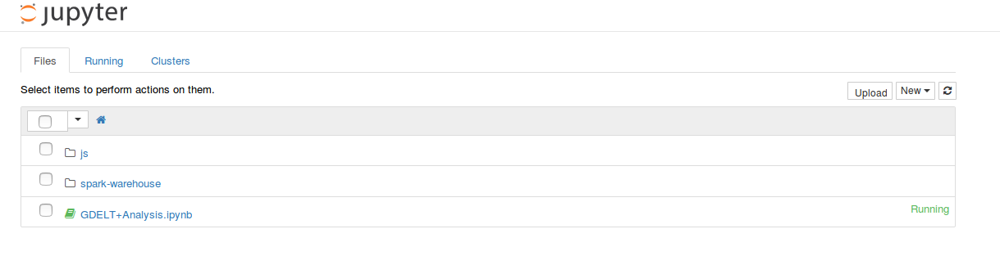
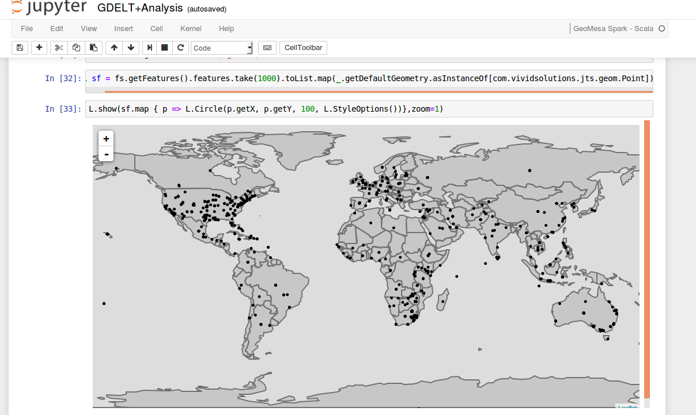

Geodocker: Bootstrapping GeoMesa HBase on AWS S3
==========================================================

GeoMesa can be run on top of HBase using S3 as the underlying storage engine.  This mode of running GeoMesa is cost-effective as one sizes the database cluster for the compute and memory requirements, not the storage requirements.  The following guide describes how to bootstrap GeoMesa in this manner.  This guide assumes you have an Amazon Web Services account already provisioned as well as an IAM key pair.  To set up the AWS command line tools, follow the instructions found in the AWS `online documentation <http://docs.aws.amazon.com/cli/latest/userguide/cli-chap-getting-started.html>`_.

.. _Amazon Web Services: https://aws.amazon.com/

.. _Amazon ElasticMapReduce: https://aws.amazon.com/emr/

Bootstrap an EMR cluster with HBase
-----------------------------------

First, you will need to configure an S3 bucket for use by HBase.  Create a json file called ``geomesa-hbase-on-s3.json`` with the following content.

.. code-block:: javascript

  [
     {
       "Classification": "hbase-site",
       "Properties": {
         "hbase.rootdir": "s3://geomesa-hbase-root"}
     },
     {
       "Classification": "hbase",
       "Properties": {
       "hbase.emr.storageMode":"s3"
       }
     }
  ]

Then, ensure that the bucket exists.

.. code-block:: shell
   
   $ aws s3 mb s3://geomesa-hbase-root

Then, Use the following command to bootstrap an EMR cluster with HBase.  You will need to change the ``KeyName`` to the IAM key pair you intend to use for this cluster and ``SubnetId`` to the id of the subnet if that key is associated with a specific subnet.  You can also edit the instance types to a size appropriate for your use case.  Specify the appropriate path to the json file you created in the last step.

.. note::

  In the code below, ``$VERSION`` = |release|

.. code-block:: shell

  $ aws emr create-cluster                                \                                                                                                                                     
    --name "GeoMesa HBase on S3"                          \
    --release-label emr-5.2.0                             \
    --output text                                         \
    --use-default-roles                                   \
    --ec2-attributes KeyName=__KEY_NAME__,SubnetId=__SUBNET_ID__      \
    --applications Name=Hadoop Name=Zookeeper Name=Spark Name=HBase   \
    --instance-groups                                                 \
      Name=Master,InstanceCount=1,InstanceGroupType=MASTER,InstanceType=m4.2xlarge \
      Name=Workers,InstanceCount=3,InstanceGroupType=CORE,InstanceType=m4.xlarge   \
    --configurations file:///path/to/geomesa-hbase-on-s3.json         \
    --bootstrap-actions Name=BootstrapGeoMesa,Path=s3://geomesa-hbase-public/bootstrap-geomesa-hbase.sh,Args=\[1.3.1-SNAPSHOT\]

After executing that command, you can monitor the state of the EMR bootstrap process
by going to the `Management Console <https://console.aws.amazon.com/elasticmapreduce/home?region=us-east-1#cluster-list>`_.  Find the name (as specified in the ``aws emr`` command) of the cluster and click through to its details page.  Under the **Hardware** section, you can find the master node and its IP address.  Copy the IP address and then run the following command.

.. code-block:: shell

   $ ssh -i /path/to/key ec2-user@<ip_address>

This should log you into the master node of the EMR cluster you just
started. You can see a list of docker instances by running the following command:
 
.. code-block:: shell

   $ sudo docker ps

You should see output similar to the following:

.. code-block:: shell

   CONTAINER ID        IMAGE                                     COMMAND                  CREATED             STATUS              PORTS               NAMES
   6a1ca1114c9b        quay.io/geomesa/geomesa-jupyter:latest    "tini -- start-notebo"   4 minutes ago       Up 4 minutes                            jupyter
   e28e07dd20de        quay.io/geodocker/geoserver:latest        "/opt/tomcat/bin/cata"   3 minutes ago       Up 3 minutes                            geoserver
   5f4ae17263db        quay.io/geomesa/accumulo-geomesa:latest   "/sbin/geomesa-entryp"   5 minutes ago       Up 5 minutes                            accumulo-gc
   b389e8e45542        quay.io/geomesa/accumulo-geomesa:latest   "/sbin/geomesa-entryp"   5 minutes ago       Up 5 minutes                            accumulo-tracer
   996327bf6a9f        quay.io/geomesa/accumulo-geomesa:latest   "/sbin/geomesa-entryp"   5 minutes ago       Up 5 minutes                            accumulo-monitor
   89738108b7a3        quay.io/geomesa/accumulo-geomesa:latest   "/sbin/geomesa-entryp"   5 minutes ago       Up 5 minutes                            accumulo-master

Ingest Public GDELT data
------------------------

Make sure you leave enough time for the machine to be completely bootstrapped before running the command to find the docker instances.
GeoMesa ships with predefined data models for many open spatio-temporal data sets such as GDELT.  To ingest the most recent 7 days of `GDELT
<http://www.gdeltproject.org>`_ from Amazon's public S3 bucket:

.. code-block:: shell

    $ FILES=$(seq 7 -1 1 | xargs -n 1 -I{} sh -c "date -d'{} days ago' +%Y%m%d" | xargs -n 1 -I{} echo s3a://gdelt-open-data/events/{}.export.csv | tr '\n' ' ')
    $ sudo docker exec accumulo-master geomesa ingest -c geomesa.gdelt -C gdelt -f gdelt -s gdelt -u root -p secret $FILES

You can then query the data using the GeoMesa command line export tool.

.. code-block:: shell

    $ sudo docker exec accumulo-master geomesa export -c gdelt -f gdelt -u root -p secret -m 100

You can register GDELT as a layer in the provided GeoServer as well.  GeoServer is running on port 9090
of the master node.  You can access it at *http://<ip_address>:9090/geoserver*, where *<ip_address>* is the
address you looked up before ``ssh``\ ing into the master node.  To register a GeoMesa layer, you'll first need
to know the internal URL of the Zookeeper instance.  Run the following command:

.. code-block:: shell

    $ sudo docker exec accumulo-master cat /opt/accumulo/conf/accumulo-site.xml | grep -A2 instance.zoo | grep value | sed 's/.*<value>\(.*\)<\/value>/\1/'

Then, in the *Stores -> Add New Store -> Accumulo (GeoMesa)* dialog in Geoserver, set the values to the following.

.. code::

   DataSourceName: gdelt
   instanceId: gis
   zookeepers: $zookeeper
   user: root
   password: secret
   tableName: geomesa.gdelt

Save the store and publish the ``gdelt`` layer.  Set the "Native Bounding Box" and the "Lat Lon Bounding Box" to
``-180,-90,180,90``.  Save the layer.  Then, navigate to the preview page at
*http://<ip_address>:9090/geoserver/cite/wms?service=WMS&version=1.1.0&request=GetMap&layers=cite:gdelt&styles=&bbox=-180,-90,180.0,90&width=768&height=356&srs=EPSG:4326&format=application/openlayers*.

Analyze GDELT with GeoMesa, Jupyter, SparkSQL, Vegas, and Leaflet
-----------------------------------------------------------------

Your bootstrapped spatial analytic environment has an instance of Jupyter notebook configured to analyze data in GeoMesa using SparkSQL and to visualize the results using Leaflet maps and Vegas (Vega-Lite) charts.  To start, navigate to *http://<ip_address>:8888/* where *<ip_address>* is the publicly accessible IP address of the master node.  You will see a sample GDELT analysis notebook.

Click the **GDELT Analysis** notebook.  Edit the zookeeper value in the first cell by setting it to the zookeeper ip address as described above.  Then, select *Cell -> Run All* from the menu bar.  This will execute all the cells in the notebook.  Scroll through the sample and you will see some map and chart visualizations at the bottom.

.. image:: _static/img/jupyter_chart_viz.png
