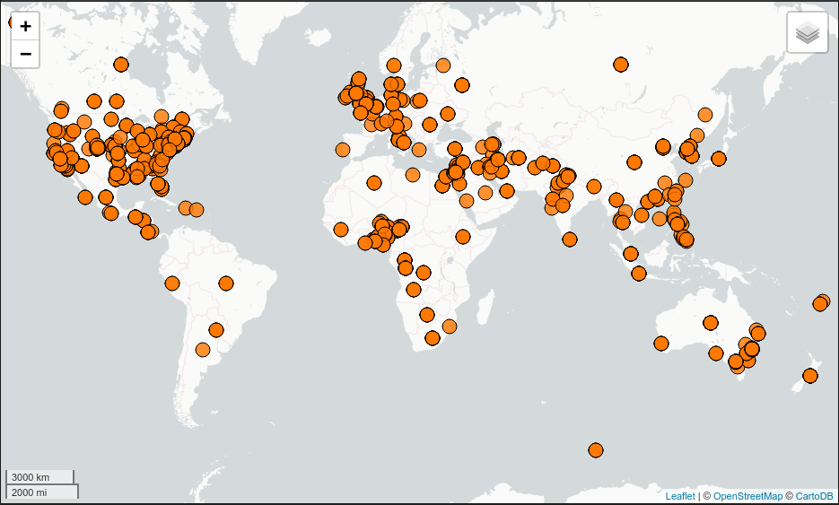

GeoMesa Accumulo Quick Start
============================

This tutorial is the fastest and easiest way to get started with GeoMesa using Accumulo.
It is a good stepping-stone on the path to the other tutorials, that present increasingly
involved examples of how to use GeoMesa.

About this Tutorial
-------------------

In the spirit of keeping things simple, the code in this tutorial only
does a few small things:

1. Establishes a new (static) SimpleFeatureType
2. Prepares the Accumulo tables to store this type of data
3. Creates a few thousand example SimpleFeatures
4. Writes these SimpleFeatures to the Accumulo table
5. Queries for a given geographic rectangle, time range, and attribute
   filter, writing out the entries in the result set
6. Uses GeoServer to visualize the data (optional)

Prerequisites
-------------

Before you begin, you must have the following:

-  `Java <http://java.oracle.com/>`__ JDK 1.8
-  Apache `Maven <http://maven.apache.org/>`__ |maven_version|
-  a GitHub client
-  an Accumulo |accumulo_version| instance
-  an Accumulo user that has both create-table and write permissions
-  the GeoMesa distributed runtime installed for your instance (see below)

Installing the GeoMesa Distributed Runtime
------------------------------------------

Follow the instructions under :ref:`install_accumulo_runtime` to install GeoMesa in your Accumulo instance.

Download and Build the Tutorial
-------------------------------

Pick a reasonable directory on your machine, and run:

.. code-block:: bash

    $ git clone https://github.com/geomesa/geomesa-tutorials.git
    $ cd geomesa-tutorials

.. warning::

    Make sure that you download or checkout the version of the tutorials project that corresponds to
    your GeoMesa version. See :ref:`tutorial_versions` for more details.

To ensure that the quick start works with your environment, modify the ``pom.xml``
to set the appropriate versions for Accumulo, Hadoop, etc.

For ease of use, the project builds a bundled artifact that contains all the required
dependencies in a single JAR. To build, run:

.. code-block:: bash

    $ mvn clean install -pl geomesa-tutorials-accumulo/geomesa-tutorials-accumulo-quickstart -am

Run the Tutorial
----------------

On the command line, run:

.. code-block:: bash

    $ java -cp geomesa-tutorials-accumulo/geomesa-tutorials-accumulo-quickstart/target/geomesa-tutorials-accumulo-quickstart-${geomesa.version}.jar \
        org.geomesa.example.accumulo.AccumuloQuickStart \
        --accumulo.instance.id <instance>               \
        --accumulo.zookeepers <zookeepers>              \
        --accumulo.user <user>                          \
        --accumulo.password <password>                  \
        --accumulo.catalog <table>

where you provide the following arguments:

-  ``<instance>`` the name of your Accumulo instance
-  ``<zookeepers>`` your Zookeeper nodes, separated by commas
-  ``<user>`` the name of an Accumulo user that has permissions to
   create, read and write tables
-  ``<password>`` the password for the previously-mentioned Accumulo
   user
-  ``<table>`` the name of the destination table that will accept these
   test records. This table should either not exist or should be empty

.. warning::

    If you have set up the GeoMesa Accumulo distributed
    runtime to be isolated within a namespace (see
    :ref:`install_accumulo_runtime_namespace`) the value of ``<table>``
    should include the namespace (e.g. ``myNamespace.geomesa``).

Optionally, you can also specify that the quick start should delete its data upon completion. Use the
``--cleanup`` flag when you run to enable this behavior.

Once run, you should see the following output:

.. code-block:: none

    Loading datastore

    Creating schema: GLOBALEVENTID:String,Actor1Name:String,Actor1CountryCode:String,Actor2Name:String,Actor2CountryCode:String,EventCode:String,NumMentions:Integer,NumSources:Integer,NumArticles:Integer,ActionGeo_Type:Integer,ActionGeo_FullName:String,ActionGeo_CountryCode:String,dtg:Date,geom:Point

    Generating test data

    Writing test data
    Wrote 2356 features

    Running test queries
    Running query BBOX(geom, -120.0,30.0,-75.0,55.0) AND dtg DURING 2017-12-31T00:00:00+00:00/2018-01-02T00:00:00+00:00
    01 719026369=719026369|MEXICO|MEX|AMERICAN|USA|193|6|1|6|4|Playas De Tijuana, Baja California, Mexico|MX|2018-01-01T00:00:00.000Z|POINT (-117.133 32.55)
    02 719025074=719025074|||RUSSIA|RUS|042|2|1|2|3|Irvine, California, United States|US|2018-01-01T00:00:00.000Z|POINT (-117.823 33.6695)
    03 719025082=719025082|||UNITED STATES|USA|014|2|1|2|2|Texas, United States|US|2018-01-01T00:00:00.000Z|POINT (-97.6475 31.106)
    04 719025084=719025084|||UNITED STATES|USA|031|4|1|4|2|Texas, United States|US|2018-01-01T00:00:00.000Z|POINT (-97.6475 31.106)
    05 719026868=719026868|UNITED STATES|USA|||010|5|1|4|2|Texas, United States|US|2018-01-01T00:00:00.000Z|POINT (-97.6475 31.106)
    06 719026879=719026879|TEXAS|USA|||013|10|2|10|2|Texas, United States|US|2018-01-01T00:00:00.000Z|POINT (-97.6475 31.106)
    07 719026987=719026987|UNITED STATES|USA|||110|4|1|4|2|Texas, United States|US|2018-01-01T00:00:00.000Z|POINT (-97.6475 31.106)
    08 719027257=719027257|UNITED STATES|USA|||036|10|2|10|2|Texas, United States|US|2018-01-01T00:00:00.000Z|POINT (-97.6475 31.106)
    09 719026878=719026878|UNITED STATES|USA|||013|4|2|4|3|Dallas, Texas, United States|US|2018-01-01T00:00:00.000Z|POINT (-96.8067 32.7831)
    10 719027238=719027238|UNITED STATES|USA|INDUSTRY||081|1|1|1|3|Central Valley, California, United States|US|2018-01-01T00:00:00.000Z|POINT (-119.682 34.0186)

    Returned 669 total features

    Running query BBOX(geom, -120.0,30.0,-75.0,55.0) AND dtg DURING 2017-12-31T00:00:00+00:00/2018-01-02T00:00:00+00:00
    Returning attributes [GLOBALEVENTID, dtg, geom]
    01 719025742=719025742|2018-01-01T00:00:00.000Z|POINT (-117.157 32.7153)
    02 719025915=719025915|2018-01-01T00:00:00.000Z|POINT (-117.157 32.7153)
    03 719025400=719025400|2018-01-01T00:00:00.000Z|POINT (-117.393 33.2103)
    04 719025135=719025135|2018-01-01T00:00:00.000Z|POINT (-117.823 33.6695)
    05 719026216=719026216|2018-01-01T00:00:00.000Z|POINT (-97.6475 31.106)
    06 719026312=719026312|2018-01-01T00:00:00.000Z|POINT (-97.6475 31.106)
    07 719026320=719026320|2018-01-01T00:00:00.000Z|POINT (-97.6475 31.106)
    08 719026992=719026992|2018-01-01T00:00:00.000Z|POINT (-97.6475 31.106)
    09 719027120=719027120|2018-01-01T00:00:00.000Z|POINT (-97.6475 31.106)
    10 719026984=719026984|2018-01-01T00:00:00.000Z|POINT (-91.8749 31.1801)

    Returned 669 total features

    Running query EventCode = '051'
    01 719025634=719025634|FIJI|FJI|||051|2|1|2|1|Fiji|FJ|<null>|POINT (178 -18)
    02 719027116=719027116|UNITED STATES|USA|KING||051|8|1|8|3|San Diego, California, United States|US|<null>|POINT (-117.157 32.7153)
    03 719027117=719027117|LOS ANGELES|USA|KING||051|26|3|26|2|California, United States|US|<null>|POINT (-119.746 36.17)
    04 719025036=719025036|||SENATE||051|5|1|5|2|Alabama, United States|US|<null>|POINT (-86.8073 32.799)
    05 719026318=719026318|SENATE||UNITED STATES|USA|051|2|1|2|2|Alabama, United States|US|<null>|POINT (-86.8073 32.799)
    06 719026296=719026296|CHAMBER||||051|20|1|20|3|Springfield, South Carolina, United States|US|<null>|POINT (-81.2793 33.4968)
    07 719025744=719025744|CIVIL SERVANT||||051|20|1|10|3|White House, District of Columbia, United States|US|<null>|POINT (-77.0364 38.8951)
    08 719026946=719026946|INDIANA|USA|||051|12|1|12|2|Indiana, United States|US|<null>|POINT (-86.2604 39.8647)
    09 719025279=719025279|EDMONTON|CAN|||051|5|1|5|4|Dufferin County, Ontario, Canada|CA|<null>|POINT (-80.1667 44.0833)
    10 719027252=719027252|AMERICAN CIVIL LIBERTIES UNION|USA|||051|2|1|2|2|Pennsylvania, United States|US|<null>|POINT (-77.264 40.5773)

    Returned 276 total features

    Running query EventCode = '051' AND dtg DURING 2017-12-31T00:00:00+00:00/2018-01-02T00:00:00+00:00
    Returning attributes [GLOBALEVENTID, dtg, geom]
    01 719025634=719025634|2018-01-01T00:00:00.000Z|POINT (178 -18)
    02 719027116=719027116|2018-01-01T00:00:00.000Z|POINT (-117.157 32.7153)
    03 719027117=719027117|2018-01-01T00:00:00.000Z|POINT (-119.746 36.17)
    04 719025036=719025036|2018-01-01T00:00:00.000Z|POINT (-86.8073 32.799)
    05 719026318=719026318|2018-01-01T00:00:00.000Z|POINT (-86.8073 32.799)
    06 719026296=719026296|2018-01-01T00:00:00.000Z|POINT (-81.2793 33.4968)
    07 719025744=719025744|2018-01-01T00:00:00.000Z|POINT (-77.0364 38.8951)
    08 719026946=719026946|2018-01-01T00:00:00.000Z|POINT (-86.2604 39.8647)
    09 719025279=719025279|2018-01-01T00:00:00.000Z|POINT (-80.1667 44.0833)
    10 719027252=719027252|2018-01-01T00:00:00.000Z|POINT (-77.264 40.5773)

    Returned 138 total features

The quick start code may also be run via Maven using the ``live-test``
profile and specifying the connection parameters as system properties:

.. code-block:: bash

    $ mvn -Plive-test exec:exec            \
        -Daccumulo.instance.id <instance>  \
        -Daccumulo.zookeepers <zookeepers> \
        -Daccumulo.user <user>             \
        -Daccumulo.password <password>     \
        -Daccumulo.catalog <table>

Looking at the Code
-------------------

The source code is meant to be accessible for this tutorial. The main logic is contained in
the generic ``org.geomesa.example.quickstart.GeoMesaQuickStart`` in the ``geomesa-tutorials-common`` module,
which is datastore agnostic. Some relevant methods are:

-  ``createDataStore`` get a datastore instance from the input configuration
-  ``createSchema`` create the schema in the datastore, as a pre-requisite to writing data
-  ``writeFeatures`` use a ``FeatureWriter`` to write features to the datastore
-  ``queryFeatures`` run several queries against the datastore
-  ``cleanup`` delete the sample data and dispose of the datastore instance

The quickstart uses a small subset of GDELT data. Code for parsing the data into GeoTools SimpleFeatures is
contained in ``org.geomesa.example.data.GDELTData``:

-  ``getSimpleFeatureType`` creates the ``SimpleFeatureType`` representing the data
-  ``getTestData`` parses an embedded TSV file to create ``SimpleFeature`` objects
-  ``getTestQueries`` illustrates several different query types, using CQL (GeoTools' Contextual Query Language)

.. _accumulo_quickstart_visualize:

Visualize Data (optional)
-------------------------

There are two options to visual the data ingested by this quick start. The easiest option is to use the
``export`` command of the GeoMesa Accumulo tools distribution. For a more production ready example, you
can alternatively stand up a GeoServer and connect it to your Accumulo instance.

Visualize Data With Leaflet
~~~~~~~~~~~~~~~~~~~~~~~~~~~

.. warning::

    To successfully run this command you must have a computer that is connected to the internet
    in order to access external Leaflet resources.

The ``export`` command is a part of the GeoMesa Accumulo command-line tools. In order to use the
command, ensure you have the command-line tools installed as described in
:ref:`setting_up_accumulo_commandline`. The ``export`` command provides the ``leaflet`` format which
will export the features to a Leaflet map that you can open in your web browser. To produce the map,
run the following command from the GeoMesa Accumulo tools distribution
directory:

.. code:: bash

    bin/geomesa-accumulo export   \
        --output-format leaflet   \
        --instance <instance>     \
        --zookeepers <zookeepers> \
        --user <user>             \
        --password <password>     \
        --catalog <table>

Where the connection parameters are the same you used above during the quickstart. To view the map simply
open the url provided by the command in your web browser. If you click the menu in the upper right of the
map you can enable and disable the heatmap and feature layers as well as the two provided base layers.

    Visualizing quick-start data with Leaflet

Visualize Data With GeoServer
~~~~~~~~~~~~~~~~~~~~~~~~~~~~~

You can use GeoServer to access and visualize the data stored in GeoMesa. In order to use GeoServer,
download and install version |geoserver_version|. Then follow the instructions in
:ref:`install_accumulo_geoserver` to enable GeoMesa.

Register the GeoMesa Store with GeoServer
~~~~~~~~~~~~~~~~~~~~~~~~~~~~~~~~~~~~~~~~~

Log into GeoServer using your user and password credentials. Click "Stores" and "Add new Store".
Select the ``Accumulo (GeoMesa)`` vector data source, and fill in the required parameters.

Basic store info:

-  ``workspace`` this is dependent upon your GeoServer installation
-  ``data source name`` pick a sensible name, such as ``geomesa_quick_start``
-  ``description`` this is strictly decorative; ``GeoMesa quick start``

Connection parameters:

-  these are the same parameter values that you supplied on the
   command line when you ran the tutorial; they describe how to connect
   to the Accumulo instance where your data reside

Click "Save", and GeoServer will search your Accumulo table for any
GeoMesa-managed feature types.

Publish the Layer
~~~~~~~~~~~~~~~~~

GeoServer should recognize the ``gdelt-quickstart`` feature type, and
should present that as a layer that can be published. Click on the
"Publish" link.

You will be taken to the "Edit Layer" screen. You will need to enter values for the data bounding
boxes. In this case, you can click on the link to compute these values from the data.

Click on the "Save" button when you are done.

Take a Look
~~~~~~~~~~~

Click on the "Layer Preview" link in the left-hand gutter. If you don't
see the quick-start layer on the first page of results, enter the name
of the layer you just created into the search box, and press
``<Enter>``.

Once you see your layer, click on the "OpenLayers" link, which will open
a new tab. You should see a collection of red dots similar to the following image:

.. figure:: _static/geomesa-quickstart-gdelt-data/geoserver-layer-preview.png
    :alt: Visualizing quick-start data with GeoServer

    Visualizing quick-start data with GeoServer

Tweaking the display
~~~~~~~~~~~~~~~~~~~~

Here are just a few simple ways you can play with the visualization:

-  Click on one of the red points in the display, and GeoServer will
   report the detail records underneath the map area.
-  Shift-click to highlight a region within the map that you would like
   to zoom into.
-  Click on the "Toggle options toolbar" icon in the upper-left corner
   of the preview window. The right-hand side of the screen will include
   a "Filter" text box. Enter ``EventCode = '051'``, and press on the
   "play" icon. The display will now show only those points matching
   your filter criterion. This is a CQL filter, which can be constructed
   in various ways to query your data. You can find more information
   about CQL from `GeoServer's CQL
   tutorial <http://docs.geoserver.org/2.9.1/user/tutorials/cql/cql_tutorial.html>`__.

Generating Heatmaps
~~~~~~~~~~~~~~~~~~~

-  To try out server-side processing, you can install the Heatmap SLD from
   the :doc:`geomesa-examples-gdelt` tutorial.
-  After configuring the SLD, in the URL, change ``styles=`` to be
   ``styles=heatmap``. Once you press ``<Enter>``, the display will
   change to a density heat-map.

.. note::

    For this to work, you will have to first install the WPS module for GeoServer
    as described in :doc:`/user/geoserver`.
