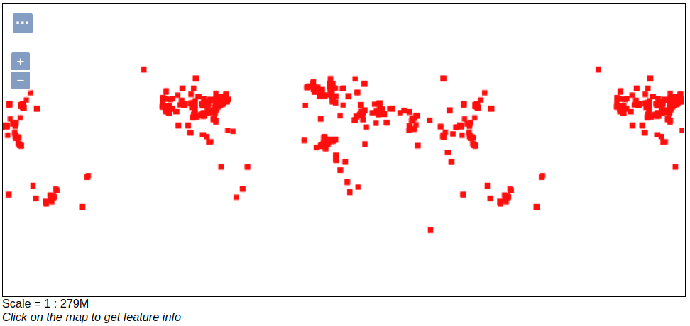

GeoMesa FSDS Quick Start
========================

This tutorial is the fastest and easiest way to get started with the
GeoMesa FileSystem Datastore (FSDS). In the spirit of keeping things simple, the
code in this tutorial only does a few things:

1. Establishes a new (static) SimpleFeatureType
2. Prepares the FSDS to store this type of data
3. Creates a few thousand example SimpleFeatures
4. Writes these SimpleFeatures to the FSDS
5. Queries for a given geographic rectangle, time range, and attribute
   filter, writing out the entries in the result set

Prerequisites
-------------

Before you begin, you must have the following installed and configured:

-  `Java <http://java.oracle.com/>`__ JDK 1.8
-  Apache `Maven <http://maven.apache.org/>`__ |maven_version|
-  a GitHub client

Download and Build the Tutorial
-------------------------------

Pick a reasonable directory on your machine, and run:

.. code-block:: bash

    $ git clone https://github.com/geomesa/geomesa-tutorials.git
    $ cd geomesa-tutorials

.. warning::

    Make sure that you download or checkout the version of the tutorials project that corresponds to
    your GeoMesa version. See :ref:`tutorial_versions` for more details.

To ensure that the quick start works with your environment, modify the ``pom.xml``
to set the appropriate versions for Hadoop, etc.

For ease of use, the project builds a bundled artifact that contains all the required
dependencies in a single JAR. To build, run:

.. code-block:: bash

    $ mvn clean install -pl geomesa-quickstart-fsds -am

About this Tutorial
-------------------

The quick start operates by inserting and then querying several thousand features.
After the insertions are complete, a sequence of queries are run to
demonstrate different types of queries possible via the GeoTools API.

Running the Tutorial
--------------------

On the command line, run:

.. code-block:: bash

    $ java -cp geomesa-quickstart-fsds/target/geomesa-quickstart-fsds-$VERSION.jar \
        org.geomesa.example.fsds.FSDSQuickStart \
        --fs.path /tmp/fsds/                    \
        --fs.encoding parquet

The arguments above indicate:

-  ``fs.path`` the FSDS storage path. Each simple feature type will produce a sub-directory here.
-  ``fs.encoding`` the file storage encoding. The quickstart comes pre-configured to use Apache's Parquet encoding.

Once run, you should see the following output:

.. code-block:: none

    Loading datastore
    Unable to load native-hadoop library for your platform... using builtin-java classes where applicable

    Creating schema: GLOBALEVENTID:String,Actor1Name:String,Actor1CountryCode:String,Actor2Name:String,Actor2CountryCode:String,EventCode:String,NumMentions:Integer,NumSources:Integer,NumArticles:Integer,ActionGeo_Type:Integer,ActionGeo_FullName:String,ActionGeo_CountryCode:String,dtg:Date,geom:Point:srid=4326

    Generating test data

    Writing test data
    Wrote 2356 features

    Running test queries
    Running query BBOX(geom, -120.0,30.0,-75.0,55.0) AND dtg DURING 2017-12-31T00:00:00+00:00/2018-01-02T00:00:00+00:00
    01 719024913=719024913|||VICTORIA|AUS|173|2|1|2|4|Victoria Harbour, Ontario, Canada|CA|2018-01-01T00:00:00.000Z|POINT (-79.7667 44.75)
    02 719024913=719024913|||VICTORIA|AUS|173|2|1|2|4|Victoria Harbour, Ontario, Canada|CA|2018-01-01T00:00:00.000Z|POINT (-79.7667 44.75)
    03 719024918=719024918|||EMPLOYER||020|10|1|10|3|Brooklyn, New York, United States|US|2018-01-01T00:00:00.000Z|POINT (-75.1704 42.3442)
    04 719024918=719024918|||EMPLOYER||020|10|1|10|3|Brooklyn, New York, United States|US|2018-01-01T00:00:00.000Z|POINT (-75.1704 42.3442)
    05 719024923=719024923|||INDUSTRY||084|3|1|3|2|Pennsylvania, United States|US|2018-01-01T00:00:00.000Z|POINT (-77.264 40.5773)
    06 719024923=719024923|||INDUSTRY||084|3|1|3|2|Pennsylvania, United States|US|2018-01-01T00:00:00.000Z|POINT (-77.264 40.5773)
    07 719024924=719024924|||CORPORATION||115|2|1|2|4|Saskatoon, Saskatchewan, Canada|CA|2018-01-01T00:00:00.000Z|POINT (-106.667 52.1333)
    08 719024924=719024924|||CORPORATION||115|2|1|2|4|Saskatoon, Saskatchewan, Canada|CA|2018-01-01T00:00:00.000Z|POINT (-106.667 52.1333)
    09 719024925=719024925|||CORPORATION||172|2|1|2|4|Saskatoon, Saskatchewan, Canada|CA|2018-01-01T00:00:00.000Z|POINT (-106.667 52.1333)
    10 719024925=719024925|||CORPORATION||172|2|1|2|4|Saskatoon, Saskatchewan, Canada|CA|2018-01-01T00:00:00.000Z|POINT (-106.667 52.1333)

    Returned 1338 total features

    Running query BBOX(geom, -120.0,30.0,-75.0,55.0) AND dtg DURING 2017-12-31T00:00:00+00:00/2018-01-02T00:00:00+00:00
    Returning attributes [GLOBALEVENTID, dtg, geom]
    01 719024913=719024913|2018-01-01T00:00:00.000Z|POINT (-79.7667 44.75)
    02 719024913=719024913|2018-01-01T00:00:00.000Z|POINT (-79.7667 44.75)
    03 719024918=719024918|2018-01-01T00:00:00.000Z|POINT (-75.1704 42.3442)
    04 719024918=719024918|2018-01-01T00:00:00.000Z|POINT (-75.1704 42.3442)
    05 719024923=719024923|2018-01-01T00:00:00.000Z|POINT (-77.264 40.5773)
    06 719024923=719024923|2018-01-01T00:00:00.000Z|POINT (-77.264 40.5773)
    07 719024924=719024924|2018-01-01T00:00:00.000Z|POINT (-106.667 52.1333)
    08 719024924=719024924|2018-01-01T00:00:00.000Z|POINT (-106.667 52.1333)
    09 719024925=719024925|2018-01-01T00:00:00.000Z|POINT (-106.667 52.1333)
    10 719024925=719024925|2018-01-01T00:00:00.000Z|POINT (-106.667 52.1333)

    Returned 1338 total features

    Running query EventCode = '051'
    01 719024909=719024909|||MELBOURNE|AUS|051|10|1|10|4|Melbourne, Victoria, Australia|AS|2018-01-01T00:00:00.000Z|POINT (144.967 -37.8167)
    02 719024963=719024963|||CITIZEN||051|6|2|6|4|City Of Sydney, New South Wales, Australia|AS|2018-01-01T00:00:00.000Z|POINT (151.217 -33.8833)
    03 719025168=719025168|AUSTRALIAN|AUS|||051|18|1|10|4|Sydney, New South Wales, Australia|AS|2018-01-01T00:00:00.000Z|POINT (151.217 -33.8833)
    04 719025178=719025178|AUSTRALIA|AUS|COMMUNITY||051|20|2|20|4|Sydney, New South Wales, Australia|AS|2018-01-01T00:00:00.000Z|POINT (151.217 -33.8833)
    05 719025248=719025248|BUSINESS||||051|10|1|10|1|Australia|AS|2018-01-01T00:00:00.000Z|POINT (135 -25)
    06 719025509=719025509|COMMUNITY||AUSTRALIA|AUS|051|2|1|2|1|Australia|AS|2018-01-01T00:00:00.000Z|POINT (135 -25)
    07 719025555=719025555|DENMARK|DNK|||051|2|1|2|1|Australia|AS|2018-01-01T00:00:00.000Z|POINT (135 -25)
    08 719025634=719025634|FIJI|FJI|||051|2|1|2|1|Fiji|FJ|2018-01-01T00:00:00.000Z|POINT (178 -18)
    09 719025965=719025965|MIDWIFE||||051|10|1|10|4|Sydney, New South Wales, Australia|AS|2018-01-01T00:00:00.000Z|POINT (151.217 -33.8833)
    10 719024909=719024909|||MELBOURNE|AUS|051|10|1|10|4|Melbourne, Victoria, Australia|AS|2018-01-01T00:00:00.000Z|POINT (144.967 -37.8167)

    Returned 276 total features

    Running query EventCode = '051' AND dtg DURING 2017-12-31T00:00:00+00:00/2018-01-02T00:00:00+00:00
    Returning attributes [GLOBALEVENTID, dtg, geom]
    01 719024909=719024909|2018-01-01T00:00:00.000Z|POINT (144.967 -37.8167)
    02 719024963=719024963|2018-01-01T00:00:00.000Z|POINT (151.217 -33.8833)
    03 719025168=719025168|2018-01-01T00:00:00.000Z|POINT (151.217 -33.8833)
    04 719025178=719025178|2018-01-01T00:00:00.000Z|POINT (151.217 -33.8833)
    05 719025248=719025248|2018-01-01T00:00:00.000Z|POINT (135 -25)
    06 719025509=719025509|2018-01-01T00:00:00.000Z|POINT (135 -25)
    07 719025555=719025555|2018-01-01T00:00:00.000Z|POINT (135 -25)
    08 719025634=719025634|2018-01-01T00:00:00.000Z|POINT (178 -18)
    09 719025965=719025965|2018-01-01T00:00:00.000Z|POINT (151.217 -33.8833)
    10 719024909=719024909|2018-01-01T00:00:00.000Z|POINT (144.967 -37.8167)

    Returned 276 total features

    Done

Looking at the Code
-------------------

The source code is meant to be accessible for this tutorial. The main logic is contained in
the generic ``org.geomesa.example.quickstart.GeoMesaQuickStart`` in the ``geomesa-quickstart-common`` module,
which is datastore agnostic. Some relevant methods are:

-  ``createDataStore`` get a datastore instance from the input configuration
-  ``createSchema`` create the schema in the datastore, as a pre-requisite to writing data
-  ``writeFeatures`` use a ``FeatureWriter`` to write features to the datastore
-  ``queryFeatures`` run several queries against the datastore
-  ``cleanup`` deletes data and disposes of the datastore instance. Note the FSDS is not able to automatically cleanup at this time.

The quickstart uses a small subset of GDELT data. Code for parsing the data into GeoTools SimpleFeatures is
contained in ``org.geomesa.example.quickstart.GDELTData``:

-  ``getSimpleFeatureType`` creates the ``SimpleFeatureType`` representing the data
-  ``getTestData`` parses an embedded TSV file to create ``SimpleFeature`` objects
-  ``getTestQueries`` illustrates several different query types, using CQL (GeoTools' Contextual Query Language)

Visualize Data With GeoServer (optional)
----------------------------------------

You can use GeoServer to access and visualize the data stored in GeoMesa. In order to use GeoServer,
download and install version |geoserver_version|. Then follow the instructions in :ref:`install_fsds_geoserver`
to enable GeoMesa.

Register the GeoMesa Store with GeoServer
~~~~~~~~~~~~~~~~~~~~~~~~~~~~~~~~~~~~~~~~~

Log into GeoServer using your user and password credentials. Click
"Stores" and "Add new Store". Select the ``FileSystem (GeoMesa)`` vector data
source, and fill in the required parameters.

Basic store info:

-  ``workspace`` this is dependent upon your GeoServer installation
-  ``data source name`` pick a sensible name, such as ``geomesa_quick_start``
-  ``description`` this is strictly decorative; ``GeoMesa quick start``

Connection parameters:

-  these are the same parameter values that you supplied on the
   command-line when you ran the tutorial; they describe how to connect
   to the FSDS instance where your data reside

Click "Save", and GeoServer will search your FSDS directory for any
GeoMesa-managed feature types.

Publish the Layer
~~~~~~~~~~~~~~~~~

GeoServer should recognize the ``gdelt-quickstart`` feature type, and
should present that as a layer that can be published. Click on the
"Publish" link.

You will be taken to the Edit Layer screen. You will need to enter values for the data bounding
boxes. In this case, you can click on the link to compute these values from the data.

Click on the "Save" button when you are done.

Take a Look
~~~~~~~~~~~

Click on the "Layer Preview" link in the left-hand gutter. If you don't
see the quick-start layer on the first page of results, enter the name
of the layer you just created into the search box, and press
``<Enter>``.

Once you see your layer, click on the "OpenLayers" link, which will open
a new tab. You should see a collection of red dots similar to the following image:

    Visualizing quick-start data

Tweaking the display
~~~~~~~~~~~~~~~~~~~~

Here are just a few simple ways you can play with the visualization:

-  Click on one of the red points in the display, and GeoServer will
   report the detail records underneath the map area.
-  Shift-click to highlight a region within the map that you would like
   to zoom into.
-  Click on the "Toggle options toolbar" icon in the upper-left corner
   of the preview window. The right-hand side of the screen will include
   a "Filter" text box. Enter ``EventCode = '051'``, and press on the
   "play" icon. The display will now show only those points matching
   your filter criterion. This is a CQL filter, which can be constructed
   in various ways to query your data. You can find more information
   about CQL from `GeoServer's CQL
   tutorial <http://docs.geoserver.org/2.9.1/user/tutorials/cql/cql_tutorial.html>`__.

Generating Heatmaps
~~~~~~~~~~~~~~~~~~~

-  To try out server-side processing, you can install the Heatmap SLD from
   the :doc:`geomesa-examples-gdelt` tutorial.
-  After configuring the SLD, in the URL, change ``styles=`` to be
   ``styles=heatmap&density=true``. Once you press ``<Enter>``, the display will
   change to a density heat-map.

.. note::

    For this to work, you will have to first install the WPS module for GeoServer
    as described in :doc:`/user/geoserver`.
