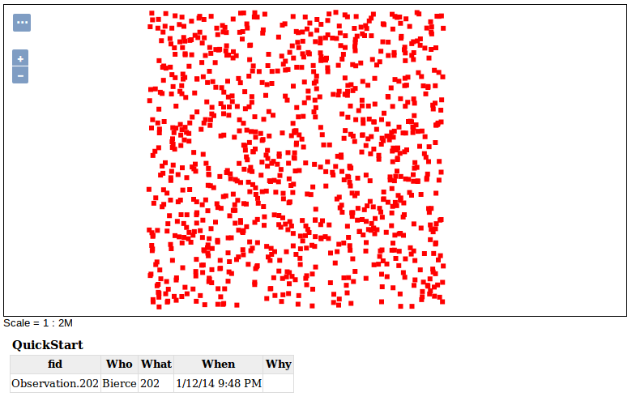

GeoMesa HBase Quick Start
=========================

This tutorial is the fastest and easiest way to get started with the
HBase support in GeoMesa. In the spirit of keeping things simple, the
code in this tutorial only does a few things:

1. Establishes a new (static) ``SimpleFeatureType``
2. Prepares the HBase table to store this type of data
3. Creates 1000 example SimpleFeatures
4. Writes these SimpleFeatures to the HBase table
5. Queries for a given geographic rectangle and time range, and
   attribute filter, and writes out the entries in the result set

Prerequisites
-------------

Before you begin, you must have the following installed and configured:

-  `Java <http://java.oracle.com/>`__ Development Kit 1.8
-  Apache `Maven <http://maven.apache.org/>`__
-  a GitHub client
-  HBase 1.1.x (optional)
-  GeoServer |geoserver_version| (optional)

An existing HBase 1.1.x installation is helpful but not necessary. The
tutorial described will work either with an existing HBase server or by
downloading the HBase binary distribution and running it in "standalone"
mode (described below).

GeoServer is only required for visualizing the HBase data. Setting up
GeoServer is beyond the scope of this tutorial.

Setting up HBase in standalone mode (optional)
----------------------------------------------

(Skip this section if you have an existing HBase 1.1.x installation.)

Download the HBase 1.1.5 binary distribution from
http://www.apache.org/dyn/closer.cgi/hbase/

Follow the chapter in the HBase Manual for running a standalone instance
of HBase (https://hbase.apache.org/book.html#quickstart). Note that this
will use the local filesystem instead of HDFS, and will spin up its own
instances of HBase and Zookeeper.

Download and build the tutorial
-------------------------------

Clone the geomesa-tutorials distribution from GitHub:

.. code-block:: bash

    $ git clone https://github.com/geomesa/geomesa-tutorials.git
    $ cd geomesa-tutorials

The ``pom.xml`` file contains an explicit list of dependent libraries
that will be bundled together into the final tutorial. You should
confirm that the versions of HBase and Hadoop match what you are
running; if it does not match, change the values of the
``hbase.version`` and ``hbase.hadoop.version`` properties. The version
of GeoMesa that this tutorial targets matches the project version of the
``pom.xml``. (Note that this tutorial has been tested with GeoMesa 1.2.2
or later).

.. note::

    The only reason these libraries are bundled into the final JAR is
    that this is easier for most people to do this than it is to set the
    classpath when running the tutorial. If you would rather not bundle
    these dependencies, mark them as ``provided`` in the POM, and update
    your classpath as appropriate.)

GeoMesa's ``HBaseDataStore`` searches for a file called
``hbase-site.xml``, which among other things configures the Zookeeper
host(s) and port. If this file is not present on the classpath, the
``hbase-default.xml`` provided by hbase-common sets the default
zookeeper quorum to "localhost" and port to 2181, which is what is used
by the standalone HBase described in "Setting up HBase in standalone
mode" above. If you have an existing HBase installation, you should copy
your ``hbase-site.xml`` file into
``geomesa-quickstart-hbase/src/main/resources`` (or otherwise add it to
the classpath when you run the tutorial).

To build the tutorial code:

.. code-block:: bash

    $ cd geomesa-quickstart-hbase
    $ mvn clean install

When this is complete, it should have built a JAR file that contains all
of the code you need to run the tutorial.

Running the tutorial
--------------------

On the command line, run:

.. code-block:: bash

    $ java -cp geomesa-quickstart-hbase/target/geomesa-quickstart-hbase-$VERSION.jar \
      com.example.geomesa.hbase.HBaseQuickStart --bigtable_table_name geomesa

The only argument passed is the name of the HBase table where GeoMesa
will store the feature type information. It will also create a table
called ``<featuretype>_z3`` which will store the Z3-indexed features.

You should see output similar to the following (not including some of
Maven's output and log4j's warnings), which lists the features that
match the specified query in the tutorial do

::

    Creating feature-type (schema):  QuickStart
    Creating new features
    Inserting new features
    Submitting query
    1.  Bierce|676|Fri Jul 18 08:22:03 EDT 2014|POINT (-78.08495724535888 37.590866849120395)|null
    2.  Bierce|190|Sat Jul 26 19:06:19 EDT 2014|POINT (-78.1159944062711 37.64226959044015)|null
    3.  Bierce|550|Mon Aug 04 08:27:52 EDT 2014|POINT (-78.01884511971093 37.68814732634964)|null
    4.  Bierce|307|Tue Sep 09 11:23:22 EDT 2014|POINT (-78.18782181976381 37.6444865782879)|null
    5.  Bierce|781|Wed Sep 10 01:14:16 EDT 2014|POINT (-78.0250604717695 37.58285696304815)|null

To see how the data is stored in HBase, use the HBase shell.

.. code-block:: bash

    $ /path/to/hbase-1.1.5/bin/hbase shell

The type information is in the ``geomesa`` table (or whatever name you
specified on the command line):

::

    hbase> scan 'geomesa'
    ROW                              COLUMN+CELL          
     QuickStart                      column=M:schema, timestamp=1463593804724, value=Who:String,What:Long,When:Date,*Where:Point:s
                                     rid=4326,Why:String

The features are stored in ``<featuretype>_z3`` (``QuickStart_z3`` in
this example):

::

    hbase> scan 'QuickStart_z3', { LIMIT => 3 }
    ROW                              COLUMN+CELL                                                                                  
     \x08\xF7\x0F#\x83\x91\xAE\xA2\x column=D:\x0F#\x83\x91\xAE\xA2\xA8PObservation.452, timestamp=1463593805801, value=\x02\x00\x
     A8P                             00\x00@Observation.45\xB2Clemen\xF3\x01\x00\x00\x00\x00\x00\x00\x01\xC4\x01\x00\x00\x01CM8\x0
                                     E\xA0\x01\x01\xC0S!\x93\xBCSg\x00\xC0CG\xBF$\x0DO\x7F\x80\x14\x1B$-?                         
     \x08\xF8\x06\x03\x19\xDFf\xA3p\ column=D:\x06\x03\x19\xDFf\xA3p\x0CObservation.362, timestamp=1463593805680, value=\x02\x00\x
     x0C                             00\x00@Observation.36\xB2Clemen\xF3\x01\x00\x00\x00\x00\x00\x00\x01j\x01\x00\x00\x01CQ\x17wh\
                                     x01\x01\xC0S\x05\xA5b\xD49"\xC0B\x88*~\xD1\xA0}\x80\x14\x1B$-?                               
     \x08\xF8\x06\x07\x19S\xD0\xA21> column=D:\x06\x07\x19S\xD0\xA21>Observation.35, timestamp=1463593805664, value=\x02\x00\x00\x
                                     00?Observation.3\xB5Clemen\xF3\x01\x00\x00\x00\x00\x00\x00\x00#\x01\x00\x00\x01CS?`x\x01\x01\
                                     xC0S_\xA7+G\xADH\xC0B\x90\xEB\xF7`\xC2T\x80\x13\x1A#,> 

Visualize the data with GeoServer (optional)
--------------------------------------------

Setting up the GeoMesa HBase GeoServer plugin
~~~~~~~~~~~~~~~~~~~~~~~~~~~~~~~~~~~~~~~~~~~~~

Clone the GeoMesa source distribution:

.. code-block:: bash

    $ git clone https://github.com/locationtech/geomesa.git
    $ cd geomesa

and build it with the ``hbase`` profile:

::

    $ mvn clean install -DskipTests -Phbase

Go into the build HBase GeoServer plugin module:

::

    $ cd geomesa-hbase/geomesa-hbase-gs-plugin/target

and extract the contents of the
``geomesa-hbase-gs-plugin_2.11-<version>-install.tar.gz`` file into
GeoServer's ``WEB-INF/lib`` directory. This distribution does not
include the Hadoop or Zookeeper JARs; the following JARs should be
copied from the ``lib`` directory of your HBase or Hadoop installations
into GeoServer's ``WEB-INF/lib`` directory:

-  hadoop-annotations-2.5.1.jar
-  hadoop-auth-2.5.1.jar
-  hadoop-common-2.5.1.jar
-  hadoop-mapreduce-client-core-2.5.1.jar
-  hadoop-yarn-api-2.5.1.jar
-  hadoop-yarn-common-2.5.1.jar
-  zookeeper-3.4.6.jar
-  commons-configuration-1.6.jar

Note: the versions may vary depending on your installation. In addition,
for Hadoop 2.6.0+, ``htrace-core-<version>.jar`` is also required.

The HBase data store requires the configuration file ``hbase-site.xml``
to be on the classpath. This can be accomplished, for example in Tomcat,
by placing the file in ``WEB-INF/classes`` (you should create the
directory if it doesn't exist). Restart GeoServer.

Register the GeoMesa store with GeoServer
~~~~~~~~~~~~~~~~~~~~~~~~~~~~~~~~~~~~~~~~~

Log into GeoServer using your user and password credentials. Click
"Stores" and "Add new Store". Select the ``HBase (GeoMesa)`` vector data
source, and enter the following parameters.

-  ``workspace`` this is dependent upon your GeoServer installation
-  ``data source name`` pick a sensible name, such as,
   ``geomesa_quick_start``
-  ``description`` this is strictly decorative; ``GeoMesa quick start``
-  ``bigtable_table_name`` the name of the table you specified on the
   command line

Click "Save", and GeoServer will search your HBase table for any
GeoMesa-managed feature types.

Publish the layer
~~~~~~~~~~~~~~~~~

GeoServer should recognize the ``QuickStart`` feature type, and should
present that as a layer that could be published. Click on the "Publish"
link.

You will be taken to the "Edit Layer" screen.

In the "Data" pane, enter values for the bounding boxes. In this case,
you can click on the link to compute these values from the data.

Click on the "Save" button when you are done.

Take a look
~~~~~~~~~~~

Click on the "Layer Preview" link in the left-hand gutter. If you don't
see the quickstart layer on the first page of results, enter the name of
the layer you just created into the search box, and press . Select the
layer, and you should see a small square with a collection of red dots.
(You may shift-click to highlight a region to zoom into). After zooming
in your view should look something like this:

Click on one of the red points in the display, and GeoServer should
report a detailed record for the clicked point underneath the map area.

Click on the "Toggle options toolbar" icon in the upper-left corner of
the preview window. The right-hand side of the screen will include a
"Filter" text box. Enter ``Who = 'Bierce'``, and click "Apply". The
display will now show only those points matching your filter criterion.

This is a CQL filter, which can be constructed in various ways to query
our data. You can find more information about CQL from `GeoServer's CQL
tutorial <http://docs.geoserver.org/stable/en/user/tutorials/cql/cql_tutorial.html>`__.
