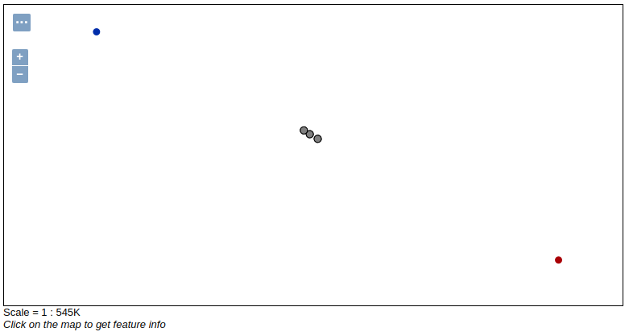

GeoMesa Kafka Streams Quick Start
=================================

This tutorial demonstrates using Kafka Streams with GeoMesa. It will walk-through reading from and writing to a
GeoMesa-Kafka topic and using Kafka Streams to process data.

About this Tutorial
-------------------

This tutorial utilizes the same components as the :ref:`kafka_quickstart` and can be viewed as an expansion of it. Here
we will:

1. Establishes a new (static) SimpleFeatureType
2. Prepares the Kafka topic to write this type of data
3. Creates a few thousand example SimpleFeatures
4. Writes these SimpleFeatures to the Kafka topic
5. Consume these features from the topic using Kafka Streams
6. Process the consumed features
7. Write the result back to the same Kafka topic
8. Visualize the changing data in GeoServer (optional)

The quick start operates by simultaneously querying and writing several thousand feature updates. The data contains
location information for two entities. A unique feature identifier is used for each entity. Updates for an entity will
re-use the entity's feature identifier such that there will only be one live feature for each entity.

The Kafka Streams topology will be configured to look for instances when the two entities are withing a distance
threshold of each other. These proximity events are written back to the same topic with a unique feature identifier so
that they persist in the layer.

The data used is a simulated drive between Charlottesville and Richmond Virginia, following the I64 interstate.

Background
----------

<<<<<<< HEAD
`Apache Kafka <https://kafka.apache.org/>`__ is "publish-subscribe
=======
`Apache Kafka <http://kafka.apache.org/>`__ is "publish-subscribe
<<<<<<< HEAD
<<<<<<< HEAD
<<<<<<< HEAD
<<<<<<< HEAD
<<<<<<< HEAD
=======
>>>>>>> e74fa3f690 (GEOMESA-3254 Add Bloop build support)
=======
>>>>>>> 3e610250ce (GEOMESA-3254 Add Bloop build support)
>>>>>>> 58d14a257e (GEOMESA-3254 Add Bloop build support)
=======
>>>>>>> 58d14a257 (GEOMESA-3254 Add Bloop build support)
>>>>>>> fa60953a42 (GEOMESA-3254 Add Bloop build support)
<<<<<<< HEAD
<<<<<<< HEAD
=======
>>>>>>> 58d14a257e (GEOMESA-3254 Add Bloop build support)
>>>>>>> 7564665969 (GEOMESA-3254 Add Bloop build support)
=======
>>>>>>> e74fa3f690 (GEOMESA-3254 Add Bloop build support)
=======
>>>>>>> 58d14a257e (GEOMESA-3254 Add Bloop build support)
>>>>>>> 9e49c1aac7 (GEOMESA-3254 Add Bloop build support)
=======
>>>>>>> 3e610250ce (GEOMESA-3254 Add Bloop build support)
messaging rethought as a distributed commit log."

In the context of GeoMesa, Kafka is a useful tool for working with
streams of geospatial data. Interaction with Kafka in GeoMesa occurs
through the KafkaDataStore which implements the GeoTools
<<<<<<< HEAD
`DataStore <https://docs.geotools.org/latest/userguide/library/data/datastore.html>`__
=======
`DataStore <http://docs.geotools.org/latest/userguide/library/data/datastore.html>`__
<<<<<<< HEAD
<<<<<<< HEAD
<<<<<<< HEAD
<<<<<<< HEAD
<<<<<<< HEAD
=======
>>>>>>> e74fa3f690 (GEOMESA-3254 Add Bloop build support)
=======
>>>>>>> 3e610250ce (GEOMESA-3254 Add Bloop build support)
>>>>>>> 58d14a257e (GEOMESA-3254 Add Bloop build support)
=======
>>>>>>> 58d14a257 (GEOMESA-3254 Add Bloop build support)
>>>>>>> fa60953a42 (GEOMESA-3254 Add Bloop build support)
<<<<<<< HEAD
<<<<<<< HEAD
=======
>>>>>>> 58d14a257e (GEOMESA-3254 Add Bloop build support)
>>>>>>> 7564665969 (GEOMESA-3254 Add Bloop build support)
=======
>>>>>>> e74fa3f690 (GEOMESA-3254 Add Bloop build support)
=======
>>>>>>> 58d14a257e (GEOMESA-3254 Add Bloop build support)
>>>>>>> 9e49c1aac7 (GEOMESA-3254 Add Bloop build support)
=======
>>>>>>> 3e610250ce (GEOMESA-3254 Add Bloop build support)
interface.

Additionally, GeoMesa configures a Kafka Streams topology to read, process
and write data to the topic. More information about Kafka Streams can be
found in the `official documentation <https://kafka.apache.org/documentation/streams/>`__.

Prerequisites
-------------

Before you begin, you must have the following installed and configured:

<<<<<<< HEAD
-  `Java <https://adoptium.net/temurin/releases/>`__ JDK 1.8
-  Apache `Maven <https://maven.apache.org/>`__ |maven_version|
-  a GitHub client
-  a Kafka |kafka_required_version| cluster

Ensure your Kafka and Zookeeper instances are running. You can use
Kafka's `quickstart <https://kafka.apache.org/documentation.html#quickstart>`__
=======
-  `Java <http://java.oracle.com/>`__ JDK 1.8
-  Apache `Maven <http://maven.apache.org/>`__ |maven_version|
-  a GitHub client
-  a Kafka instance version |kafka_version|

Ensure your Kafka and Zookeeper instances are running. You can use
Kafka's `quickstart <http://kafka.apache.org/documentation.html#quickstart>`__
<<<<<<< HEAD
<<<<<<< HEAD
<<<<<<< HEAD
<<<<<<< HEAD
<<<<<<< HEAD
=======
>>>>>>> e74fa3f690 (GEOMESA-3254 Add Bloop build support)
=======
>>>>>>> 3e610250ce (GEOMESA-3254 Add Bloop build support)
>>>>>>> 58d14a257e (GEOMESA-3254 Add Bloop build support)
=======
>>>>>>> 58d14a257 (GEOMESA-3254 Add Bloop build support)
>>>>>>> fa60953a42 (GEOMESA-3254 Add Bloop build support)
<<<<<<< HEAD
<<<<<<< HEAD
=======
>>>>>>> 58d14a257e (GEOMESA-3254 Add Bloop build support)
>>>>>>> 7564665969 (GEOMESA-3254 Add Bloop build support)
=======
>>>>>>> e74fa3f690 (GEOMESA-3254 Add Bloop build support)
=======
>>>>>>> 58d14a257e (GEOMESA-3254 Add Bloop build support)
>>>>>>> 9e49c1aac7 (GEOMESA-3254 Add Bloop build support)
=======
>>>>>>> 3e610250ce (GEOMESA-3254 Add Bloop build support)
to get Kafka/Zookeeper instances up and running quickly.

Configure GeoServer (optional)
------------------------------

You can use GeoServer to access and visualize the data stored in GeoMesa. In order to use GeoServer,
download and install version |geoserver_version|. Then follow the instructions in :ref:`install_kafka_geoserver`
to enable GeoMesa.

Download and Build the Tutorial
-------------------------------

Pick a reasonable directory on your machine, and run:

.. code-block:: bash

    $ git clone https://github.com/geomesa/geomesa-tutorials.git
    $ cd geomesa-tutorials

.. warning::

    Make sure that you download or checkout the version of the tutorials project that corresponds to
    your GeoMesa version. See :ref:`tutorial_versions` for more details.

To ensure that the quick start works with your environment, modify the ``pom.xml``
to set the appropriate versions for Kafka, Zookeeper, etc.

For ease of use, the project builds a bundled artifact that contains all the required
dependencies in a single JAR. To build, run:

.. code-block:: bash

    $ mvn clean install -pl geomesa-tutorials-kafka/geomesa-tutorials-kafka-streams-quickstart -am

Running the Tutorial
--------------------

On the command line, run:

.. code-block:: bash

    $ java -cp geomesa-tutorials-kafka/geomesa-tutorials-kafka-streams-quickstart/target/geomesa-tutorials-kafka-streams-quickstart-$VERSION.jar \
        org.geomesa.example.kafka.KafkaStreamsQuickStart \
        --kafka.brokers <brokers>                 \
        --kafka.zookeepers <zookeepers>

where you provide the following arguments:

- ``<brokers>`` your Kafka broker instances, comma separated. For a
  local install, this would be ``localhost:9092``
- ``<zookeepers>`` your Zookeeper nodes, comma separated. For a local
  install, this would be ``localhost:2181``

Optionally, you can also specify that the quick start should delete its data upon completion. Use the
``--cleanup`` flag when you run to enable this behavior.

Once run, the quick start will create the Kafka topic, then pause and prompt you to register the layer in
GeoServer. If you do not want to use GeoServer, you can skip this step. Otherwise, follow the instructions in
the next section before returning here.

Once you continue, the tutorial should run for approximately thirty seconds. You should see the following output:

.. code-block:: none

    Loading datastore
    
    Loading datastore
    
    Creating schema: entityId:String,dtg:Date,geom:Point
    
    Generating test data
    
    Configuring Streams Topology
    Feature type created - register the layer 'cvilleric-quickstart' in geoserver with bounds: MinX[-78.4696824929457] MinY[37.532442090296044] MaxX[-77.42668269989638] MaxY[38.03920921521279]
    Press <enter> to continue
    

    Writing features to Kafka... refresh GeoServer layer preview to see changes
    Current consumer state:
    a=a|2022-09-21T21:03:02.675Z|POINT (-78.2742794712714 37.995618168053184)
    b=b|2022-09-21T21:03:02.675Z|POINT (-77.56747216770198 37.6305975318267)
    Current consumer state:
    a=a|2022-09-21T21:28:02.675Z|POINT (-78.01751112645616 37.872800086051654)
    b=b|2022-09-21T21:28:02.675Z|POINT (-77.87883454073382 37.772794168668476)
    Current consumer state:
    b=b|2022-09-21T21:53:02.675Z|POINT (-78.14780655790103 37.95424382536054)
    a=a|2022-09-21T21:53:02.675Z|POINT (-77.711327871061 37.694257161353974)
    proximity0ab51dd3-2e48-4827-9388-c76c7f95279b=proximity-a-b|2022-09-21T21:35:02.675Z|POINT (-77.94037514437152 37.81389651562376)
    proximity911fd4dd-40c8-4336-90aa-0315e4d896b5=proximity-b-a|2022-09-21T21:33:02.675Z|POINT (-77.94037514437152 37.81389651562376)
    proximity70a19c33-8d77-4539-b2a0-5d4f0abfcd9a=proximity-a-b|2022-09-21T21:33:02.675Z|POINT (-77.96397858370257 37.828337948614255)
    proximityaef4c251-9edb-4d96-8a1a-65da5a40c11d=proximity-b-a|2022-09-21T21:34:02.675Z|POINT (-77.95393639315081 37.82182948351288)
    proximity3025cd2b-699a-4625-9760-2781acf98edf=proximity-a-b|2022-09-21T21:34:02.675Z|POINT (-77.95393639315081 37.82182948351288)
    proximity0eb6874d-19c1-4c55-887f-ff8e50455662=proximity-b-a|2022-09-21T21:35:02.675Z|POINT (-77.96397858370257 37.828337948614255)
    Current consumer state:
    b=b|2022-09-21T22:18:02.675Z|POINT (-78.40589688999782 38.018104630123695)
    a=a|2022-09-21T22:18:02.675Z|POINT (-77.46880947199425 37.579440835126896)
    proximity0ab51dd3-2e48-4827-9388-c76c7f95279b=proximity-a-b|2022-09-21T21:35:02.675Z|POINT (-77.94037514437152 37.81389651562376)
    proximity911fd4dd-40c8-4336-90aa-0315e4d896b5=proximity-b-a|2022-09-21T21:33:02.675Z|POINT (-77.94037514437152 37.81389651562376)
    proximity70a19c33-8d77-4539-b2a0-5d4f0abfcd9a=proximity-a-b|2022-09-21T21:33:02.675Z|POINT (-77.96397858370257 37.828337948614255)
    proximityaef4c251-9edb-4d96-8a1a-65da5a40c11d=proximity-b-a|2022-09-21T21:34:02.675Z|POINT (-77.95393639315081 37.82182948351288)
    proximity3025cd2b-699a-4625-9760-2781acf98edf=proximity-a-b|2022-09-21T21:34:02.675Z|POINT (-77.95393639315081 37.82182948351288)
    proximity0eb6874d-19c1-4c55-887f-ff8e50455662=proximity-b-a|2022-09-21T21:35:02.675Z|POINT (-77.96397858370257 37.828337948614255)

    Done

Visualize Data With GeoServer (optional)
----------------------------------------

You can use GeoServer to access and visualize the data stored in GeoMesa. In order to use GeoServer,
download and install version |geoserver_version|. Then follow the instructions in :ref:`install_kafka_geoserver`
to enable GeoMesa.

Register the GeoMesa Store with GeoServer
~~~~~~~~~~~~~~~~~~~~~~~~~~~~~~~~~~~~~~~~~

Log into GeoServer using your user and password credentials. Click
"Stores" and "Add new Store". Select the ``Kafka (GeoMesa)`` vector data
source, and fill in the required parameters.

Basic store info:

-  ``workspace`` this is dependent upon your GeoServer installation
-  ``data source name`` pick a sensible name, such as ``geomesa_quick_start``
-  ``description`` this is strictly decorative; ``GeoMesa quick start``

Connection parameters:

-  these are the same parameter values that you supplied on the
   command line when you ran the tutorial; they describe how to connect
   to the Kafka instance where your data resides

Click "Save", and GeoServer will search Zookeeper for any GeoMesa-managed feature types.

Publish the Layer
~~~~~~~~~~~~~~~~~

If you have already run the command to start the tutorial, then GeoServer should recognize the
``cvilleric-quickstart`` feature type, and should present that as a layer that can be published. Click on the
"Publish" link. If not, then run the tutorial as described above in **Running the Tutorial**. When
the tutorial pauses, go to "Layers" and "Add new Layer". Select the GeoMesa Kafka store you just
created, and then click "publish" on the ``cvilleric-quickstart`` layer.

You will be taken to the Edit Layer screen. You will need to enter values for the data bounding
boxes. For this demo, use the values MinX: -78.46969, MinY: 37.53245, MaxX: -77.42669, MaxY: 38.03921.

Click on the "Save" button when you are done.

Style the Layer (optional)
~~~~~~~~~~~~~~~~~~~~~~~~~~

To better visualize the interaction of input data and data generated by the Kafka Stream topology it can be helpful to
apply some simple styling rules. To do this first create a new style.

Click "Styles" and "Add a new style". Give it a reasonable name and set the Format to CSS. Insert the following CSS
into the editor window.

.. code-block:: none

    * {
      	mark: symbol(circle);
        mark-size: 9px;
        fill: #1e8003;
    }

    [entityId = 'a'] :mark {
      	fill: #AD0000;
    }

    [entityId = 'b'] :mark {
      	fill: #001AAD;
    }

Click "Submit" to save the style. Next the style must be added to the layer and set as default. Under
"Layers" select the layer you created. On the "Publishing" tab, under "WMS Setting" and "Layer Settings" set the
"Default Style" to the style you created. At the bottom of the page click "Save" to proceed.

Take a Look
~~~~~~~~~~~

Click on the "Layer Preview" link in the left-hand gutter. If you don't
see the quick-start layer on the first page of results, enter the name
of the layer you just created into the search box, and press
``<Enter>``.

At first, there will be no data displayed. Once you have reached this
point, return to the quick start console and hit "<enter>" to continue the tutorial.
As the data is updated in Kafka, you can refresh the layer preview page to see
the feature moving around.

What's Happening in GeoServer
~~~~~~~~~~~~~~~~~~~~~~~~~~~~~

The layer preview of GeoServer uses the ``KafkaFeatureStore`` to show a
real time view of the current state of the data stream. There are two
``SimpleFeatures`` being updated over time in Kafka which is
reflected in the GeoServer display.

As you refresh the page, you should see the ``SimpleFeatures`` move around.
When the two points (red and blue points below) are close to each other you will see ``SimpleFeatures`` representing the
proximity events (grey points below) added to the data stream. These features will remain where they are because there
are no updates being sent with the same feature IDs.

    Visualizing quick-start data with GeoServer

Looking at the Code
-------------------

The source code is meant to be accessible for this tutorial. The logic is contained in
the generic ``org.geomesa.example.quickstart.GeoMesaQuickStart`` in the ``geomesa-quickstart-common`` module,
and the Kafka-Streams specific ``org.geomesa.example.kafka.KafkaStreamsQuickStart`` in the
``geomesa-quickstart-kafka-streams`` module. Some relevant methods are:

-  ``createDataStore`` overridden in the ``KafkaQuickStart``  to use the input configuration to get a pair of datastore instances, one for writing and one for reading data. Additionally, the ``GeoMesaStreamsBuilder`` is used to create the Kafka Streams topology builder.
-  ``createSchema`` create the schema in the datastore, as a pre-requisite to writing data
-  ``writeFeatures`` overridden in the ``KafkaQuickStart`` to simultaneously write and read features from Kafka as well as setup and run the streams topology
-  ``queryFeatures`` not used in this tutorial
-  ``cleanup`` delete the sample data and dispose of the datastore instance

Code for parsing the data into GeoTools SimpleFeatures is contained in ``org.geomesa.example.data.CvilleRICData``:

-  ``getSimpleFeatureType`` creates the ``SimpleFeatureType`` representing the data
-  ``getTestData`` parses an embedded CSV file to create ``SimpleFeature`` objects
-  ``getTestQueries`` not used in this tutorial

Streams Topology
~~~~~~~~~~~~~~~~

The code in ``setupStreams`` uses the GeoMesa Kafka Streams integration to build the Kafka Streams topology. The
``GeoMesaStreamsBuilder`` class wraps an internal Kafka ``StreamsBuilder`` instance. This allows GeoMesa to provide the
Kafka ``Serde`` when reading and writing data to the underlying Kafka topic and provide the ``TimestampExtractor``
appropriate to the ``SimpleFeatureType``. Additionally, GeoMesa is able to resolve the correct Kafka topic for a given
TypeName.

The quickstart topology reads data from the quickstart topic into a ``KStream``, leveraging the ``Serde`` and
``TimestampExtractor`` from GeoMesa.

.. code-block:: java

    KStream<String, GeoMesaMessage> input = builder.stream(typeName);

Next the input stream is filtered to remove any messages that are not updates to our two entities. Failure to do this
step would allow the proximity messages we write later to be pickup up and processed by the topology. After filtering
the data is re-keyed. The ``GeoPartitioner`` class is a ``KeyValueMapper`` that is used to select a new key for each
record. The new key is determined by utilizing a GeoMesa ``Z2SFC`` to determine which geospatial Z-Bin a given record
is contained in. More info on Z2 curves and indexing can be found in the :ref:`index_overview`. Changing the record keys
will cause Kafka Stream to repartition the data stream. This will create an intermediate topic but will ensure that data
is co-located with other data that is spatially proximal.

.. code-block:: java

    KStream<String, GeoMesaMessage> geoPartioned = input
        .filter((k, v) -> !Objects.equals(getFID(v), "") && !getFID(v).startsWith(proximityId))
        .selectKey(new GeoPartitioner(numbits, defaultGeomIndex));

To find if a point is in proximity of another requires computing the distance to every other point. To find all
proximities in a set of points requires the cartesian product of all points. This can be a very expensive operation so
reducing the number of points that need to be compared is important. Spatially partitioning the data allows us to
reduce the number of comparisons by excluding spatial regions. Only the cartesian product of records sharing the same
Z-Bin need to be evaluated (this tutorial ignores the issue with Z-Bin boundaries).

The quickstart next uses the GeoPartitioned ``KStream`` to perform a self join using the, now spatial, keys. This allows
us to create a Proximity object for each comparison that needs to be evaluated.

A self join will by its nature join a record to itself. The filter step first removes these and then performs the actual
proximity calculation and threshold check. Finally we convert the ``Proximity`` events into ``GeoMesaMessage`` and set
a key that indicates it's a proximity message (use in the previous filter step).

.. code-block:: java

    KStream<String, GeoMesaMessage> proximities = geoPartioned
        .join(geoPartioned,
            (left, right) -> new Proximity(left, right, defaultGeomIndex),
            JoinWindows.of(Duration.ofMinutes(2)),
            StreamJoined.with(Serdes.String(), serde, serde))
        .filter((k, v) -> v.areDifferent() && v.getDistance() < proximityDistanceMeters)
        .mapValues(Proximity::toGeoMesaMessage)
        .selectKey((k, v) -> proximityId + UUID.randomUUID());

Lastly the ``GeoMesaStreamsBuilder`` is used again to configure the target topic from the provided TypeName and handle
the ``Serde`` for us.

.. code-block:: java

    builder.to(typeName, proximities);

