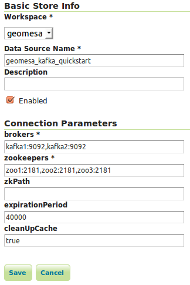

GeoMesa Kafka Quick Start
=========================

This tutorial will show you how to:

1. Write custom Java code to produce and consume messages in `Apache
   Kafka <http://kafka.apache.org/>`__ using GeoMesa.
2. Query the data and replay the messages in a Kafka topic to achieve an
   earlier state.
3. Visualize the changes being made in Kafka with GeoServer.

Background
----------

`Apache Kafka <http://kafka.apache.org/>`__ is "publish-subscribe
messaging rethought as a distributed commit log." In the context of
GeoMesa, Kafka is a useful tool for working with streams of geospatial
data. Interaction with Kafka in GeoMesa occurs with the KafkaDataStore
which implements the `GeoTools DataStore
interface <http://docs.geotools.org/latest/userguide/library/data/datastore.html>`__.

Prerequisites
-------------

First, make sure that GeoServer is installed and configured to use GeoMesa as described in the :doc:`../user/installation_and_configuration` section of the GeoMesa User Manual, especially the part about the GeoMesa Kafka GeoServer plugin. 

-  basic knowledge of `GeoTools <http://www.geotools.org>`__,
   `GeoServer <http://geoserver.org>`__, and Kafka,
-  an instance of Kafka 0.8.2.x with (an) appropriate Zookeeper
   instance(s),
-  an instance of GeoServer version 2.5.2 with the GeoMesa plugin
   installed,
-  `Java JDK
   7 <http://www.oracle.com/technetwork/java/javase/downloads/index.html>`__,
-  `Apache Maven <http://maven.apache.org/>`__ 3.2.2 or better, and
-  a `git <http://git-scm.com/>`__ client.

Run the Code
------------

Ensure your Kafka and Zookeeper instances are running. You can use
`Kafka's
quickstart <http://kafka.apache.org/documentation.html#quickstart>`__ to
get Kafka/Zookeeper instances up and running quickly.

The example code is found in the GeoMesa tutorials distribution, which may
be cloned from GitHub:

.. code-block:: bash

    $ git clone https://github.com/geomesa/geomesa-tutorials.git

The Kafka QuickStart tutorial is in the ``geomesa-quickstart-kafka`` directory:

.. code-block:: bash

    $ cd geomesa-tutorials/geomesa-quickstart-kafka
    $ mvn clean install -DskipTests=true

After building, run the tutorial program, where $VERSION = |version|:

.. code-block:: bash

    java -cp ./target/geomesa-quickstart-kafka-$VERSION.jar com.example.geomesa.kafka.KafkaQuickStart -brokers "localhost:9092" -zookeepers "localhost:2181"

where you provide your own values for the following arguments:

-  ``brokers``: your Kafka broker instances, separated by commas.
-  ``zookeepers``: your Zookeeper nodes, separated by commas.
-  ``zkPath``: Zookeeper's path where metadata is stored. Defaults to
   /geomesa/ds/kafka.

The program will create some metadata in Zookeeper and an associated
topic in your Kafka instance, and pause execution to let you add the
newly created ``KafkaDataStore`` to GeoServer.

Visualize with GeoServer
------------------------

Register the GeoMesa store with GeoServer
~~~~~~~~~~~~~~~~~~~~~~~~~~~~~~~~~~~~~~~~~

Log into GeoServer using your user and password credentials. Click
“Stores” in the left-hand gutter and “Add new Store”. If you do not see
the Kafka Data Store listed under Vector Data Sources, ensure the plugin
and dependencies are in the right directory and restart GeoServer.

Select the ``Kafka Data Store`` vector data source and enter the
following parameters:

-  basic store info

   -  ``workspace``: this is dependent upon your GeoServer installation
   -  ``data source name``: pick a sensible name, such as,
      ``geomesa_kafka_quickstart``
   -  ``description``: this is strictly decorative;
      ``GeoMesa Kafka quick start``

-  connection parameters: these are the same parameter values that you
   supplied on the command-line when you ran the tutorial; they describe
   how to connect to the Kafka instance where your data resides

   -  ``timeout``: how long the data will be available, in milliseconds

Note: If you left out the zkPath command line argument when running the
quickstart program, you can leave the zkPath connection parameter in
GeoServer empty.

   "Inputting parameters into geoserver"

Click "Save" and GeoServer will search your Kafka instance for any
GeoMesa-managed feature types.

Publish the layer
~~~~~~~~~~~~~~~~~

GeoServer should recognize the ``KafkaQuickStart`` feature type that
should be presented as a layer that can be published. Click on the
"Publish" link. You will be taken to the Edit Layer screen.

In the Data pane, you'll need to enter values for the bounding boxes. In
this case, you can click on the links to compute these values from the
data. Click "Save".

View the layer
~~~~~~~~~~~~~~

Click on the "Layer Preview" link in the left-hand gutter. If you don't
see the quick-start layer on the first page of results, enter the name
of the layer you just created into the search box, and press <Enter>.

Once you see your layer, click on the "OpenLayers" link, which will open
a new tab. At this point, there are no messages in Kafka so nothing will
be shown.

Produce Some SimpleFeatures
---------------------------

Resume the program's execution by inputting <Enter> in the terminal now
that the ``KafkaDataStore`` is registered in GeoServer. The program will
create two ``SimpleFeature``\ s and additionally write a stream of
updates to the two ``SimpleFeature``\ s over the course of about a
minute.

You should refresh the GeoServer page repeatedly to visualize the
updates being written to Kafka.

What's happening in GeoServer
~~~~~~~~~~~~~~~~~~~~~~~~~~~~~

The layer preview of GeoServer uses the
``LiveKafkaConsumerFeatureSource`` to show a real time view of the
current state of the data stream. Two ``SimpleFeature``\ s are being
updated over time in Kafka which is reflected in the GeoServer display.

You should see two ``SimpleFeature``\ s that start on the left side
gradually move to the right side while crossing each other in the
middle, as the page is refreshed. As the two ``SimpleFeature``\ s get
updated, the older ``SimpleFeature``\ s disappear from the display.

.. figure:: _static/img/tutorials/2015-06-09-geomesa-kafka-quickstart/kafkadatastore2.png
   :alt: "GeoServer view"

   "GeoServer view"

Consumers explained
~~~~~~~~~~~~~~~~~~~

GeoMesa wraps Kafka consumers in two different ways; as a
``LiveKafkaConsumerFeatureSource`` or
``ReplayKafkaConsumerFeatureSource`` (which implement GeoTools'
`FeatureSource <http://docs.geotools.org/latest/javadocs/org/geotools/data/FeatureSource.html>`__
API).

The ``LiveKafkaConsumerFeatureSource`` will consume messages as they are
being produced and maintain the real time state of SimpleFeatures
pertaining to a Kafka topic.

The ``ReplayKafkaConsumerFeatureSource`` allows users to specify any
range of time in order to obtain the state of SimpleFeatures from any
previous moment.

View the Consumer Output
------------------------

The program will construct the live and replay consumers and log
SimpleFeatures to the console after all the messages are sent to Kafka
and therefore after all the updates are made.

The live consumer will log the state of the two SimpleFeatures after all
updates are finished. The replay consumer will log the state of the two
SimpleFeatures five seconds earlier than the last update. The replay
consumer will create a new SimpleFeatureType with an additional
attribute ``KafkaLogTime``. By preserving the ``KafkaLogTime`` as an
attribute, we can create the state of SimpleFeatures at time *x* by
querying for when ``KafkaLogTime`` equals *x*.

.. code-block:: bash

    Consuming with the live consumer...
    2 features were written to Kafka
    Here are the two SimpleFeatures that were obtained with the live consumer:
    fid:1 | name:James | age:20 | dtg:Mon Dec 14 19:08:23 EST 2015 | geom:POINT (180 90)
    fid:2 | name:John | age:62 | dtg:Fri Oct 02 09:56:49 EDT 2015 | geom:POINT (180 -90)

    Consuming with the replay consumer...
    2 features were written to Kafka
    Here are the two SimpleFeatures that were obtained with the replay consumer:
    fid:2 | name:John | age:52 | dtg:Thu May 21 21:27:19 EDT 2015 | geom:POINT (132 -66) | KafkaLogTime:Tue Jun 09 13:33:47 EDT 2015
    fid:1 | name:James | age:59 | dtg:Sat Jan 24 06:26:44 EST 2015 | geom:POINT (132 66) | KafkaLogTime:Tue Jun 09 13:33:47 EDT 2015

Conclusion
----------

Since the source code for this quickstart is accessible, it is advised
to follow along in the code to get a deeper understanding of what's
really going on.

Given a stream of geospatial data, GeoMesa's integration with Kafka
enables users to maintain a real time state of SimpleFeatures or
retrieve any arbitrary state preserved in history. One can additionally
process and analyze streams of data by integrating a data processing
system like `Storm <https://storm.apache.org/>`__ or
`Samza <http://samza.apache.org>`__. We have a
`tutorial <http://www.geomesa.org/geomesa-osm-analysis/>`__ on using
Storm with GeoMesa.

For additional information about the ``KafkaDataStore``, see the
`readme <https://github.com/locationtech/geomesa/blob/master/geomesa-kafka/geomesa-kafka-datastore/README.md>`__
on github.
