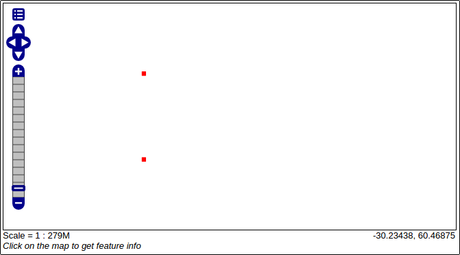

GeoMesa Kafka Quick Start
=========================

This tutorial will show you how to:

1. Write custom Java code to produce and consume messages in `Apache
   Kafka <http://kafka.apache.org/>`__ using GeoMesa.
2. Query the data and replay the messages in a Kafka topic to achieve an
   earlier state.
3. Visualize the changes being made in Kafka with GeoServer.

Background
----------

`Apache Kafka <http://kafka.apache.org/>`__ is "publish-subscribe
messaging rethought as a distributed commit log."

In the context of GeoMesa, Kafka is a useful tool for working with
streams of geospatial data. Interaction with Kafka in GeoMesa occurs
with the KafkaDataStore which implements the GeoTools
`DataStore <http://docs.geotools.org/latest/userguide/library/data/datastore.html>`__
interface.

Prerequisites
-------------

-  basic knowledge of `GeoTools <http://www.geotools.org>`__,
   `GeoServer <http://geoserver.org>`__, and Kafka,
-  an instance of Kafka 0.8.2.x with (an) appropriate Zookeeper
   instance(s),
-  an instance of GeoServer version |geoserver_version| with the GeoMesa Kafka plugin
   installed,
-  `Java JDK 8 <http://www.oracle.com/technetwork/java/javase/downloads/index.html>`__,
-  `Apache Maven <http://maven.apache.org/>`__ |maven_version|, and
-  a `git <http://git-scm.com/>`__ client.

In order to install the GeoMesa Kafka GeoServer plugin, follow the
instructions
`here <https://github.com/locationtech/geomesa/tree/master/geomesa-kafka/geomesa-kafka-gs-plugin>`__.

Ensure your Kafka and Zookeeper instances are running. You can use
Kafka's
`quickstart <http://kafka.apache.org/documentation.html#quickstart>`__
to get Kafka/Zookeeper instances up and running quickly.

Download and Build the Tutorial
-------------------------------

Pick a reasonable directory on your machine, and run:

.. code-block:: bash

    $ git clone https://github.com/geomesa/geomesa-tutorials.git
    $ cd geomesa-tutorials

To build, run

.. code-block:: bash

    $ mvn clean install -pl geomesa-quickstart-kafka

.. note::

    Ensure that the version of Kafka and Zookeeper in
    the root ``pom.xml`` match your environment.

.. note::

    Depending on the version, you may also need to build
    GeoMesa locally. Instructions can be found in
    :doc:`/user/installation_and_configuration`.

Run the Code
------------

On the command-line, run:

.. code-block:: bash

    $ java -cp geomesa-quickstart-kafka/target/geomesa-quickstart-kafka-$VERSION.jar com.example.geomesa.kafka.KafkaQuickStart -brokers <brokers> -zookeepers <zookeepers>

where you provide the values for the following arguments:

-  ``<brokers>`` your Kafka broker instances, comma separated. For a
   local install, this would be ``localhost:9092``.
-  ``<zookeepers>`` your Zookeeper nodes, comma separated. For a local
   install, this would be ``localhost:2181``.

The program will create some metadata in Zookeeper and an associated
topic in your Kafka instance, and pause execution to let you add the
newly created ``KafkaDataStore`` to GeoServer. Once GeoServer has been
configured, we'll pick back up with the paused program.

Optional command-line arguments for ``KafkaQuickStart`` are:

-  ``-zkPath <zkpath>``: used for specifying the Zookeeper path for
   storing GeoMesa metadata. Defaults to "/geomesa/ds/kafka" and
   ordinarily does not need to be changed
-  ``-automated``: omits the pause in execution for configuring
   GeoServer.

The class may also be run using Maven via the ``live-test`` profile.

.. code-block:: bash

    $ mvn -Plive-test exec:exec -Dbrokers=<brokers> -Dzookeepers=<zookeepers>

Register the Store in GeoServer
-------------------------------

Log into GeoServer using your credentials. Click “Stores” in the
left-hand gutter and “Add new Store”. If you do not see the Kafka Data
Store listed under Vector Data Sources, ensure the plugin and
dependencies are in the right directory and restart GeoServer.

Select the ``Kafka Data Store`` vector data source and enter the
following parameters:

-  Basic Store Info
-  ``workspace`` this is dependent upon your GeoServer installation
-  ``data source name`` pick a sensible name, such as,
   ``geomesa_kafka_quickstart``
-  ``description`` pick a sensible description, such as
   ``GeoMesa Kafka quick start``
-  Connection Parameters
-  ``brokers`` your Kafka broker instances, comma separated. Use the
   same ones you used on the command line.
-  ``zookeepers`` your Zookeeper nodes, comma separated. Use the same
   ones you used on the command line.

Leave all other fields empty or with the default value.

Click "Save" and GeoServer will search your Kafka instance for any
GeoMesa-managed feature types.

Publish the Layer
-----------------

GeoServer should find the ``KafkaQuickStart`` feature type in the data
store and redirect you to the "New Layer" page, presenting the feature
type as a layer that can be published. Click on the "Publish" link. You
will be taken to the "Edit Layer" page.

.. warning::

    If you have not yet run the quick start code as described
    in **Run the Code** above, the feature type will not have been
    registered and you will not get a "New Layer" page after saving the
    store. In this case, run the code as described above, click on
    "Layers" in the left-hand gutter, click on "Add a new resource", and
    select your data store in the pulldown next to "Add layer from". The
    link to publish the ``KafkaQuickStart`` feature should appear.

You can leave most fields as default. In the Data pane, you'll need to
enter values for the bounding boxes. In this case, you can click on the
links to compute these values from the data. Click "Save".

View the layer
--------------

Click on the "Layer Preview" link in the left-hand gutter. If you don't
see the quick-start layer on the first page of results, enter the name
of the layer you just created into the search box, and press <Enter>.

Once you see your layer, click on the "OpenLayers" link, which will open
a new tab. At this point, there are no messages in Kafka so nothing will
be shown.

Produce Some Data
-----------------

Resume the program's execution by inputting <Enter> in your terminal now
that the ``KafkaDataStore`` is registered in GeoServer. The program will
create two ``SimpleFeature``\ s and then write a stream of updates to
the two ``SimpleFeature``\ s over the course of about a minute.

You can refresh the GeoServer layer preview repeatedly to visualize the
updates being written to Kafka.

What's Happening in GeoServer
-----------------------------

The layer preview of GeoServer uses the
``LiveKafkaConsumerFeatureSource`` to show a real time view of the
current state of the data stream. Two ``SimpleFeature``\ s are being
updated over time in Kafka which is reflected in the GeoServer display.

As you refresh the page, you should see two ``SimpleFeature``\ s that
start on the left side gradually move to the right side while crossing
each other in the middle. As the two ``SimpleFeature``\ s get updated,
the older ``SimpleFeature``\ s disappear from the display.



Consumers Explained
-------------------

GeoMesa wraps Kafka consumers in two different ways; as a
``LiveKafkaConsumerFeatureSource`` or a
``ReplayKafkaConsumerFeatureSource``. Both of these classes implement
GeoTools'
`FeatureSource <http://docs.geotools.org/latest/javadocs/org/geotools/data/FeatureSource.html>`__
API.

The ``LiveKafkaConsumerFeatureSource`` will consume messages as they are
being produced and maintain the real time state of SimpleFeatures
pertaining to a Kafka topic.

The ``ReplayKafkaConsumerFeatureSource`` allows users to specify any
range of time in order to obtain the state of SimpleFeatures from any
previous moment.

View the Consumer Output
------------------------

The program will construct the live and replay consumers and log
SimpleFeatures to the console after all the messages are sent to Kafka
and therefore after all the updates are made.

The live consumer will log the state of the two SimpleFeatures after all
updates are finished. The replay consumer will log the state of the two
SimpleFeatures five seconds earlier than the last update. The replay
consumer will create a new ``SimpleFeatureType`` with an additional
attribute ``KafkaLogTime``. By preserving the ``KafkaLogTime`` as an
attribute, we can create the state of SimpleFeatures at time *x* by
querying for when ``KafkaLogTime`` equals *x*.

.. code-block:: bash

    Consuming with the live consumer...
    2 features were written to Kafka
    Here are the two SimpleFeatures that were obtained with the live consumer:
    fid:1 | name:James | age:20 | dtg:Mon Dec 14 19:08:23 EST 2015 | geom:POINT (180 90)
    fid:2 | name:John | age:62 | dtg:Fri Oct 02 09:56:49 EDT 2015 | geom:POINT (180 -90)

    Consuming with the replay consumer...
    2 features were written to Kafka
    Here are the two SimpleFeatures that were obtained with the replay consumer:
    fid:2 | name:John | age:52 | dtg:Thu May 21 21:27:19 EDT 2015 | geom:POINT (132 -66) | KafkaLogTime:Tue Jun 09 13:33:47 EDT 2015
    fid:1 | name:James | age:59 | dtg:Sat Jan 24 06:26:44 EST 2015 | geom:POINT (132 66) | KafkaLogTime:Tue Jun 09 13:33:47 EDT 2015

For a deeper understanding of what's going on, we recommend exploring
the source code.

(Optional) Listening for FeatureEvents
--------------------------------------

The GeoTools API also includes a mechanism to fire off a
```FeatureEvent`` <http://docs.geotools.org/stable/javadocs/index.html?org/geotools/data/FeatureEvent.Type.html>`__
each time there is an event (typically when the data are changed) in a
``DataStore``. A client may implement a
```FeatureListener`` <http://docs.geotools.org/stable/javadocs/index.html?org/geotools/data/FeatureEvent.Type.html>`__,
which has a single method called ``changed()`` that is invoked as each
``FeatureEvent`` is fired.

The code in ``com.example.geomesa.kafa.KafkaListener`` implements a
simple ``FeatureListener`` that simply prints the messages received.
Open up a second terminal window and run:

.. code-block:: bash

    $ java -cp geomesa-quickstart-kafka/target/geomesa-quickstart-kafka-$VERSION.jar com.example.geomesa.kafka.KafkaListener -brokers <brokers> -zookeepers <zookeepers>

and use the same settings for ``<brokers>`` and ``<zookeepers>``. Then
in the first terminal window, re-run the ``KafkaQuickStart`` code as
before. The ``KafkaListener`` terminal should produce messages like the
following:

::

    Received FeatureEvent of Type: CHANGED
    fid:1 | name:Hannah | age:53 | dtg:Sun Dec 13 11:04:40 EST 2015 | geom:POINT (-66 -33)
    Received FeatureEvent of Type: CHANGED
    fid:2 | name:Claire | age:77 | dtg:Thu Feb 26 02:06:41 EST 2015 | geom:POINT (-66 33)

The ``KafkaListener`` code will run until interrupted.

The portion of ``KafkaListener`` that creates and implements the
``FeatureListener`` is:

.. code-block:: java

    // the live consumer must be created before the producer writes features
    // in order to read streaming data.
    // i.e. the live consumer will only read data written after its instantiation
    SimpleFeatureSource consumerFS = consumerDS.getFeatureSource(sftName);

    consumerFS.addFeatureListener(new FeatureListener() {
        @Override
        public void changed(FeatureEvent featureEvent) {
            System.out.println("Received FeatureEvent of Type: " + featureEvent.getType());

            if (featureEvent.getType() == FeatureEvent.Type.CHANGED && 
                    featureEvent instanceof KafkaFeatureEvent) {
                printFeature(((KafkaFeatureEvent) featureEvent).feature());
            }

            if (featureEvent.getType() == FeatureEvent.Type.REMOVED) {
                System.out.println("Received Delete for filter: " + featureEvent.getFilter());
            }
        }
    });

Additionally, the ``KafkaQuickStart`` class run above can generate a
'clear' control message at the end of the run if you specify
"-Dclear=true" on the commandline. This will generate a Feature removed
``FeatureEvent`` with a ``Filter.INCLUDE``.

.. code-block:: bash

    $ java -Dclear=true -cp geomesa-quickstart-kafka/target/geomesa-quickstart-kafka-$VERSION.jar com.example.geomesa.kafka.KafkaQuickStart -brokers <brokers> -zookeepers <zookeepers>

KafkaDataStore Load Test
------------------------

For those interested in load testing the KafkaDataStore, there is a
simple utility with constructs any number of SimpleFeatures, rolls a
random latitude, and then have them step left or right.

.. code-block:: bash

    $ java -cp target/geomesa-quickstart-kafka-$VERSION.jar com.example.geomesa.kafka.KafkaLoadTester -brokers <brokers> -zookeepers <zookeepers> -count <count>

The 'count' parameter is optional. Without it, the tool defaults to 1000
SimpleFeatures.

Conclusion
----------

Given a stream of geospatial data, GeoMesa's integration with Kafka
enables users to maintain a real time state of SimpleFeatures or
retrieve any arbitrary state preserved in history. One can additionally
process and analyze streams of data by integrating a data processing
system like `Storm <https://storm.apache.org/>`__ or
`Samza <http://samza.apache.org>`__. See the :doc:`./geomesa-quickstart-storm`
tutorial for more information on using Storm with GeoMesa.

For additional information about the ``KafkaDataStore``, see the
`readme <https://github.com/locationtech/geomesa/blob/master/geomesa-kafka/geomesa-kafka-datastore/README.md>`__
on github.
