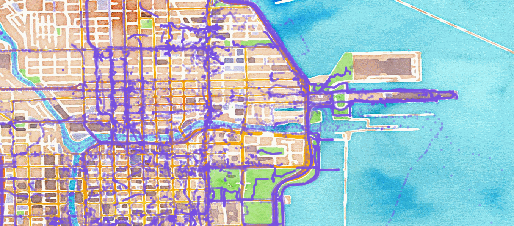

GeoMesa Storm Quick Start
=========================

Apache Storm is "a free and open source distributed realtime computation
system."

You can leverage Storm to analyze and ingest data into GeoMesa in near
real time. In this tutorial, we will:

1. Use Apache Kakfa to send messages to a Storm topology.
2. Use Storm to parse Open Street Map (OSM) data files and ingest them
   into Accumulo.
3. Leverage Geoserver to query and visualize the data.

Prerequisites
-------------

You will need access to:

-  an instance of Accumulo |accumulo_version|,
-  an Accumulo user with create-table and write permissions,
-  an installation of Kafka |kafka_version|,
-  an installation of Storm 0.9+, and
-  an instance of GeoServer |geoserver_version| with the GeoMesa Accumulo plugin.
   installed

In order to install the GeoMesa Accumulo GeoServer plugin, see :ref:`install_accumulo_geoserver`.

You will also need:

-  The `xz <http://tukaani.org/xz/>`__ data compression tool,
-  `Java JDK
   8 <http://www.oracle.com/technetwork/java/javase/downloads/index.html>`__,
-  `Apache Maven <http://maven.apache.org>`__ |maven_version|, and
-  a `git <http://git-scm.com/>`__ client.

Download and Build the Tutorial
-------------------------------

Pick a reasonable directory on your machine, and run:

.. code-block:: bash

    $ git clone https://github.com/geomesa/geomesa-tutorials.git
    $ cd geomesa-tutorials

.. note::

    You may need to download a particular release of the
    tutorials project to target a particular GeoMesa release.

To build, run

.. code-block:: bash

    $ mvn clean install -pl geomesa-quickstart-storm

.. note::

    Ensure that the version of Accumulo, Hadoop, Storm,
    etc in the root ``pom.xml`` match your environment.

.. note::

    Depending on the version, you may also need to build
    GeoMesa locally. Instructions can be found in
    :ref:`installation`.

Obtaining OSM Data
------------------

In this demonstration, we will use the ``simple-gps-points`` OSM data
that contains only the location of an observation. Download the
`OSM <http://planet.openstreetmap.org/>`__ data
`here <http://planet.openstreetmap.org/gps/simple-gps-points-120312.txt.xz>`__.

.. note::

    The file is approximately 7 GB.

Use the following command to unpack the data:

.. code-block:: bash

    $ xz simple-gps-points-120312.txt.xz

Deploy the Ingest Topology
--------------------------

The quickstart topology will read messages off of a Kafka topic, parse
them into ``SimpleFeature``\ s, and write them to Accumulo.

Use ``storm jar`` to submit the topology to your Storm instance:

.. code-block:: bash

    $ storm jar geomesa-quickstart-storm/target/geomesa-quickstart-storm-$VERSION.jar \
        com.example.geomesa.storm.OSMIngest \
        -instanceId <accumulo-instance-id>  \
        -zookeepers <zookeepers>            \   
        -user <accumulo username>           \
        -password <accumulo password>       \
        -tableName OSM                      \
        -featureName event                  \
        -topic OSM

Run Data through the System
---------------------------

We use Kafka as the input to our Storm topology. First, create a topic
to send data:

For Kafka 0.8 use the following command.

.. code-block:: bash

    $ kafka-create-topic.sh      \
        --zookeeper <zookeepers> \
        --replica 3              \
        --partition 10           \
        --topic OSM

For Kafka 0.9+ use the following command.

.. code-block:: bash

    $ kafka-topics.sh          \
        --create               \
        --zookeeper localhost  \
        --replication-factor 3 \
        --partitions 10        \
        --topic OSM

Note that we create a topic with several partitions in order to
parallelize the ingest from the producer side as well as from the
consumer (Storm) side.

Next, use the tutorial code to send the OSM file as a series of Kafka
messages:

.. code-block:: bash

    $ java -cp geomesa-quickstart-storm/target/geomesa-quickstart-storm-$VERSION.jar \
        com.example.geomesa.storm.OSMIngestProducer \
        -ingestFile simple-gps-points-120312.txt    \
        -topic OSM                                  \
        -brokers <kafka broker list>

Note that Kafka's default partitioner class assigns a message partition
based on a hash of the provided key. If no key is provided, all messages
are assigned the same partition.

.. code-block:: java

    for (String x = bufferedReader.readLine(); x != null; x = bufferedReader.readLine()) {
        producer.send(new KeyedMessage<String, String>(topic, String.valueOf(rnd.nextInt()), x));
    }

Storm Spouts and Bolts
----------------------

In the quick start code, the Storm ``Spout``\ s consume messages from a
Kafka topic and send them through the ingest topology:

.. code-block:: java

    public void nextTuple() {
        if (kafkaIterator.hasNext()) {
            List<Object> messages = new ArrayList<Object>();
            messages.add(kafkaIterator.next().message());
            _collector.emit(messages);
        }
    }

The ``Bolt``\ s parse the message and create and write
``SimpleFeature``\ s. In the ``prepare`` method of the ``Bolt`` class,
we grab the connection parameters that were initialized in the
constructor and get a handle on a ``FeatureWriter``:

.. code-block:: java

    ds = DataStoreFinder.getDataStore(connectionParams);
    SimpleFeatureType featureType = ds.getSchema(featureName);
    featureBuilder = new SimpleFeatureBuilder(featureType);
    featureWriter = ds.getFeatureWriter(featureName, Transaction.AUTO_COMMIT);

The input to the ``Bolt``'s execute method is a ``Tuple`` containing a
``String``. We split the ``String`` on '%' to get individual points. For
each point, we split on commas to extract the attributes. We parse the
latitude and longitude field to set the default geometry of our
``SimpleFeature``. Note that OSM latitude and longitude values are
stored as integers that must be divided by 107.

.. code-block:: java

    private Geometry getGeometry(final String[] attributes) {
        ...
        final Double lat = (double) Integer.parseInt(attributes[LATITUDE_COL_IDX]) / 1e7;
        final Double lon = (double) Integer.parseInt(attributes[LONGITUDE_COL_IDX]) / 1e7;
        return geometryFactory.createPoint(new Coordinate(lon, lat));
    }

    public void execute(Tuple tuple) {
        ...
        featureBuilder.reset();
        final SimpleFeature simpleFeature = featureBuilder.buildFeature(String.valueOf(UUID.randomUUID().getMostSignificantBits()));
        simpleFeature.setDefaultGeometry(getGeometry(attributes));

        try {
            final SimpleFeature next = featureWriter.next();
            for (int i = 0; i < simpleFeature.getAttributeCount(); i++) {
                next.setAttribute(i, simpleFeature.getAttribute(i));
            }
            ((FeatureIdImpl) next.getIdentifier()).setID(simpleFeature.getID());
            featureWriter.write();
        } catch (Exception e) {
          ...
        }
    }

Register the Layer in GeoServer
-------------------------------

Log into GeoServer using your credentials. Click “Stores” in the
left-hand gutter and “Add new Store”. If you do not see the Accumulo
Data Store listed under Vector Data Sources, ensure the plugin and
dependencies are in the right directory and restart GeoServer.

Select the ``Accumulo (GeoMesa)`` vector data source and configure it
using the command line arguments you used above. Use ``geomesa`` as the
workspace - if you use something different, you will need to modify the
WMS requests below.

Leave all other fields empty or with the default value.

Click "Save" and GeoServer will search your data store for any available
feature types.

Publish the Layer
-----------------

GeoServer should find the ``OSM`` feature type and present it as a layer
that can be published. Click on the "Publish" link. You will be taken to
the Edit Layer screen.

You can leave most fields as default. In the Data pane, you'll need to
enter values for the bounding boxes. In this case, you can click on the
links to compute these values from the data. Click "Save".

Visualize the Data
------------------

Let's look at events in Chicago. The default point style is a red square
that does not suit our purposes. Add
the :download:`OSMPoint.sld <_static/geomesa-quickstart-storm/OSMPoint.sld>` file to
GeoServer, then browse to the following URL:

::

    http://localhost:8080/geoserver/wms?service=WMS&version=1.1.0&request=GetMap&layers=geomesa:OSM&styles=OSMPoint&bbox=-87.63,41.88,-87.61,41.9&width=1400&height=600&srs=EPSG:4326&format=application/openlayers

   Showing all OSM events in Chicago before Mar 12, 2012

Heatmaps
--------

Use a heatmap to more clearly visualize a high volume of data in the
same location.

.. note::

    The heatmap style requires that ``geomesa-process-wps`` be installed in your
    GeoServer, as described in :ref:`install_geomesa_process`.

Add the
:download:`heatmap.sld <_static/geomesa-quickstart-storm/heatmap.sld>` file to
GeoServer, then browse to the following URL:

::

    http://localhost:8080/geoserver/wms?service=WMS&version=1.1.0&request=GetMap&layers=geomesa:OSM&styles=heatmap&bbox=-87.63,41.88,-87.61,41.9&width=1400&height=600&srs=EPSG:4326&format=application/openlayers

.. figure:: _static/geomesa-quickstart-storm/ChicagoDensity.png
   :alt: Showing heatmap of OSM events in Chicago before Mar 12, 2012

   Showing heatmap of OSM events in Chicago before Mar 12, 2012

Conclusion
----------

Although this quickstart uses a static file for input, Storm excels at
reading real time data. As data comes in, the Storm topology can parse
it and ingest it into GeoMesa for retrieval. Additional analytics can be
run on the data inside the topology to further enhance or inform the
output. For real time visualization, GeoMesa also supports maps powered
by Kafka instead of Accumulo. See the :doc:`./geomesa-quickstart-kafka`
tutorial for more details.
