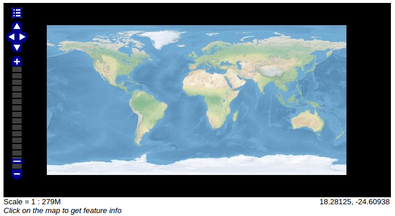

GeoMesa Raster Support
======================

This tutorial will show you how to:

1. Deploy and use the raster data support in GeoMesa
2. Prepare and ingest raster data
3. Conduct WMS/WCS queries of raster data

Prerequisites
-------------

.. note::

    For Accumulo deployment, you will need access to an Accumulo |accumulo_version| instance.

Before you begin, you should have these:

-  basic knowledge of `GeoTools <http://www.geotools.org>`__ and
   `GeoServer <http://geoserver.org>`__
-  access to a `GeoServer <http://geoserver.org/>`__ 2.8.x installation
-  an Accumulo user that has both create-table and write permissions
-  the `Geospatial Data Abstraction Library
   (GDAL) <http://www.gdal.org/>`__ installed

Before you begin, you should have also set up GeoMesa, using the instructions in :ref:`accumulo_raster`.

Introduction
------------

The Raster support in GeoMesa was produced to support image pyramids in ``EPSG:4326``.

Currently WMS and WCS (version 1.0.0) queries are supported via the
GeoServer plugin.

Ingest
------

First, download and extract the example data set `NE2_HR_LC_SR_W_DR.zip`_ from `Natural Earth`_ (this is the
"large size" raster data for "Natural Earth 2 with Shaded Relief, Water, and Drainages" on `this download page`_).
To ingest the raster image into GeoMesa, you must first produce an image pyramid from this file by using
``gdal_retile.py``. For an explanation of the parameters used below, see
the `gdal\_retile documentation <http://www.gdal.org/gdal_retile.html>`__.

.. _Natural Earth: http://www.naturalearthdata.com/
.. _NE2_HR_LC_SR_W_DR.zip: http://naciscdn.org/naturalearth/10m/raster/NE2_HR_LC_SR_W_DR.zip
.. _this download page: http://www.naturalearthdata.com/downloads/10m-raster-data/10m-natural-earth-2/

.. code-block:: bash

    $ gdal_retile.py -v -pyramidOnly -r lanczos -levels 4 \
        -ps 675 675 -targetDir ./ NE2_HR_LC_SR_W_DR.tif

Once the image pyramid has been prepared, ingest the tiles using the
GeoMesa command line tools. To do this you will first need to follow the
tools deployment instructions in :ref:`setting_up_accumulo_commandline`.
Once the GeoMesa tools have been deployed you will be able to ingest the prepared pyramid:

.. code-block:: bash

    $ geomesa-accumulo ingest-raster -u username -p password \
        -t natearth -f "/path/to/pyramid/1/" -F geotiff

The ingest needs to be repeated per level of the pyramid generated by
GDAL. Keep the table name (in this case "natearth") the same between
runs of the ingest. Once this process is complete you will need to
register the table into a GeoServer coverage store of the type "GeoMesa
Coverage Format".

When attempting to ingest your own rasters, tiles should be on the order
of 128x128 to 1024x1024 pixels.

GeoServer Deployment
--------------------

The GeoMesa GeoServer community module is required to enable registering GeoMesa Raster layers
in GeoServer. If you have not already, please follow the instructions
in :ref:`accumulo_raster`.

Registering in GeoServer
------------------------

To view the ingested pyramid via WMS and WCS you must register the new
table in a "Accumulo (Geomesa Raster)" coverage store in the GeoServer UI. Login to
your GeoServer and follow these steps:

1. Add a new datastore to GeoServer by navigating to the Stores page and
   then click "Add new Store".
2. Click the "Accumulo (Geomesa Raster)" as an option under "Raster Data
   Sources"
3. Fill in the fields as appropriate to your Accumulo and Zookeeper
   configurations. The "accumulo.catalog" field must match the name of the
   table we ingested the demo data to.
4. Click "Save", then click "Publish" when GeoServer prompts you to add
   the layer.
5. Once you have completed registering the layer, you should be able to
   use the open layers preview for the layer to view the raster via WMS.

|"GeoMesa Raster WMS example"|

WCS Queries
-----------

WCS version 1.0.0 queries are fairly similar to WMS queries. Try running
the following WCS query on the Natural Earth test data table by first
modifying and running the following url as needed for your GeoServer
configuration.

.. code::

    http://localhost:8080/geoserver/workspace/wcs?service=WCS&version=1.0.0&request=GetCoverage&coverage=workspace:natearth&bbox=-180.0,-90.0,180.0,90.0&width=660&height=330&crs=EPSG:4326&format=geotiff

This will return a GeoTIFF of the extension requested. As in the WMS
open layers viewer, the tiles are concatenated together into a mosaic.

