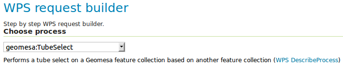
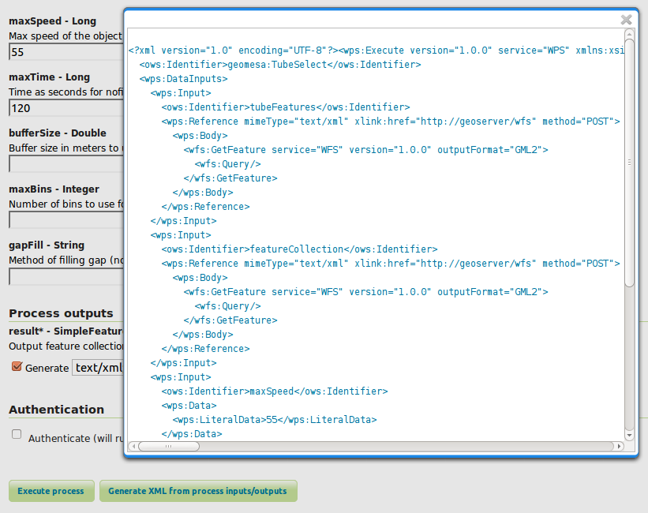
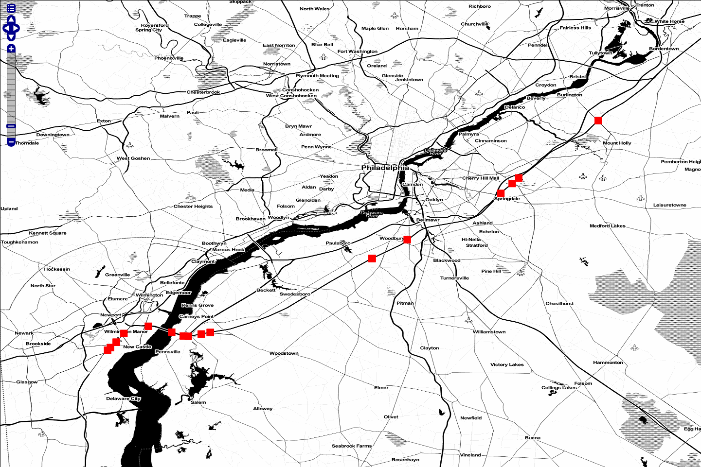
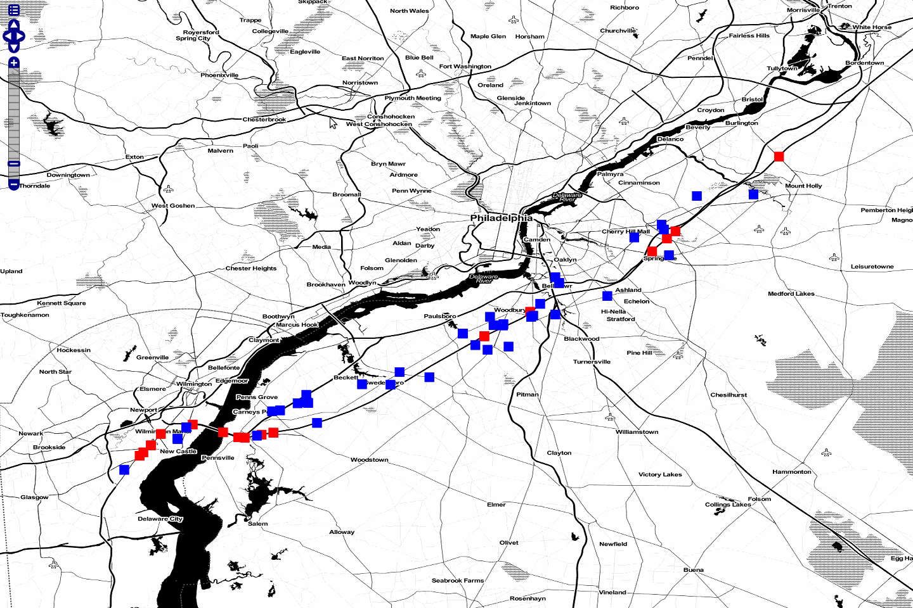
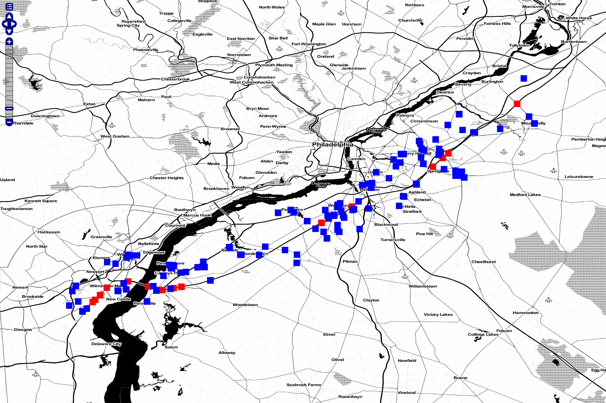

Web Processing Services (WPS) Tube Select
=========================================

This tutorial will show you how to:

1. Ingest a set of Twitter data.
2. Use GeoServer Web Processing Services (WPS) to generate
   time-interpolated queries.
3. Query from and save results to GeoServer layers.

Introduction
------------

A time-interpolated query finds features that intersect in both **space
and time**. Normal spatial or temporal queries select features that
fall within a specified geometry, time range, or both. A
time-interpolated query has a changing geometry as you move forward in
time.

Imagine you are traveling from Washington, DC to New York City and are
interested in people traveling the same route at the same time. These
travelers would be within a given distance from you at any point in the
trip. They wouldn't be in DC while you were arriving in New York. Thus
the geometry of results of your query would be **a function of time**.

Time-interpolated queries are more complex than normal spatial or
temporal queries, as the input is a sequence of points or lines with an
increasing time attribute. Time-interpolated queries are colloquially
known as **tube selects**.

Prerequisites
-------------

Make sure that you've worked through the steps described in the
:ref:`installation` section of the GeoMesa User
Manual, particularly the tasks relevant to Accumulo. Afterwards, it may be
necessary to change the versions of Accumulo and Hadoop that the tutorial
uses. After completing the deployment tutorial, you should have:

-  an instance of Accumulo |accumulo_version| running on Hadoop
   |hadoop_version|,
-  access to an Accumulo user that has both create-table and write
   permissions, and
-  an instance of GeoServer 2.5.2 with the GeoMesa plugin installed.

Because this tutorial requires building custom Java code, development
tools should also be installed and configured:

-  `Java JDK 8 <http://www.oracle.com/technetwork/java/javase/downloads/index.html>`__,
-  `Apache Maven <http://maven.apache.org/>`__ |maven_version|, and
-  a `git <http://git-scm.com/>`__ client.

Using the GeoServer Plugin
--------------------------

Once everything is installed you should see "geomesa:TubeSelect" appear
in the `WPS Request
Builder <http://docs.geoserver.org/stable/en/user/services/wps/requestbuilder.html>`__,
which is found under the *Demos* link in the menu bar on the left side
of the GeoServer web administration interface.

   "geomesa:TubeSelect WPS plugin"

Downloading and Building the Tutorial Code
------------------------------------------

Clone the **geomesa** project and build it, if you haven't already:

.. code-block:: bash

    $ git clone https://github.com/locationtech/geomesa.git
    $ cd geomesa
    $ mvn clean install

This is needed to install the GeoMesa JAR files in your local Maven
repository. For more information see the `GeoMesa Accumulo Quick
Start </geomesa-quickstart/>`__ tutorial. We'll be using Twitter data
from the public Twitter API for this tutorial and ingesting it using a
single node ingester that uses a
`GeoTools <http://www.geotools.org/>`__-based ``FeatureSource`` to
ingest into GeoMesa. First, check out the code and take a look at it:

.. code-block:: bash

    $ git clone https://github.com/geomesa/geomesa-twitter
    $ cd geomesa-twitter

To build the project, run the following command:

.. code-block:: bash

    $ mvn clean install

Collecting Twitter Data
-----------------------

.. warning::

    It will take several hours to collect a large enough set of Twitter data for the analysis below.

The **twitter-collect** module collects
`Twitter <http://twitter.com/>`__ data in JSON format and writes it a
local file. To run the code, you will need a Twitter account, as well as
access tokens. Go to the Twitter development app management console at
https://apps.twitter.com/ and create a new application, then go to the
"Keys and Access Tokens" page to generate an "Access Token." The
consumer API key, the consumer secret, the access token, and the access
token secret are all needed to run the collection process.

Run the program:

.. code-block:: bash

    $ java -jar twitter-collect/target/twitter-collect-accumulo1.5-1.0-SNAPSHOT.jar \
        --consumerKey <CONSUMER_KEY> \
        --consumerSecret <CONSUMER_SECRET> \
        --outputDir ./tmp \
        --secret <ACCESS_SECRET> \
        --token <ACCESS_TOKEN>

This will collect live Twitter data and save it in JSON files in the
``tmp`` subdirectory; this will collect data indefinitely until it is
interrupted.

Ingesting Twitter Data
----------------------

The **twitter-ingest** module takes a set of JSON files.

There are three classes in the module:

-  ``Runner``: Provides the main method to handle command line argument
   parsing
-  ``TwitterFeatureIngester``: Inserts features into GeoMesa using a
   GeoTools ``FeatureSource``
-  ``TwitterParser``: Parses Twitter JSON files and turns them into
   ``SimpleFeature``\ s

Run the ingest program:

.. code-block:: bash

    $ java -jar twitter-ingest/target/twitter-ingest-accumulo1.5-1.0-SNAPSHOT.jar \
        --featureName <featureName> \
        --tableName <tableName> \
        --instanceId <instance> \
        --user <user> \
        --password <password> \
        --zookeepers <zookeepers> \
        tmp/20151201/20151201-090959.txt

where ``<featureName>`` is the name of the SimpleFeatureType to create,
``<tableName>`` is the name of the GeoMesa catalog table to use, and
``<instance>``, ``<user>``, ``<password>``, and ``<zookeepers>``\ are
needed to connect to Accumulo. The final argument is the name of one of
the Twitter JSON files created by the **twitter-collect** module.

After ingesting the data, create a data store and layer in GeoServer
from the data ingested into GeoMesa (see the **VISUALIZE DATA WITH
GEOSERVER** section of the `GeoMesa Accumulo Quick Start
tutorial </geomesa-quickstart/>`__ for more details about how to do
this).

More about parsing Twitter JSON data
~~~~~~~~~~~~~~~~~~~~~~~~~~~~~~~~~~~~

The JSON object returned from the tweets stream is documented on the
`Twitter developer
site <https://dev.twitter.com/docs/platform-objects/tweets>`__. For this
tutorial we'll be interested in the following fields:

-  ``coordinates``: a `geoJSON <http://geojson.org/>`__ object with
   lat/lon (do not use the deprecated ``geo`` field)
-  ``user``: the user object
-  ``id``: the user id
-  ``name``: the user name
-  ``id``: the tweet id
-  ``created_at``: the time when the tweet was created
-  ``text``: the text of the tweet

The Twitter JSON looks something like this:

.. code-block:: json

    {
      "retweeted" : false,
      "source" : "web",
      "favorited" : false,
      "coordinates" : {
        "coordinates" : [
          -75.14310264,
          40.05701649
        ],
        "type" : "Point"
      },
      "place" : null,
      "retweet_count" : 0,
      "entities" : {
        "hashtags" : [],
        "user_mentions" : [
          {
            "name" : "Twitter API",
            "indices" : [
              19,
              30
            ],
            "id" : 6253282,
            "id_str" : "6253282",
            "screen_name" : "twitterapi"
          }
        ],
        "urls" : []
      },
      "truncated" : false,
      "in_reply_to_status_id_str" : null,
      "created_at" : "Wed Feb 29 19:42:02 +0000 2012",
      "contributors" : null,
      "text" : "Man I like me some @twitterapi",
      "in_reply_to_user_id" : null,
      "user" : {
        "friends_count" : 5,
        "follow_request_sent" : null,
        "profile_sidebar_fill_color" : "ffffff",
        "profile_image_url" : "http://a1.twimg.com/profile_images/1540298033/phatkicks_normal.jpg",
        "profile_background_image_url_https" : "https://si0.twimg.com/profile_background_images/365782739/doof.jpg",
        "profile_background_color" : "C0DEED",
        "notifications" : null,
        "url" : "http://blog.roomanna.com",
        "id" : 370773112,
        "is_translator" : false,
        "following" : null,
        "screen_name" : "fakekurrik",
        "lang" : "en",
        "location" : "",
        "followers_count" : 8,
        "statuses_count" : 142,
        "name" : "fakekurrik",
        "description" : "I am just a testing account, following me probably won't gain you very much",
        "favourites_count" : 1,
        "profile_background_tile" : true,
        "listed_count" : 0,
        "contributors_enabled" : false,
        "profile_link_color" : "0084B4",
        "profile_image_url_https" : "https://si0.twimg.com/profile_images/1540298033/phatkicks_normal.jpg",
        "profile_sidebar_border_color" : "C0DEED",
        "created_at" : "Fri Sep 09 16:13:20 +0000 2011",
        "utc_offset" : -28800,
        "verified" : false,
        "show_all_inline_media" : false,
        "profile_background_image_url" : "http://a3.twimg.com/profile_background_images/365782739/doof.jpg",
        "default_profile" : false,
        "protected" : false,
        "id_str" : "370773112",
        "profile_text_color" : "333333",
        "default_profile_image" : false,
        "time_zone" : "Pacific Time (US & Canada)",
        "geo_enabled" : true,
        "profile_use_background_image" : true
      },
      "id" : 174942523154894848,
      "in_reply_to_status_id" : null,
      "geo" : null,
      "in_reply_to_user_id_str" : null,
      "id_str" : "174942523154894848",
      "in_reply_to_screen_name" : null
    }

We parse this object manually with `GSON
(google-json) <https://github.com/google/gson>`__. Optionally,
you can create Java Object bindings for GSON and parse the entire tweet
into an object. For more information about connecting to the twitter
public stream check out the `Twitter Public Stream
website <https://dev.twitter.com/docs/streaming-apis/streams/public>`__.

Creating a Web Processing Service (WPS) Request
-----------------------------------------------

The WPS builder will provide us with a sample XML document as a starting
point to perform a tube select. Entering the values we want and clicking
the "Generate XML" button produces the request document that we'll save
as ``tube-select.xml`` for use later.

   "Generating XML from inputs"

Chaining Processes
~~~~~~~~~~~~~~~~~~

WPS supports chaining other WPS processes. This is useful when selecting
data from an existing layer or storing data back into GeoServer to
create a new layer. The GeoServer User Guide has a section on `Process
Chaining <http://docs.geoserver.org/stable/en/user/services/wps/processes/chaining.html>`__.

Tube Selections
---------------

Using a Layer as Input
~~~~~~~~~~~~~~~~~~~~~~

For this demonstration, let's assume someone is traveling from
Wilmington, DE to north of Philadelphia, PA along the New Jersey
Turnpike and is tweeting. Each tweet would have a GPS coordinate and a
timestamp allowing us to infer that the person was traveling somewhere
around 55mph (25 m/s) on the Turnpike. This track is the input that
defines the "tube" geometry for our query. Using the ``maxSpeed`` of 25
m/s and a ``maxTime`` of 120s we will create a space/time query tube.
Here's a GeoServer rendering of a possible track:

   "Tube Features"

Using JSON as Input
~~~~~~~~~~~~~~~~~~~

Instead of using a layer as input, you can manually define an input
``FeatureCollection`` track with JSON using
`GeoJSON <http://geojson.org/>`__. The features need a unique **id**,
a **geometry** object, and a property named **dtg** representing the
observation time of the feature. A sample of two of our input track
points is shown below:

.. code-block:: xml

     <wps:Input>
        <ows:Identifier>tubeFeatures</ows:Identifier>
        <wps:Data>
             <wps:ComplexData mimeType="application/json">
                <![CDATA[
                {
                   "features" : [
                        {
                            "id" : "0",
                            "geometry" : {
                                "coordinates": [-75.6002273 , 39.669456],
                                "type" : "Point"
                            },
                            "type" : "Feature",
                            "properties" : {
                                "dtg" : "2014-05-17T15:33:16.000+0000",
                            }
                        }, {
                            "id" : "1",
                            "geometry" : {
                                "coordinates": [-75.5102991 , 39.6857254],
                                "type" : "Point"
                            },
                            "type" : "Feature",
                            "properties" : {
                                "dtg" : "2014-05-17T15:39:28.000+0000",
                            }
                        }
                   ],
                   "type" : "FeatureCollection"
                }
                ]]>
            </wps:ComplexData>
        </wps:Data>
    </wps:Input>

Posting a Query
~~~~~~~~~~~~~~~

After creating our tube query XML we can post it to GeoServer with
``curl``:

.. code-block:: bash

    $ curl -u admin:geoserver -H 'Content-type: xml' -XPOST -d@'/tmp/query.xml' http://localhost:8081/geoserver/wps | json_pp

In this request, the MIME type of the result variable is set to ``json``
in our file ``query.xml``:

.. code-block:: xml

    <wps:ResponseForm>
      <wps:RawDataOutput mimeType="application/json">
        <ows:Identifier>result</ows:Identifier>
      </wps:RawDataOutput>
    </wps:ResponseForm>

We piped the output into
`json\_pp <http://search.cpan.org/~makamaka/JSON-PP-2.27103/bin/json_pp>`__,
which will pretty print the output (native packages are available for
most Linux distributions).

Saving The Output as a Layer
----------------------------

Chaining your result with a **gs:import** process allows you to store
your layer back into GeoMesa, allowing you to render a layer. Below we
have created a layer combination with a map, our original tube track,
and our results with ``maxSpeed`` 25 m/s and ``maxTime`` 120 s. These
layers are **mapproxy:globe.osm.toner**, **accumulo:njtrack**, and
**accumulo:nj120**:

.. code-block:: bash

    http://localhost:8081/geoserver/wms?service=WMS&version=1.1.0&request=GetMap&layers=mapproxy:globe.osm.toner,accumulo:njtrack,accumulo:nj120&styles=&bbox=-75.62390877,39.65103897,-74.81563784,40.04023423&width=1440&height=960&srs=EPSG:4326&format=application/openlayers

   "Tube Result at 25m/s 120s"

Tweaking Parameters
-------------------

maxSpeed, maxTime, bufferSize
~~~~~~~~~~~~~~~~~~~~~~~~~~~~~

Adjusting the ``maxSpeed`` and ``maxTime`` parameters will increase the
size of the tube from both a spatial and temporal aspect. Features that
are further away in either time or geometry could possibly be reached by
the input track by increasing these parameters. Below, we have doubled
our ``maxTime`` to 240 s creating a wider tube. Perhaps our friend
strayed off the highway and visited a restaurant or gas station. We'd
like to account for that possibility. Once again, a chained
**gs:import** command has stored the layer as **nj240**.

.. code-block:: bash

    http://localhost:8081/geoserver/wms?service=WMS&version=1.1.0&request=GetMap&layers=mapproxy:globe.osm.toner,accumulo:njtrack,accumulo:nj240&styles=&bbox=-75.62390877,39.65103897,-74.81563784,40.04023423&width=1440&height=960&srs=EPSG:4326&format=application/openlayers

   "Tube Result at 25m/s 240s"

gapFill
~~~~~~~

Many input tracks can be sparse. Our friend driving the Turnpike didn't
tweet every 5 seconds. Selecting a ``gapFill`` method fills in those
missing tracks. In this tutorial we used the **line** option for gap
filling. The options available for the ``gapFill`` method are:

-  ``none`` - use when you have a dense track
-  ``line`` - draws a line between points two points and uses the time
   range of both points

Beyond Curl
-----------

WPS services can also be accessed by a variety of clients including
`OpenLayers <http://openlayers.org/>`__, which has implemented a
`JavaScript WPS
Builder <http://dev.openlayers.org/releases/OpenLayers-2.13.1/examples/wps.html>`__
tutorial similar to the one built into GeoServer.
