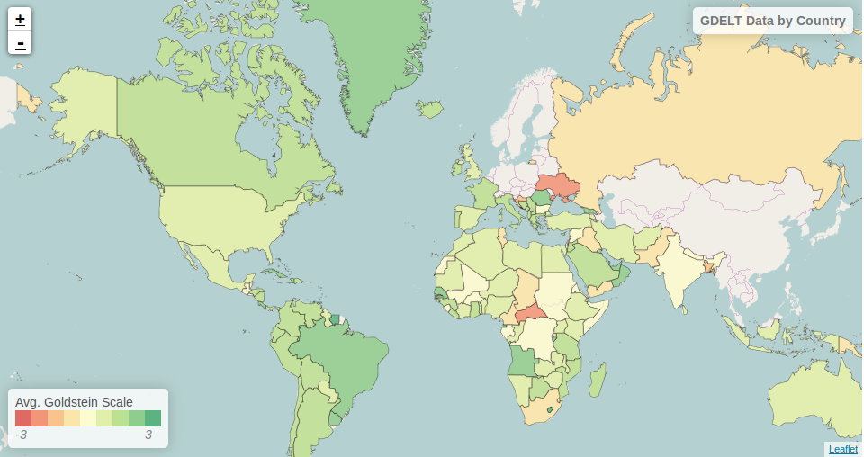

Visualizing Analytics in Jupyter
================================

This tutorial will show you how to:

1. Use GeoMesa with `Apache Spark <http://spark.apache.org/>`__.
2. Calculate aggregate statistics using a covering set of polygons.
3. Create a new simple feature type to represent this aggregation.
4. Use Jupyter and leaflet to visualize the result.

Background
----------

`Apache Spark <http://spark.apache.org>`__ is a "fast and general engine
for large-scale data processing". Spark presents an abstraction called a
Resilient Distributed Dataset (RDD) that facilitates expressing
transformations, filters, and aggregations, and efficiently executes the
computation across a distributed set of resources. Spark manages the
lineage of a block of transformed data so that if a node goes down,
Spark can restart the computation for just the missing blocks.

`Jupyter Notebook <https://github.com/jupyter/notebook>`__ is an interactive web interface
for a kernel. Jupyter allows you quickly prototype by writing code in runnable cells, computing a final result
as you go. Visualization of data is also easily done through integration Jupyter cell "magics" to create JavaScript and
HTML outputs.

Here, we will combine these two services to demonstrate an operation we are naming "Shallow Join". This operation
is a means of imposing a small, covering set of data, onto a much larger set of data. In our example, GDELT data has
geometries for each event, but it is not directly known in which country the event took place. We "join" this geometry
against the polygons of the covering set in order to calculate statistics for a geographical region.

Prerequisites
-------------

.. warning::

    You will need access to a Hadoop |hadoop_version| installation with Yarn as well as an Accumulo |accumulo_version| database.

    You will need to have ingested GDELT data using GeoMesa. Instructions are available in :doc:`geomesa-examples-gdelt`.

    You will need to have ingested a shapefile of polygons outlining your regions of choice. In this tutorial we use
    `this <http://thematicmapping.org/downloads/world_borders.php>`__ shapefile of countries.

You will also need:

-  a `Spark <http://spark.apache.org/>`__ 1.5.0 or later distribution
-  an Accumulo user that has appropriate permissions to query your data
-  `Java JDK 8 <http://www.oracle.com/technetwork/java/javase/downloads/index.html>`__,
-  a `Jupyter Notebook <https://github.com/jupyter/notebook>`__ server with the
    `Apache Toree <https://toree.incubator.apache.org/documentation/user/installation.html>`__ Scala kernel installed

Create RDDs
-----------

First, set up the parameters and initialize each of the desired data stores.

.. code-block:: scala

    val gdeltParams = Map(
      "instanceId" -> "instance",
      "zookeepers" -> "zoo1,zoo2,zoo3",
      "user"       -> "user",
      "password"   -> "*****",
      "auths"      -> "USER,ADMIN",
      "tableName"  -> "geomesa_catalog")

    val countriesParams = Map(
      "instanceId" -> "instance",
      "zookeepers" -> "zoo1,zoo2,zoo3",
      "user"       -> "user",
      "password"   -> "*****",
      "auths"      -> "USER,ADMIN",
      "tableName"  -> "countries_catalog")

    val gdeltDs = DataStoreFinder.getDataStore(gdeltParams)
    val countriesDs = DataStoreFinder.getDataStore(countriesParams)

Next, initialize a Spark context from the Simple Feature Types of the data stores.

.. code-block:: scala

    val types = gdeltDs.getTypeNames.map(ds.getSchema) ++ countriesDs.getTypeNames.map(ds.getSchema)
    val sc = new SparkContext(GeoMesaSpark.init(new SparkConf(true), types)

Now we can initialize RDDs for each of the two sources.

.. code-block:: scala

    val gdeltRDD = GeoMesaSpark.rdd(new Configuration, sc, gdeltParams, Query("gdelt"), None)
    val countriesRDD = GeoMesaSpark.rdd(new Configuration, sc, countriesParams, Query("countries"), None)

Grouping by polygons
--------------------

To perform our shallow join, we send our smaller data set, countries, to each of the partitions of the larger data set,
GDELT events. This is accomplished through a Spark broadcast, which serializes desired data and sends it to each of the
nodes in the cluster. This way it is only copied once per task. Note also, that we collect the countries RDD into
an Array before broadcasting. Spark does not allow broadcasting of RDDs, and due to the small size of the data set, we
can safely collect data onto the driver node without a risk of running out of memory.

.. code-block:: scala

    val broadcastedRegions = sc.broadcast(countriesRdd.collect)

With the covering set available on each partition, we can iterate over the GDELT events and key them by the region they
were contained in. In ``mapPartitions``, ``iter`` is an iterator to all the elements (in this case Simple Features) on
the partition. Here we transform each iterator and store the result into a new RDD.

.. code-block:: scala

    val keyedData = gdeltRdd.mapPartitions { iter =>
        import org.locationtech.geomesa.utils.geotools.Conversions._

        iter.flatMap { sf =>
            // Iterate over regions until a match is found
            val it = broadcastedRegions.value.iterator
            var container = ""
            while (it.hasNext() && container == "") {
                val country = it.next()
                // If the polygon contains the event, set the container
                if (country.geometry.contains(sf.geometry)) {
                    container = country.getAttribute("NAME").asInstanceOf[String]
                }
            }
            // return the found country as the key
            if (container != "") {
                Some(container, sf)
            } else {
                None
            }
        }
    }

Our new RDD is now of type ``RDD[(String, SimpleFeature)]`` and can be used for a Spark ``reduceByKey`` operation, but
first, we need to create a simple feature type to represent the aggregated data.

Creating a New Simple Feature Type
----------------------------------

We first loop through the attributes of a sample feature from the GDELT RDD to decide what fields can be aggregated.

.. code-block:: scala

    val featureAttributes = gdeltRdd.first.getAttributes.toSeq
    val countableIndices = featureAttributes.toIndexedSeq.indices.flatMap( { index =>
        // Skip the id
        if (index != 0) {
            featureAttributes(index) match {
                case attr if attr != null && attr.getClass == classOf[Integer] =>
                    Some(index, "Integer")
                case attr if attr != null && attr.getClass == classOf[java.lang.Long] =>
                    Some(index, "Long")
                case attr if attr != null && attr.getClass == classOf[java.lang.Double] =>
                    Some(index, "Double")
                case _ => None
            }
        } else {
            None
        }
    }).toArray
    val countable = sc.broadcast(countableIndices)

With these fields, we can create a Simple Feature Type to store their averages and totals, prefixing each one with
"total_" and "avg_". Of course, it may not make sense to aggregate ID fields or fields that are already an average,
should they appear, but this approach makes it easy if the fields are not known ahead of time.

.. code-block:: scala

    val sftBuilder = new SftBuilder()
    sftBuilder.stringType("country")
    sftBuilder.multiPolygon("geom")
    sftBuilder.intType("count")
    val featureProperties = smallGdeltRdd.first.getProperties.toSeq
    countableIndices.foreach { case (index, clazz) => {
        val featureName = featureProperties.apply(index).getName
        clazz match {
            case "Integer" => sftBuilder.intType("total_" + featureName)
            case "Long" => sftBuilder.longType("total_" + featureName)
            case "Double" => sftBuilder.doubleType("total_" + featureName)
        }
        sftBuilder.doubleType("avg_"+featureProperties.apply(index).getName)
        }
    }
    val coverSft = SimpleFeatureTypes.createType("aggregate",sftBuilder.getSpec)

Aggregating by Key
------------------

To begin aggregating we first send our new Simple Feature Type to each of the executors so that they are
able to create and serialize Simple Features of that type.

.. code-block:: scala

    GeoMesaSpark.register(Seq(coverSft))

    val newSfts = sc.broadcast(GeoMesaSparkKryoRegistrator.typeCache.values.map { sft =>
        (sft.getTypeName, SimpleFeatureTypes.encodeType(sft))
    }.toArray)

    keyedData.foreachPartition { iter =>
        newSfts.value.foreach { case (name, spec) =>
            val newSft = SimpleFeatureTypes.createType(name, spec)
            GeoMesaSparkKryoRegistrator.putType(newSft)
        }
    }

Now we can apply a ``reduceByKey`` operation to the keyed RDD. This Spark operation will take pairs of RDD elements of
the same key, apply the given function, and replace them with the result. Here, we have three cases for reduction.

1. The two Simple Features have not been aggregated into one of a new type.
2. The two Simple Features have both been aggregated into one of a new type.
3. One of the Simple Features has been aggregated (but not both).

For the sake of brevity, we will only show the first case, with the other three following similar patterns.

.. code-block:: scala

    // Grab each feature's properties
    val featurePropertiesA = featureA.getProperties.toSeq
    val featurePropertiesB = featureB.getProperties.toSeq
    // Create a new aggregate feature to hold the result
    val featureFields = Seq("empty", featureA.geometry) ++ Seq.fill(aggregateSft.getTypes.size-2)("0")
    val aggregateFeature = ScalaSimpleFeatureFactory.buildFeature(aggregateSft, featureFields, featureA.getID)

    // Loop over the countable properties and sum them for both gdelt simple features
    countable.value.foreach { case (index, clazz) =>
        val propA = featurePropertiesA(index)
        val propB = featurePropertiesB(index)
        val valA = if (propA == null) 0 else propA.getValue
        val valB = if (propB == null) 0 else propB.getValue

        val sum  = (valA, valB) match {
            case (a: Integer, b: Integer) => a + b
            case (a: java.lang.Long, b: java.lang.Long) => a + b
            case (a: java.lang.Double, b: java.lang.Double) => a + b
            case _ => throw new Exception("Couldn't match countable type.")
        }
        // Set the total
        if( propA != null)
            aggregateFeature.setAttribute("total_"+ propA.getName.toString, sum)

    }
    aggregateFeature.setAttribute("count", new Integer(2))
    aggregateFeature

Spark also provides a ``combineByKey`` operation that also divides nicely into these three cases, but is slightly more
logically complex.

With the totals and counts calculated, we can now compute the averages for each field. Also while iterating, we can add
the country name and geometry to each feature. To do that, we first broadcast a map of name to geometry.

.. code-block:: scala

    val countryMap: scala.collection.Map[String, Geometry] =
        countriesRdd.map { sf =>
            (sf.getAttribute("NAME").asInstanceOf[String] -> sf.getAttribute("the_geom").asInstanceOf[Geometry])
        }.collectAsMap

    val broadcastedCountryMap = sc.broadcast(countryMap)

Then we can transform the aggregate RDD into one with averages and geometries added.

.. code-block:: scala

    val averaged = aggregate.mapPartitions { iter =>
        import org.locationtech.geomesa.utils.geotools.Conversions.RichSimpleFeature

        iter.flatMap { case (countryName, sf) =>
            if (sf.getType.getTypeName == "aggregate") {
                sf.getProperties.foreach { prop =>
                    val name = prop.getName.toString
                    if (name.startsWith("total_")) {
                        val count = sf.get[Integer]("count")
                        val avg = (prop.getValue) match {
                                case (a: Integer) => a / count
                                case (a: java.lang.Long) => a / count
                                case (a: java.lang.Double) => a / count
                                case _ => throw new Exception(s"couldn't match $name")
                        }

                        sf.setAttribute("avg_" + name.substring(6), avg)
                    }
                }
                sf.setAttribute("country", countryName)
                sf.setDefaultGeometry(broadcastedCountryMap.value.getOrElse(countryName,null))
                Some(sf)
            } else {
                None
            }
        }
    }

Visualization
-------------

At this point, we have created a new Simple Feature Type representing aggregated data, and an RDD of Simple Features of
this type. The above code can all be compiled and submitted as a Spark job, but if placed into a Jupyter Notebook, the
RDD can be kept in memory, and even quickly tweaked while continuously updating visualizations. With a Jupyter notebook
server running with the Apache Toree kernel, create a notebook with the above code. The next section highlights how to
create visualizations with the aggregated data.

While there are many ways to visualize data from an RDD, here we choose to demonstrate the use of leaflet for easy integration
with Jupyter Notebook. To use, either install it through Jupyter's ``nbextensions`` tool, or place the following HTML
magic in your notebook to import it properly.

.. code-block:: HTML

    %%HTML
    <link rel="stylesheet" href="http://cdn.leafletjs.com/leaflet/v0.7.7/leaflet.css" />
    

The problem of getting data from an RDD in the Scala Kernel to client-side JavaScript can also be solved in many ways.
One option is to save the RDD to a GeoMesa schema and use the GeoServer Manager API to publish a WMS layer. Leaflet
is capable of then reading a WMS layer into its map via HTTP. A more direct route, however, is to export the RDD as GeoJSON.
To do this, use Toree's ``AddDeps`` magic to add the GeoTool GeoJSON dependency on the fly.

.. code-block:: bash

    %AddDeps org.geotools gt-geojson 14.1 --transitive --repository http://download.osgeo.org/webdav/geotools

We are then able to transform the RDD of Simple Features to an RDD of strings, collect those strings from each partition,
 join them, and write them to a file.

.. code-block:: scala

    import org.geotools.geojson.feature.FeatureJSON
    import java.io.StringWriter
    val geoJsonWriters = averaged.mapPartitions{ iter =>
        val featureJson = new FeatureJSON()
        val strRep = iter.map{ sf =>
            featureJson.toString(sf)
        }
        // Join all the features on this partition
        Iterator(strRep.mkString(","))
    }
    // Collect these strings and joing them into a JSON array
    val geoJsonString = geoJsonWriters.collect.mkString("[",",","]")

    // Write to file

In order to modify the DOM from within a Jupyter cell, we must set up a Mutation Observer to correctly respond to asynchronous
changes. We attach the observer to ``element``, which refers to the cell from which the javascript code is run. Within
this observer, we instantiate a new Leaflet map, and add a base layer from OSM.

.. code-block:: javascript

    (new MutationObserver(function() {

        // Initialize the map
        var map = L.map('map').setView([35.4746,-44.7022],3);
        // Add the base layer
        L.tileLayer("http://{s}.tile.osm.org/{z}/{x}/{y}.png").addTo(map);

        this.disconnect()
    })).observe(element[0], {childList: true})

Further, inside the leaflet, we create a tile layer from the GeoJSON file we created. There are further options of
creating a layer from an image file or from a Geoserver WMS layer.

.. code-block:: javascript

    var rawFile = new XMLHttpRequest();
    rawFile.onreadystatechange = function () {
        if(rawFile.readyState === 4) {
            if(rawFile.status === 200 || rawFile.status == 0) {
                var allText = rawFile.response;
                var gdeltJson = JSON.parse(allText)
                L.geoJson(gdeltJson).addTo(map);
                // Css override
                $('svg').css("max-width","none")
            }
        }
    }
    rawFile.open("GET", "aggregateGdelt.json", false);
    rawFile.send()

There are many opportunities here to style these layers such as coloring polygons by attributes. Here we color each
country's polygon by its average goldstein scale, indicating how events are contributing to the stability of a country
during that time range.

The final result of the analysis described in this tutorial is found in the Jupyter notebook: :download:`_static/shallow-join-gdelt.ipynb`.
A static render of this notebook can be found on Github (https://github.com/locationtech/geomesa/docs/tutorials/_static/shallow-join-gdelt.ipynb).