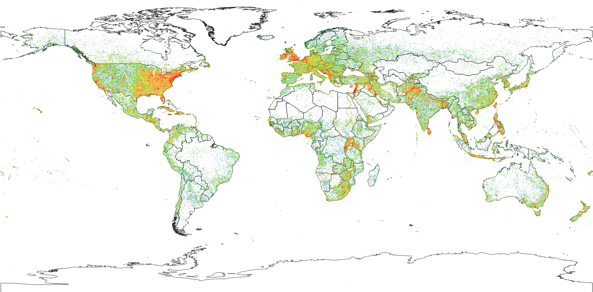

GeoMesa Spark: Basic Analysis
=============================

This tutorial will show you how to:

1. Use GeoMesa with `Apache Spark <https://spark.apache.org/>`__.
2. Write custom Scala code for GeoMesa to generate histograms and
   spatial densities of `GDELT <https://www.gdeltproject.org/>`__ event
   data.

Background
----------

`Apache Spark <https://spark.apache.org>`__ is a "fast and general engine
for large-scale data processing". Spark presents an abstraction called a
Resilient Distributed Dataset (RDD) that facilitates expressing
transformations, filters, and aggregations, and efficiently executes the
computation across a distributed set of resources. Spark manages the
lineage of a block of transformed data so that if a node goes down,
Spark can restart the computation for just the missing blocks.

GeoMesa has support for executing Spark jobs over data stored in
GeoMesa. You can initialize a Spark RDD using standard CQL queries and
by passing standard CQL functions to transform the data. In the spirit
of the obligatory Word Count map-reduce example, we demonstrate two
geospatial spins on word count. First, counting features by time
resolution to compute a time series of spatial data, and second,
aggregating by grid cell to rapidly generate density plots. Apache Spark
enables us to express these transformations easily and succinctly.

Prerequisites
-------------

.. warning::

    You will need access to a Hadoop |hadoop_version| installation with Yarn as well as an Accumulo |accumulo_required_version| database.

    You will need to have ingested GDELT data using GeoMesa. Instructions are available in :doc:`geomesa-examples-gdelt`.

You will also need:

-  a `Spark <https://spark.apache.org/>`__ |spark_required_version| distribution
-  an Accumulo user that has appropriate permissions to query your data
-  `Java JDK 11 <https://adoptium.net/temurin/releases/>`__,
-  `Apache Maven <https://maven.apache.org/>`__ |maven_version|, and
-  a `git <https://git-scm.com/>`__ client

The tutorial example below presumes that Spark is installed and configured, and
that a cluster with Hadoop and Yarn is running. We will use ``spark-submit`` to run
our jobs on the cluster.

Set Up Tutorial Code
--------------------

Clone the geomesa-tutorials project, and go into the ``geomesa-examples-spark`` directory:

    $ git clone https://github.com/geomesa/geomesa-tutorials.git
    $ cd geomesa-tutorials/geomesa-examples-spark

.. note::

    The code in this tutorial is written in `Scala <https://scala-lang.org/>`__.

Count Events by Day of Year
---------------------------

You will need to have ingested some
`GDELT <https://www.gdeltproject.org/>`__ data into Accumulo with GeoMesa, as described in :doc:`geomesa-examples-gdelt` or :ref:`gdelt_converter`.

The ``com.example.geomesa.spark.CountByDay`` class in the ``src/main/scala`` directory
is a self-contained example that may be submitted to Spark as an example of analysis.
The libraries used are described in the :doc:`/user/spark/index` chapter of the
GeoMesa manual. We describe this example code below.

Example Code
^^^^^^^^^^^^

First, we set our connection parameters-- you will need to modify these settings
to match the configuration of your cluster:

.. code-block:: scala

    val params = Map(
      "accumulo.instance.name" -> "instance",
      "accumulo.zookeepers"    -> "zoo1,zoo2,zoo3",
      "accumulo.user"          -> "user",
      "accumulo.password"      -> "*****",
      "accumulo.catalog"       -> "geomesa.catalog",
      "geomesa.security.auths" -> "USER,ADMIN")

We also define an ECQL filter used to select a subset of GDELT data from
the GeoMesa Accumulo data store. The value of ``during`` should also be edited
to match the range of GDELT data that you have ingested.

.. code-block:: scala

    // Define a GeoTools Filter here
    val typeName = "gdelt"
    val geom     = "geom"
    val date     = "dtg"

    val bbox   = "-80, 35, -79, 36"
    val during = "2014-01-01T00:00:00.000Z/2014-01-31T12:00:00.000Z"

    val filter = s"bbox($geom, $bbox) AND $date during $during"

Within the ``main()`` method for the class, we create an ``AccumuloDataStore``:

.. code-block:: scala

    // Get a handle to the data store
    val ds = DataStoreFinder.getDataStore(params).asInstanceOf[AccumuloDataStore]

and create the GeoTools ``Filter`` from the ECQL:

.. code-block:: scala

    // Construct a CQL query to filter by bounding box
    val q = new Query(typeName, ECQL.toFilter(filter))

We set up Spark:

.. code-block:: scala

    // Configure Spark
    val conf = new SparkConf().setAppName("testSpark")
    val sc = SparkContext.getOrCreate(conf)

The ``GeoMesaSpark`` object provided by the **geomesa-spark-core** module
uses the SPI to find an implementation of the ``SpatialRDDProvider`` interface.
In this case, this will be an instance of ``AccumuloSpatialRDDProvider`` from
the **geomesa-accumulo-spark** module, which will connect to Accumulo with
the parameters provided. (For more information on this interface, see
:doc:`/user/spark/core` in the GeoMesa manual.)

.. code-block:: scala

    // Get the appropriate spatial RDD provider
    val spatialRDDProvider = GeoMesaSpark(params)

Next, initialize an ``RDD[SimpleFeature]`` using this provider:

.. code-block:: scala

    // Get an RDD[SimpleFeature] from the spatial RDD provider
    val queryRDD = spatialRDDProvider.rdd(new Configuration, sc, params, q)

Finally, we construct our computation which consists of extracting the
``SQLDATE`` from each ``SimpleFeature`` and truncating it to the day
resolution.

.. code-block:: scala

    val dayAndFeature = queryRDD.mapPartitions { iter =>
      val df = new SimpleDateFormat("yyyyMMdd")
      val ff = CommonFactoryFinder.getFilterFactory
      val exp = ff.property("SQLDATE")
      iter.map { f => (df.format(exp.evaluate(f).asInstanceOf[java.util.Date]), f) }
    }

Then, we group by the day and count up the number of events in each
group.

.. code-block:: scala

    val countByDay = dayAndFeature.map( x => (x._1, 1)).reduceByKey(_ + _)
    countByDay.collect().foreach(println)

Run the Tutorial Code
^^^^^^^^^^^^^^^^^^^^^

If you have not already done so, modify the ``CountByDay.scala`` class so that
the parameter map points to your cloud instance, and ensure that the ``filter``
covers a valid range of your GDELT data.

Build (or rebuild) the JAR. This example JAR is shaded and will contain all of
JARs needed to run the appropriate analysis in Spark.

.. code-block:: bash

    $ mvn clean install

We can submit the job to our Yarn cluster using ``spark-submit``:

.. code-block:: bash

    $ /path/to/spark/bin/spark-submit --master yarn \
      --class com.example.geomesa.spark.CountByDay \
      target/geomesa-examples-spark-$VERSION.jar

.. note::

    Note that ``$VERSION`` is the geomesa-tutorials version, not the GeoMesa version.

Alternatively, you may run the Spark job locally by setting ``--master 'local[*]``.
You should see a lot of Spark logging, and then the counts:

.. code-block:: bash

    (20140117,57)
    (20140120,38)
    (20140113,407)
    ...

Parallel Computation of Spatial Event Densities
-----------------------------------------------

In the second demonstration, we compute densities of our feature by
discretizing the spatial domain and counting occurrences of the feature
in each grid cell. We use `GeoHashes <https://en.wikipedia.org/wiki/Geohash>`__ as our
discretization of the world so that we can configure the resolution of
our density by setting the number of bits in the GeoHash.

This code is does not exist in GeoMesa; it's left as an exercise for the reader.

First, start with a similar ``RDD[SimpleFeature]`` as before but expand
the bounding box.

.. code-block:: scala

    val f = ff.bbox("geom", -180, -90, 180, 90, "EPSG:4326")
    val q = new Query("gdelt", f)

    val queryRDD = spatialRDDProvider.rdd(new Configuration, sc, params, q, None)

Project (in the relational sense) the ``SimpleFeature`` to a 2-tuple of
``(GeoHash, 1)``.

.. code-block:: scala

    val discretized = queryRDD.map { f =>
       (geomesa.utils.geohash.GeoHash(f.getDefaultGeometry.asInstanceOf[Point], 25), 1)
    }

Then, group by grid cell and count the number of features per cell.

.. code-block:: scala

    val density = discretized.reduceByKey(_ + _)
    density.collect.foreach(println)

The resulting density plot is visualized below.

