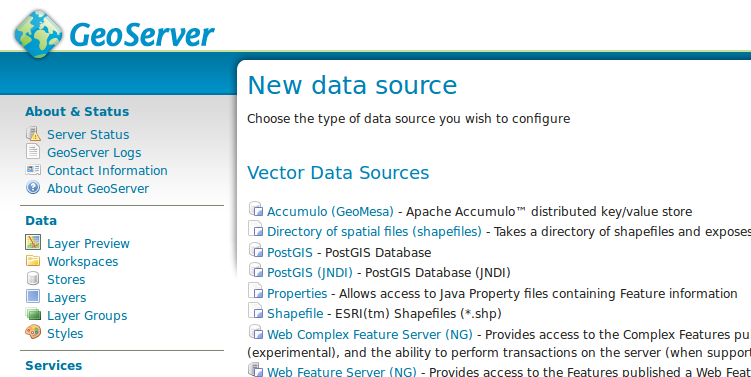
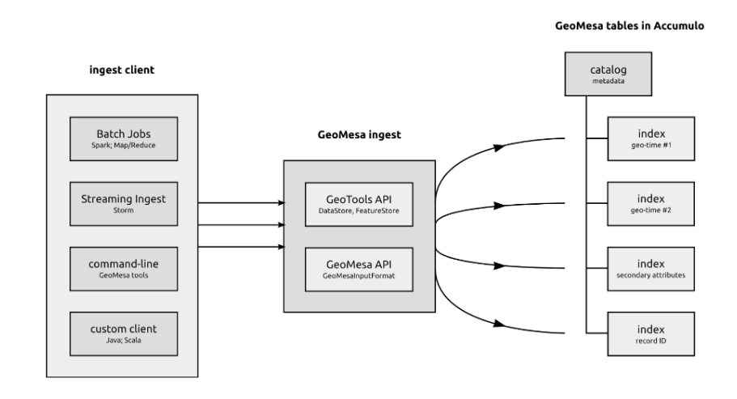
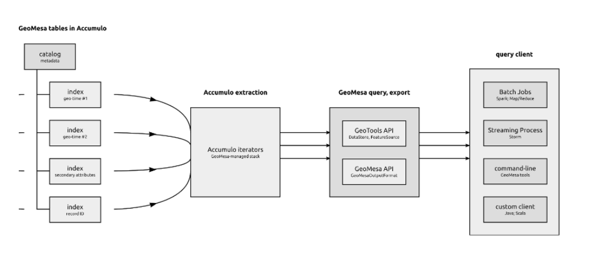
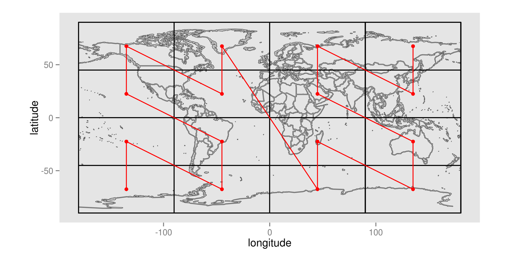
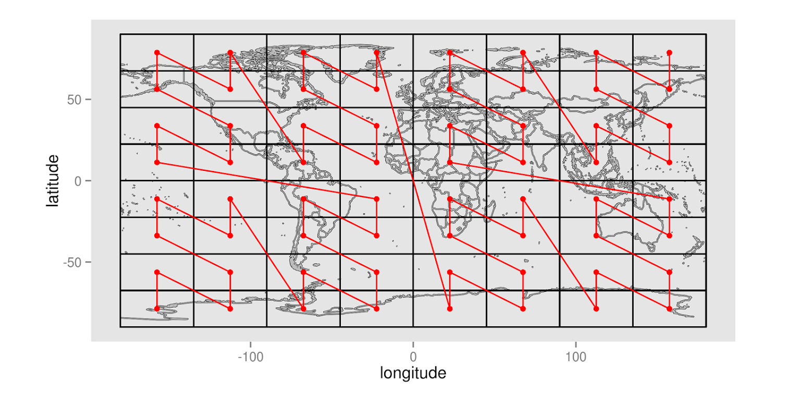
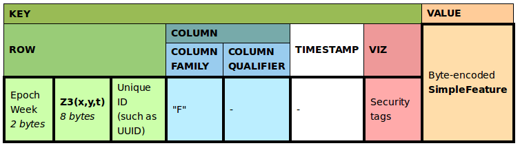

Architecture Overview
=====================

GeoMesa supports several scalable, cloud-based data storage technologies, including Apache Accumulo, Apache HBase, and Google Cloud Bigtable, as well as the Apache Kafka message broker for streaming data. Apache Storm lets you define information sources and manipulations to allow batch distributed processing of streaming data with GeoMesa, and a GeoMesa environment can also take advantage of Apache Spark to do large-scale analytics of stored and streaming data.

.. image:: _static/img/GMHadoopInfrastructure.png
   :align: center

.. _geomesa_and_geoserver:

GeoMesa and GeoServer
---------------------

GeoMesa's GeoServer plugins let GeoServer work with data stored using GeoMesa tables. The plugin maps the GeoServer capabilities associated with data sources to the GeoMesa formatted tables and provides a number of optimizations to support specific use cases.

If an application already uses GeoServer, integration with GeoMesa is simply a matter of adding a new datastore to GeoServer and updating the application’s configuration.

Integration with GeoMesa
------------------------

GeoMesa implements `GeoTools <http://geotools.org/>`_ interfaces to provide programmatic access, and HTTP access to
the following Open Geospatial Consortium standards:

* `Web Feature Service (WFS) <http://www.opengeospatial.org/standards/wfs>`_
* `Web Mapping Service (WMS) <http://www.opengeospatial.org/standards/wms>`_
* `Web Processing Service (WPS) <http://www.opengeospatial.org/standards/wps>`_
* `Web Coverage Service (WCS) <http://www.opengeospatial.org/standards/wcs>`_

Multiple frameworks may be used for streaming and batch ingestion of data. These include the GeoMesa command line tools, map-reduce jobs with Apache Hadoop, and real-time topologies running on Apache Storm. The following diagram shows one possible ingest architecture:

The following shows one possible query architecture, in which the GeoTools and GeoMesa APIs mediate the use of Accumulo iterators for external query clients:

Key-value stores and Z-curves
-----------------------------

The data stores that GeoMesa uses for long-term storage are key-value databases, a type of NoSQL database in which every record is stored and retrieved using a unique identifier for that record known as a key. Accumulo, HBase, and Google Cloud Bigtable sort these keys and can store them across any number of nodes (servers). 

When using a key-value database, good design of the keys themselves can lead to more efficient applications. Unlike relational databases, where the keys are frequently sequential integers, key value stores usually use the key to represent a feature by which the data are frequently queried. For example, imagine a database of customer orders being indexed by the order number. Then, when a client queries by order number, the database goes directly to that key and returns that order's record.

This is a simplification of how Accumulo, HBase, and Bigtable key structures actually work, but the foundational principle of GeoMesa can be explained in terms of keys and values. To store spatio-temporal data, we need to create a key that represents the time/space location of the record. GeoMesa uses this system to store locations as points along a special line that visits all the sectors of a map, like the red line shown here:

This red line is known as a space-filling curve, or to be more specific, a Z-Curve. This line visits each cell exactly once, establishing a unique ordering of cells.

Space-filling curves can also work with higher-resolution maps, like the one shown here:

.. following 53% instead of 50 because the image was a little smaller than the one above

Each point in this curve can be assigned a sequential value, letting GeoMesa represent what might have been a latitude-longitude pair as a single integer. This is great for representing two-dimensional data in a one-dimensional key, as is the case with a key-value datastore. Even more significantly, these space-filling curves can be adapted for *n* dimensions, letting GeoMesa linearize  *n* dimensions of data in a single dimension. 

GeoMesa Indexing Key
--------------------

The basic principle of GeoMesa’s index is to represent the three dimensions of longitude, latitude, and time with a three-dimensional space filling curve, using the values of the points along this curve as the key. This lets it store a record in a key-value store with a key that represents the three data dimensions that we most often use for queries. 

The actual key structure is more complex than a simple key-value pair. Below is a more detailed representation of GeoMesa's index in Accumulo: 

Note the  Z3 encoding in the Key section and the `Simple Feature <https://en.wikipedia.org/wiki/Simple_Features>`_ (a spatial record) in the Value section. The structure of this key can be adjusted depending on the data, but this is the default. 

