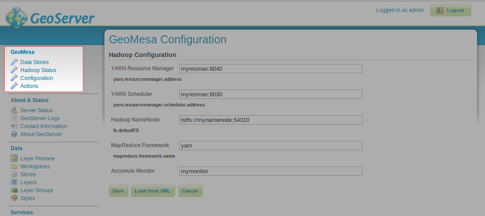
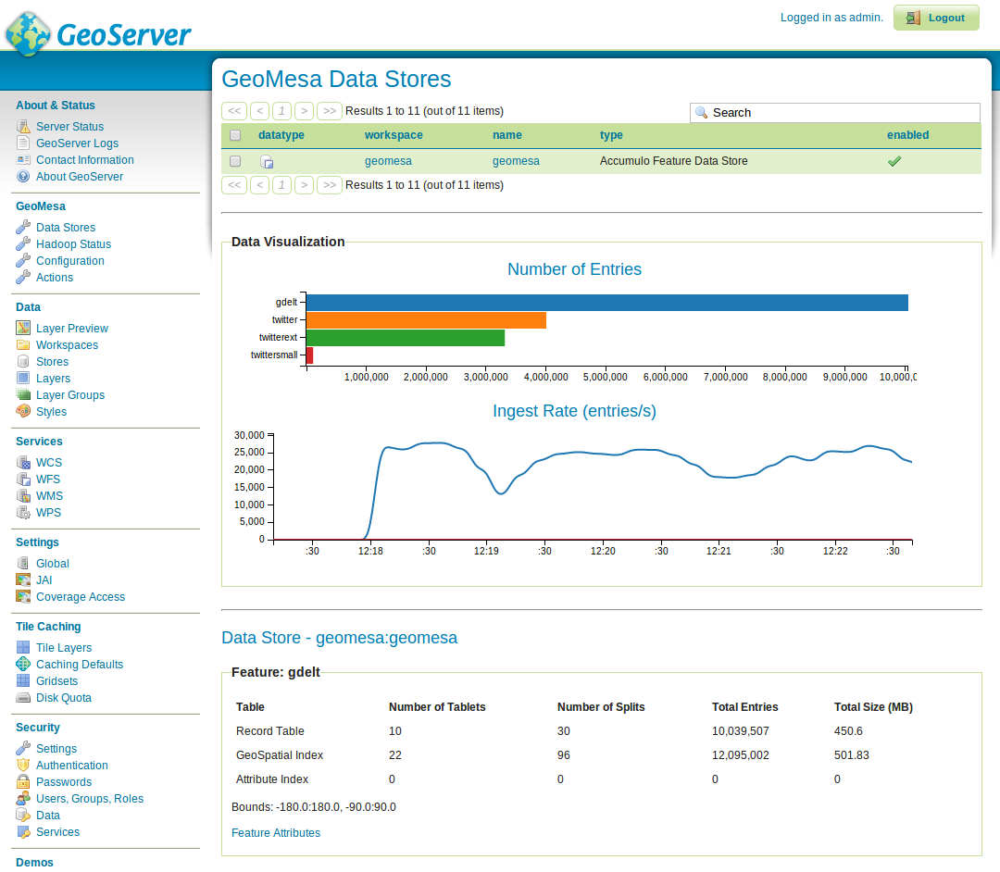
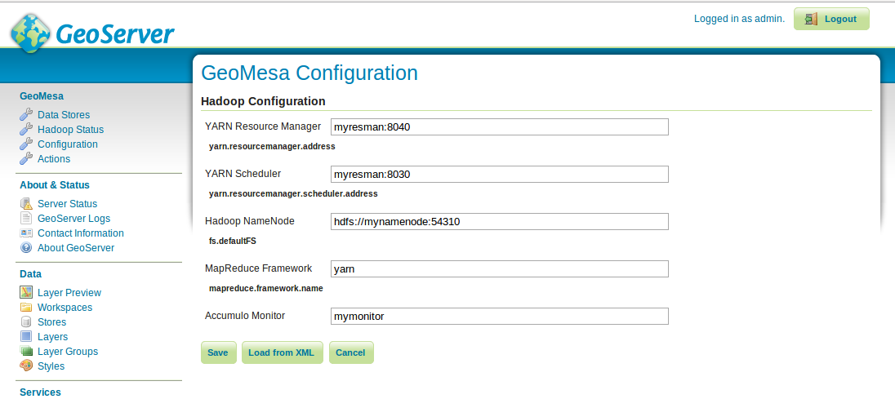
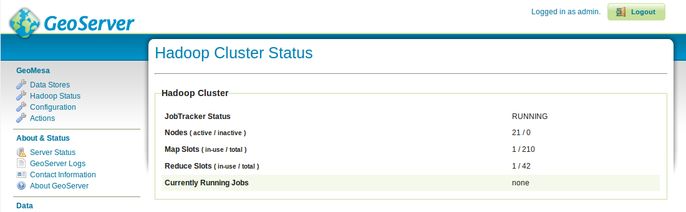

GeoMesa GeoServer Plugins
=========================

Background
----------

When you install the GeoMesa plugins for GeoServer, you get access to the
GeoMesa User Interface. The GeoMesa UI shows the status of your GeoMesa
data stores and will eventually provide additional features such as the
ability to build indices on your data and calculate statistics on your common
queries.

Instructions for installing the GeoMesa plugins in GeoServer are
available at :ref:`install_geoserver_plugins`.

Access to the User Interface
----------------------------

You can reach the GeoServer main screen by sending a browser to
``http://127.0.0.1:8080/geoserver`` and logging in with a username of ``admin``
and a password of  ``geoserver``. (This URL and password are default values and
may be different at your own installation.) 

Once you have installed the GeoMesa plugin, the GeoServer administration interface will include a GeoMesa menu on the sidebar:

Data Store Summary
------------------

Any GeoMesa data stores that you have added to GeoServer can be examined
on the Data Stores page. The top of that page has a table listing
all of your GeoMesa data stores. Underneath that are two charts.
The first shows the number of records in your different
features, and the second displays the progress of any ingestion currently in progress.

.. note::

    In order for the ingest chart to display, the Accumulo monitor must be running and the
    configuration page must have the correct address for the monitor (see below).

Further down the page, GeoServer displays statistics on each feature. This
shows the different tables used to store the feature in Accumulo, the number
of tablets per table, and the total number of entries. Clicking the 'Feature
Attributes' link displays a list of all the attributes for the feature shows
whether they are indexed for querying.

Configuration
-------------

To use certain UI features you'll need to first set the appropriate
properties on the configuration page. Most of these properties
correspond to Hadoop properties, and they can be copied from your hadoop
configuration files. You can enter them by hand, or you can upload your
hadoop configuration files directly to the page. To do this, use the
'Load from XML' button.

Hadoop Status
-------------

Once the configuration is done, you can monitor the Hadoop cluster
status on the Hadoop Status page. Here you can see the load on your
cluster and any currently running jobs.

Analysis with WPS
-----------------

As described by the Open Geospatial Consortium's page on WPS, 

    The OpenGIS® Web Map Service Interface Standard (WMS) provides a simple HTTP
    interface for requesting geo-registered map images from one or more
    distributed geospatial databases. A WMS request defines the geographic
    layer(s) and area of interest to be processed. The response to the request is
    one or more geo-registered map images (returned as JPEG, PNG, etc) that can be
    displayed in a browser application. The interface also supports the ability to
    specify whether the returned images should be transparent so that layers from
    multiple servers can be combined or not.
 
A tool like GeoServer (once its WPS plugin has been installed) uses WPS to
retrieve data from GeoMesa. WPS processes can be chained, letting you use
additional WPS requests to build on the results of earlier ones.

