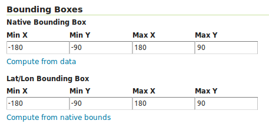

GeoServer Plugins
=================

A straightforward way to render, manipulate, and manage data stored
in GeoMesa data stores is to use `GeoServer`_,
an open source server for sharing geospatial data. This chapter describes
how to work with the GeoMesa GeoServer plugins.

.. _geoserver_versions:

GeoServer Versions
------------------

Not all versions of GeoServer are compatible with all versions of GeoMesa. Refer to the chart below for which
version to install. It is recommended to use the latest GeoServer bug-fix release for the compatible minor version,
although this may occasionally cause errors as GeoServer does not follow semantic versioning.

.. note::

    New versions of GeoServer are released regularly. GeoMesa may work with newer versions of GeoServer, but
    only the versions listed below have been verified.

+-------------------+-------------------+
| GeoMesa Version   | GeoServer Version |
+===================+===================+
<<<<<<< HEAD
<<<<<<< HEAD
<<<<<<< HEAD
<<<<<<< HEAD
<<<<<<< HEAD
<<<<<<< HEAD
| 5.0.0             | 2.24.2            |
+-------------------+-------------------+
| 4.0.0             | 2.22.2            |
=======
=======
>>>>>>> b82105a0594 (Fix recommended GeoServer version in docs)
=======
>>>>>>> eb0bd279638 (GEOMESA-3254 Add Bloop build support)
<<<<<<< HEAD
=======
<<<<<<< HEAD
=======
>>>>>>> 7564665969 (GEOMESA-3254 Add Bloop build support)
>>>>>>> 04ca02e264f (GEOMESA-3254 Add Bloop build support)
=======
=======
>>>>>>> 603c7b9204a (GEOMESA-3254 Add Bloop build support)
<<<<<<< HEAD
=======
>>>>>>> 7564665969 (GEOMESA-3254 Add Bloop build support)
=======
>>>>>>> 6fffaab2f9 (Fix recommended GeoServer version in docs)
<<<<<<< HEAD
>>>>>>> c04ca2d2a2e (Fix recommended GeoServer version in docs)
=======
=======
>>>>>>> e74fa3f690 (GEOMESA-3254 Add Bloop build support)
>>>>>>> 603c7b9204a (GEOMESA-3254 Add Bloop build support)
| 4.0.0 and later   | 2.22.2            |
=======
| 4.0.0 and later   | 2.22.0            |
>>>>>>> 58d14a257e (GEOMESA-3254 Add Bloop build support)
<<<<<<< HEAD
<<<<<<< HEAD
<<<<<<< HEAD
>>>>>>> 4a4bbd8ec03 (GEOMESA-3254 Add Bloop build support)
=======
=======
>>>>>>> 04ca02e264f (GEOMESA-3254 Add Bloop build support)
=======
>>>>>>> c04ca2d2a2e (Fix recommended GeoServer version in docs)
=======
| 4.0.0 and later   | 2.22.2            |
>>>>>>> fe2b699d58 (Fix recommended GeoServer version in docs)
<<<<<<< HEAD
>>>>>>> b82105a0594 (Fix recommended GeoServer version in docs)
=======
=======
| 4.0.0 and later   | 2.22.2            |
=======
| 4.0.0 and later   | 2.22.0            |
>>>>>>> 58d14a257 (GEOMESA-3254 Add Bloop build support)
>>>>>>> fa60953a42 (GEOMESA-3254 Add Bloop build support)
<<<<<<< HEAD
<<<<<<< HEAD
>>>>>>> eb0bd279638 (GEOMESA-3254 Add Bloop build support)
=======
=======
>>>>>>> 603c7b9204a (GEOMESA-3254 Add Bloop build support)
=======
>>>>>>> 7564665969 (GEOMESA-3254 Add Bloop build support)
<<<<<<< HEAD
>>>>>>> 04ca02e264f (GEOMESA-3254 Add Bloop build support)
=======
=======
=======
| 4.0.0 and later   | 2.22.2            |
>>>>>>> fe2b699d58 (Fix recommended GeoServer version in docs)
>>>>>>> 6fffaab2f9 (Fix recommended GeoServer version in docs)
<<<<<<< HEAD
>>>>>>> c04ca2d2a2e (Fix recommended GeoServer version in docs)
=======
=======
>>>>>>> e74fa3f690 (GEOMESA-3254 Add Bloop build support)
>>>>>>> 603c7b9204a (GEOMESA-3254 Add Bloop build support)
+-------------------+-------------------+
| 3.1.1 to 3.5.x    | 2.17.3            |
+-------------------+-------------------+
| 3.0.x to 3.1.0    | 2.17.0            |
+-------------------+-------------------+
| 2.4.x             | 2.15.x            |
+-------------------+-------------------+
| 2.2.x to 2.3.x    | 2.14.x            |
+-------------------+-------------------+
| 2.1.x and earlier | 2.12.x            |
+-------------------+-------------------+

.. warning::

    GeoMesa will not work with an incompatible version of GeoServer. Ensure that your install the correct
    version according to the chart above.

Installation
------------

Instructions for installing the GeoMesa plugins in GeoServer are
available by datastore:

 * :ref:`install_accumulo_geoserver`
 * :ref:`install_hbase_geoserver`
 * :ref:`install_cassandra_geoserver`
 * :ref:`install_kafka_geoserver`
 * :ref:`install_fsds_geoserver`
 * :ref:`install_redis_geoserver`
 * :ref:`install_lambda_geoserver`

Go to your GeoServer installation at ``http://<hostname>:8080/geoserver``.
For new installations of GeoServer, the default username is ``admin`` and
password is ``geoserver``. These should be changed to prevent unauthorized access.

Creating a Data Store
---------------------

Specific instructions by data store:

 * :doc:`/user/accumulo/geoserver`
 * :doc:`/user/hbase/geoserver`
 * :doc:`/user/cassandra/geoserver`
 * :doc:`/user/kafka/geoserver`
 * :doc:`/user/filesystem/geoserver`
 * :doc:`/user/redis/geoserver`
 * :doc:`/user/lambda/geoserver`

Publish a GeoMesa Layer
-----------------------

After a GeoMesa data store is successfully created, GeoServer will present a list
of feature types registered in that data store. Click "Publish" next to the
name of a feature type to create a layer of the data in GeoMesa of that type.

You will be taken to the **Edit Layer** screen. To render your layer, you must
first set values for the bounding boxes in the "Data" pane. In many cases, you
can click on the "Compute from native bounds" link to compute these values
from the data.

Click on the "Save" button when you are done.

.. warning::

   When configuring a time-enabled layer, generally you should set the presentation to "Continuous interval."
   Setting presentation to "List" will require displaying all unique time values in the layer, and cause WMS
   ``GetCapabilities`` requests to be slow.

Preview a Layer
---------------

Click on the "Layer Preview" link in the left-hand menu. Once you see your layer,
click on the "OpenLayers" link, which will open a new tab. If you have ingested
data into GeoMesa, it will be displayed here.

If the data you have ingested is a set of latitude/longitude points, click on
one of the points in the display (rendered by default as red squares), and GeoServer
will report detailed records stored in the GeoMesa store in the region underneath
the map area.

Click on the "Toggle options toolbar" icon in the upper-left corner
of the preview window. The right-hand side of the screen will include
a "Filter" text box. Enter a search query on the attributes of the feature type
of the data you have ingested, and press on the "play" icon. The display will now
show only those points matching your filter criterion.

This is a CQL filter, which can be constructed in various ways to query data. You can
find more information about CQL from `GeoServer's CQL
tutorial <https://docs.geoserver.org/stable/en/user/tutorials/cql/cql_tutorial.html>`__.

.. note::

   If you enabled the time dimension for a layer, such as instructed in the :doc:`../tutorials/geomesa-quickstart-accumulo`,
   then you will need to specify a TIME parameter in the URL of the form:
   ``&TIME=2014-01-01T00:00:00.000Z/2014-01-31T23:59:59.999Z``
   That tells GeoServer to display the records for the entire month of January 2014. GeoServer will add an implicit
   time filter if you do not specify one, which may cause unexpected results. This TIME parameter is distinct from the
   CQL_FILTER parameter and specifying a CQL time filter without the TIME parameter may create an empty intersection
   with the implicit time filter. You can find more information about the TIME parameter from `GeoServer's documentation <https://docs.geoserver.org/stable/en/user/services/wms/time.html>`__.

Analysis with WPS
-----------------

As described by the Open Geospatial Consortium's `Web Map Service <https://www.opengeospatial.org/standards/wms>`_ page,

    The OpenGIS® Web Map Service Interface Standard (WMS) provides a simple HTTP
    interface for requesting geo-registered map images from one or more
    distributed geospatial databases. A WMS request defines the geographic
    layer(s) and area of interest to be processed. The response to the request is
    one or more geo-registered map images (returned as JPEG, PNG, etc) that can be
    displayed in a browser application. The interface also supports the ability to
    specify whether the returned images should be transparent so that layers from
    multiple servers can be combined or not.
 
A tool like GeoServer (once its WPS plugin has been installed) uses WPS to
retrieve data from GeoMesa. WPS processes can be chained, letting you use
additional WPS requests to build on the results of earlier ones.

Configuration
-------------

WMS Plugin
^^^^^^^^^^

Depending on your hardware, it may be important to set the limits for
your WMS plugin to be higher or disable them completely by clicking
"WMS" under "Services" on the left side of the admin page of GeoServer.
Check with your server administrator to determine the correct settings.
For massive queries, the standard 60 second timeout may be too short.

|"Disable limits"|

.. |"Disable limits"| image:: _static/img/wms_limits.png

Temp Directories
^^^^^^^^^^^^^^^^

GeoServer creates temporary directories for caching various files. Running in a multi-tenant environment
can result in permission errors when different users try to write to the same directories. To avoid this,
configure your application server with the following system properties::

  -DEPSG-HSQL.directory=/tmp/$USER-hsql
  -DGEOWEBCACHE_CACHE_DIR=/tmp/$USER-gwc

.. _geoserver_explain_query:

Logging Explain Query Planning
^^^^^^^^^^^^^^^^^^^^^^^^^^^^^^

GeoMesa data stores can show their plan for executing queries,
as described in :ref:`explain_query`. To enable the logging of explain query
planning in GeoServer, add the following to the
``$GEOSERVER_DATA_DIR/logs/DEFAULT_LOGGING.xml`` file::

    <Logger name="org.locationtech.geomesa.index.utils.Explainer" level="trace">
      <AppenderRef ref="stdout"/>
      <AppenderRef ref="geoserverlogfile"/>
    </Logger>

If you are not sure of the location of your GeoServer data directory, it
is printed out when you start GeoServer::

    --------------------------------------------------------------------
    CONFIG [org.geoserver] - Loading catalog /path/to/geoserver-data-dir
    --------------------------------------------------------------------

It may also be helpful to refer to GeoServer's `Advanced log configuration`__ documentation for the
specifics of how and where to manage the GeoServer logs.

__ https://docs.geoserver.org/stable/en/user/configuration/logging.html

Auditing GeoMesa DataStores
^^^^^^^^^^^^^^^^^^^^^^^^^^^

GeoMesa data stores can audit query metrics. To enabled auditing, check the box for ``geomesa.query.audit``
when registering the data store in GeoServer.

GeoMesa data stores will generally write audited queries to log files. To configure an audit log, set the level for
``org.locationtech.geomesa.utils.audit`` to ``DEBUG``. This can be accomplished by editing the GeoServer logging
configuration (e.g. ``$GEOSERVER_DATA_DIR/logs/DEFAULT_LOGGING.xml``)::

   <Logger name="org.locationtech.geomesa.utils.audit" level="debug" additivity="false">
     <AppenderRef ref="auditLogFile"/> <!-- note: requires an appender to be defined with this name -->
   </Logger>

The Accumulo data store will also write audited queries to the ``<catalog>_queries`` table.

See :ref:`audit_provider` for details on query attribution.

GeoMesa GeoServer Extensions
----------------------------

Due to licensing, GeoServer-specific code related to GeoMesa is maintained in a separate
`repository <https://github.com/geomesa/geomesa-geoserver/>`__. It can be downloaded from Maven
central, or built from source.

It is required for Arrow output in GeoServer, among other things.

Once obtained, the GeoServer modules can be installed by copying ``geomesa-gs-*.jar`` into
the GeoServer ``lib`` directory.
