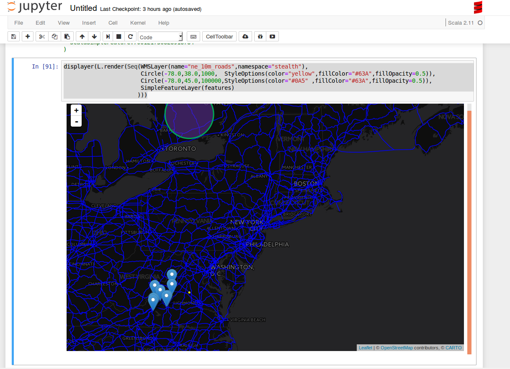

* A sample notebook session

```scala
   classpath.addRepository("http://download.osgeo.org/webdav/geotools")
   classpath.addRepository("http://central.maven.org/maven2")
   classpath.addRepository("https://repo.locationtech.org/content/repositories/geomesa-releases")
   classpath.addRepository("file:///home/username/.m2/repository")
   classpath.add("com.vividsolutions" % "jts" % "1.13")
   classpath.add("org.locationtech.geomesa" % "geomesa-accumulo-datastore" % "1.3.0")
   classpath.add("org.apache.accumulo" % "accumulo-core" % "1.6.4")
   classpath.add("org.locationtech.geomesa" % "geomesa-jupyter" % "1.3.0")
   
   import org.locationtech.geomesa.jupyter.Jupyter._
   
   implicit val displayer: String => Unit = display.html(_)
   
   import scala.collection.JavaConversions._
   import org.locationtech.geomesa.accumulo.data.AccumuloDataStoreParams._
   import org.locationtech.geomesa.utils.geotools.Conversions._
   
   val params = Map(
           zookeepersParam.key -> "ZOOKEEPERS",
           instanceIdParam.key -> "INSTANCE",
           userParam.key       -> "USER_NAME",
           passwordParam.key   -> "USER_PASS",
           tableNameParam.key  -> "TABLENAME")
   
   val ds = org.geotools.data.DataStoreFinder.getDataStore(params)
   val ff = org.geotools.factory.CommonFactoryFinder.getFilterFactory2
   val fs = ds.getFeatureSource("twitter")
   
   val filt = ff.and(
       ff.between(ff.property("dtg"), ff.literal("2016-01-01"), ff.literal("2016-05-01")), 
       ff.bbox("geom", -80, 37, -75, 40, "EPSG:4326"))
   val features = fs.getFeatures(filt).features.take(10).toList
   
   displayer(L.render(Seq(WMSLayer(name="ne_10m_roads",namespace="NAMESPACE"),
                          Circle(-78.0,38.0,1000,  StyleOptions(color="yellow",fillColor="#63A",fillOpacity=0.5)),
                          Circle(-78.0,45.0,100000,StyleOptions(color="#0A5" ,fillColor="#63A",fillOpacity=0.5)),
                          SimpleFeatureLayer(features)
                         )))
   

```


